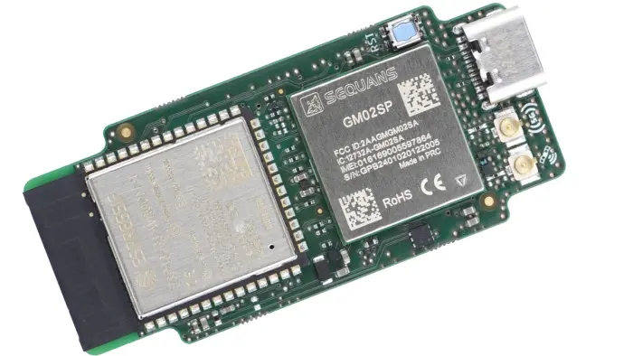

.. _walter:

DPTechnics Walter
#################

Overview
********

Walter is a compact IoT development board that combines an Espressif ESP32-S3 SoC
with a Sequans Monarch 2 GM02SP LTE-M/NB-IoT/GNSS modem.
More information about Walter can be found on the `QuickSpot Website`_ and on the
`QuickSpot GitHub page`_.

   DPTechnics Walter board (Credit: DPTechnics bv)

Hardware
********

ESP32-S3-WROOM-1-N16R2 microcontroller:

- Xtensa dual-core 32-bit LX7 CPU
- 16 MiB quad SPI flash memory
- 2 MiB quad SPI PSRAM
- 150 Mbps 802.11 b/g/n Wi-Fi 4 with on-board PCB antenna
- 2 Mbps Bluetooth 5 Low Energy with on-board PCB antenna

Sequans Monarch 2 GM02SP modem:

- Dual-mode LTE-M / NB-IoT (NB1, NB2)
- 3GPP LTE release 14 (Upgradable up to release 17)
- Ultra-low, deep-sleep mode in eDRX and PSM
- Adaptive +23 dBm, +20 dBm and +14 dBm output power
- Integrated LNA and SAW filter for GNSS reception
- Assisted and non-assisted GNSS with GPS and Galileo constellations
- Integrated SIM card
- Nano-SIM card slot
- u.FL RF connectors for GNSS and 5G antennas

Inputs & outputs:

- 24 GPIO pins for application use
- UART, SPI, I²C, CAN, I²S, and SD available on any of the GPIO pins
- ADC, DAC, and PWM integrated in ESP32-S3
- 3.3 V software-controllable output
- USB Type-C connector for flashing and debugging
- 22 test points for production programming and testing
- On-board reset button

Power supply

- 5.0 V via USB Type-C
- 3.0 - 5.5 V via Vin pin
- Not allowed to use both power inputs simultaneously
- Designed for extremely low quiescent current

Form factor

- Easy to integrate via 2.54 mm headers
- 55 mm x 24.8 mm board dimensions
- Pin and footprint compatible with EOL Pycom GPy
- Breadboard friendly

Supported Features
==================

Current Zephyr's Walter board supports the following features:

+------------+------------+-------------------------------------+
| Interface  | Controller | Driver/Component                    |
+============+============+=====================================+
| UART       | on-chip    | serial port                         |
+------------+------------+-------------------------------------+
| GPIO       | on-chip    | gpio                                |
+------------+------------+-------------------------------------+
| PINMUX     | on-chip    | pinmux                              |
+------------+------------+-------------------------------------+
| USB-JTAG   | on-chip    | hardware interface                  |
+------------+------------+-------------------------------------+
| SPI Master | on-chip    | spi                                 |
+------------+------------+-------------------------------------+
| TWAI/CAN   | on-chip    | can                                 |
+------------+------------+-------------------------------------+
| ADC        | on-chip    | adc                                 |
+------------+------------+-------------------------------------+
| Timers     | on-chip    | counter                             |
+------------+------------+-------------------------------------+
| Watchdog   | on-chip    | watchdog                            |
+------------+------------+-------------------------------------+
| TRNG       | on-chip    | entropy                             |
+------------+------------+-------------------------------------+
| LEDC       | on-chip    | pwm                                 |
+------------+------------+-------------------------------------+
| MCPWM      | on-chip    | pwm                                 |
+------------+------------+-------------------------------------+
| PCNT       | on-chip    | qdec                                |
+------------+------------+-------------------------------------+
| GDMA       | on-chip    | dma                                 |
+------------+------------+-------------------------------------+
| USB-CDC    | on-chip    | serial                              |
+------------+------------+-------------------------------------+
| Wi-Fi      | on-chip    |                                     |
+------------+------------+-------------------------------------+
| Bluetooth  | on-chip    |                                     |
+------------+------------+-------------------------------------+
| Cellular   | on-board   | modem_cellular                      |
+------------+------------+-------------------------------------+

Prerequisites
-------------

Espressif HAL requires WiFi and Bluetooth binary blobs in order work. Run the command
below to retrieve those files.

.. code-block:: console

   west blobs fetch hal_espressif

.. note::

   It is recommended running the command above after :file:`west update`.

Building & Flashing
*******************

Simple boot
===========

The board could be loaded using the single binary image, without 2nd stage bootloader.
It is the default option when building the application without additional configuration.

.. note::

   Simple boot does not provide any security features nor OTA updates.

MCUboot bootloader
==================

User may choose to use MCUboot bootloader instead. In that case the bootloader
must be build (and flash) at least once.

There are two options to be used when building an application:

1. Sysbuild
2. Manual build

.. note::

   User can select the MCUboot bootloader by adding the following line
   to the board default configuration file.

   .. code:: cfg

      CONFIG_BOOTLOADER_MCUBOOT=y

Sysbuild
========

The sysbuild makes possible to build and flash all necessary images needed to
bootstrap the board with the ESP32-S3 SoC.

To build the sample application using sysbuild use the command:

.. zephyr-app-commands::
   :tool: west
   :app: samples/hello_world
   :board: walter/esp32s3/procpu
   :goals: build
   :west-args: --sysbuild
   :compact:

By default, the ESP32 sysbuild creates bootloader (MCUboot) and application
images. But it can be configured to create other kind of images.

Build directory structure created by sysbuild is different from traditional
Zephyr build. Output is structured by the domain subdirectories:

.. code-block::

  build/
  ├── hello_world
  │   └── zephyr
  │       ├── zephyr.elf
  │       └── zephyr.bin
  ├── mcuboot
  │    └── zephyr
  │       ├── zephyr.elf
  │       └── zephyr.bin
  └── domains.yaml

.. note::

   With ``--sysbuild`` option the bootloader will be re-build and re-flash
   every time the pristine build is used.

For more information about the system build please read the :ref:`sysbuild` documentation.

Manual build
============

During the development cycle, it is intended to build & flash as quickly possible.
For that reason, images can be build one at a time using traditional build.

The instructions following are relevant for both manual build and sysbuild.
The only difference is the structure of the build directory.

.. note::

   Remember that bootloader (MCUboot) needs to be flash at least once.

Build and flash applications as usual (see :ref:`build_an_application` and
:ref:`application_run` for more details).

.. zephyr-app-commands::
   :zephyr-app: samples/hello_world
   :board: walter/esp32s3/procpu
   :goals: build

The usual ``flash`` target will work with the ``walter`` board
configuration. Here is an example for the :zephyr:code-sample:`hello_world`
application.

.. zephyr-app-commands::
   :zephyr-app: samples/hello_world
   :board: walter/esp32s3/procpu
   :goals: flash

Open the serial monitor using the following command:

.. code-block:: shell

   west espressif monitor

After the board has automatically reset and booted, you should see the following
message in the monitor:

.. code-block:: console

   ***** Booting Zephyr OS vx.x.x-xxx-gxxxxxxxxxxxx *****
   Hello World! walter/esp32s3/procpu

Debugging
*********

ESP32-S3 support on OpenOCD is available at `OpenOCD ESP32`_.

ESP32-S3 has a built-in JTAG circuitry and can be debugged without any additional chip. Only an USB cable connected to the D+/D- pins is necessary.

Further documentation can be obtained from the SoC vendor in `JTAG debugging for ESP32-S3`_.

Here is an example for building the :zephyr:code-sample:`hello_world` application.

.. zephyr-app-commands::
   :zephyr-app: samples/hello_world
   :board: walter/esp32s3/procpu
   :goals: build flash

You can debug an application in the usual way. Here is an example for the :zephyr:code-sample:`hello_world` application.

.. zephyr-app-commands::
   :zephyr-app: samples/hello_world
   :board: walter/esp32s3/procpu
   :goals: debug

References
**********

.. target-notes::

.. _`QuickSpot Website`: https://www.quickspot.io/
.. _`QuickSpot GitHub page`: https://github.com/QuickSpot
.. _`JTAG debugging for ESP32-S3`: https://docs.espressif.com/projects/esp-idf/en/latest/esp32s3/api-guides/jtag-debugging/
.. _`OpenOCD ESP32`: https://github.com/openocd-org/openocd
