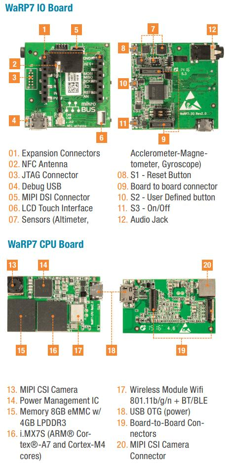

.. _warp7:

WaRP7 - Next Generation IoT and Wearable Development Platform
#############################################################

Overview
********

The i.MX7S SoC is a Hybrid multi-core processor composed of Single Cortex A7
core and Single Cortex M4 core.
Zephyr was ported to run on the M4 core. In a later release, it will also
communicate with the A7 core (running Linux) via RPmsg.

Hardware
********

The WaRP7 Platform is composed of a CPU and IO board.

WaRP7 IO Board
==============

- 6-axis Accelerometer Magnetometer: NXP FXOS8700CQ (I2C4 interface)
- 3-axis Gyroscope: NXP FXAS21002C (I2C4 interface)
- Altimeter: NXP MPL3115A2 (I2C4 interface)
- NXP NTAG NT3H1101 (I2C2 interface)
- Audio Codec: NXP SGTL5000 (I2C4 and SAI1 interfaces)
- S1 - Reset Button (POR_B signal)
- S2 - User Defined button (ENET1_RD1/GPIO7_IO1 signal)
- S3 - On/Off (MX7_ONOFF signal)
- Board to board connector (34 configurable pins)
- mikroBUS expansion connector
- 10-pin needle JTAG Connector
- Debug USB exposing two UARTs (UART1 for A7 and UART2 for M4)
- MIPI DSI 1 lane Connector
- LCD Touch Connector (I2C2 interface)
- Audio Jack: Mic and Stereo Headphone

WaRP7 CPU Board
===============

- CPU i.MX7 Solo with a Single Cortex A7 (800MHz) core and
  Single Cortex M4 (200MHz) core
- Memory

  - RAM -> A7: 4GB (Kingston 08EMCP04)
  - RAM -> M4: 3x32KB (TCML, TCMU, OCRAM_S), 1x128KB (OCRAM) and 1x256MB (DDR)
  - Flash -> A7: 8GB eMMC (Kingston 08EMCP04)
- Multimedia

  - MIPI CSI 1 lane connector with 5MP OV5640 camera module (I2C2 interface)
- Connectivity

  - Board to board connector (34 configurable pins)
  - Micro USB 2.0 OTG connector (USB_OTG1 interface)
  - Murata Type 1DX Wi-Fi IEEE 802.11b/g/n and Bluetooth 4.1 plus EDR
    (SD1, UART3 SAI2 interfaces)
- Li-ion/Li-polymer Battery Charger: NXP BC3770 (I2C1 interface)
- Power management integrated circuit (PMIC): NXP PF3000 (I2C1 interface)

For more information about the i.MX7 SoC and WaRP7, see these references:

- `i.MX 7 Series Website`_
- `i.MX 7 Solo Datasheet`_
- `i.MX 7 Solo Reference Manual`_
- `WaRP7 Site`_
- `WaRP7 Quick Start Guide`_
- `WaRP7 User Guide`_
- `WaRP7 GitHub repository`_

Supported Features
==================

The WaRP7 configuration supports the following hardware features on the
Cortex M4 Core:

+-----------+------------+-------------------------------------+
| Interface | Controller | Driver/Component                    |
+===========+============+=====================================+
| NVIC      | on-chip    | nested vector interrupt controller  |
+-----------+------------+-------------------------------------+
| SYSTICK   | on-chip    | systick                             |
+-----------+------------+-------------------------------------+
| GPIO      | on-chip    | gpio                                |
+-----------+------------+-------------------------------------+
| I2C       | on-chip    | i2c                                 |
+-----------+------------+-------------------------------------+
| UART      | on-chip    | serial port-polling;                |
|           |            | serial port-interrupt               |
+-----------+------------+-------------------------------------+
| SENSOR    | off-chip   | fxos8700 polling;                   |
|           |            | fxos8700 trigger;                   |
|           |            | fxas21002 polling;                  |
|           |            | fxas21002 trigger;                  |
+-----------+------------+-------------------------------------+

The default configuration can be found in the defconfig file:
:zephyr_file:`boards/element14/warp7/warp7_mcimx7d_m4_defconfig`

Other hardware features are not currently supported by the port.

Connections and IOs
===================

The WaRP7 board Board was tested with the following pinmux controller
configuration.

+---------------+---------------------+--------------------------------+
| Board Name    | SoC Name            | Usage                          |
+===============+=====================+================================+
| FT_TX2        | UART2_TXD           | UART Console                   |
+---------------+---------------------+--------------------------------+
| FT_RX2        | UART2_RXD           | UART Console                   |
+---------------+---------------------+--------------------------------+
| MKBUS_TX      | UART6_TXD           | UART                           |
+---------------+---------------------+--------------------------------+
| MKBUS_RX      | UART6_RXD           | UART                           |
+---------------+---------------------+--------------------------------+
| S2            | ENET1_RD1/GPIO7_IO1 | SW0                            |
+---------------+---------------------+--------------------------------+
| I2C4_SDA      | I2C4_SDA            | I2C / FXOS8700 / FXAS21002     |
+---------------+---------------------+--------------------------------+
| I2C4_SCL      | I2C4_SCL            | I2C / FXOS8700 / FXAS21002     |
+---------------+---------------------+--------------------------------+
| SENSOR_INT_B  | ENET1_RD0/GPIO7_IO0 | FXOS8700 INT1 / FXAS21002 INT1 |
+---------------+---------------------+--------------------------------+

System Clock
============

The M4 Core is configured to run at a 200 MHz clock speed.

Serial Port
===========

The iMX7S SoC has seven UARTs. The number 2 is configured for the console and
the number 6 is used in the mikroBUS connector.

Programming and Debugging
*************************

The WaRP7 doesn't have QSPI flash for the M4 and it needs to be started by
the A7 core. The A7 core is responsible to load the M4 binary application into
the RAM, put the M4 in reset, set the M4 Program Counter and Stack Pointer, and
get the M4 out of reset.
The A7 can perform these steps at bootloader level or after the Linux system
has booted.

The M4 can use up to 5 different RAMs. These are the memory mapping for A7 and
M4:

+------------+-----------------------+------------------------+-----------------------+----------------------+
| Region     | Cortex-A7             | Cortex-M4 (System Bus) | Cortex-M4 (Code Bus)  | Size                 |
+============+=======================+========================+=======================+======================+
| DDR        | 0x80000000-0xFFFFFFFF | 0x80000000-0xDFFFFFFF  | 0x10000000-0x1FFEFFFF | 2048MB (less for M4) |
+------------+-----------------------+------------------------+-----------------------+----------------------+
| OCRAM      | 0x00900000-0x0091FFFF | 0x20200000-0x2021FFFF  | 0x00900000-0x0091FFFF | 128KB                |
+------------+-----------------------+------------------------+-----------------------+----------------------+
| TCMU       | 0x00800000-0x00807FFF | 0x20000000-0x20007FFF  |                       | 32KB                 |
+------------+-----------------------+------------------------+-----------------------+----------------------+
| TCML       | 0x007F8000-0x007FFFFF |                        | 0x1FFF8000-0x1FFFFFFF | 32KB                 |
+------------+-----------------------+------------------------+-----------------------+----------------------+
| OCRAM_S    | 0x00180000-0x00187FFF | 0x20180000-0x20187FFF  | 0x00000000-0x00007FFF | 32KB                 |
+------------+-----------------------+------------------------+-----------------------+----------------------+
| QSPI Flash |                       |                        | 0x08000000-0x0BFFFFFF | 64MB                 |
+------------+-----------------------+------------------------+-----------------------+----------------------+

References
==========

- `i.MX 7 Solo Reference Manual`_ from page 182 (section 2.1.2 and 2.1.3)
- `Toradex Wiki`_

At compilation time you have to choose which RAM will be used. This
configuration is done in the file :zephyr_file:`boards/element14/warp7/warp7_mcimx7d_m4.dts` with
"zephyr,flash" (when CONFIG_XIP=y) and "zephyr,sram" properties. The available
configurations are:

.. code-block:: none

   "zephyr,flash"
   - &ddr_code
   - &tcml_code
   - &ocram_code
   - &ocram_s_code
   - &ocram_pxp_code
   - &ocram_epdc_code

   "zephyr,sram"
   - &ddr_sys
   - &tcmu_sys
   - &ocram_sys
   - &ocram_s_sys
   - &ocram_pxp_sys
   - &ocram_epdc_sys

Below you will find the instructions to load and run Zephyr on M4 from A7 using
u-boot.

Connect both micro USB interfaces into the PC. In one USB interface you will
have 2 USB serial ports, the first one is the A7 console and the second is the
M4 console for Zephyr with both configured to work at 115200 8N1.
The other USB interface is used to power the CPU and IO boards and is connected
to the USB OTG interface of the i.MX7S.

After powering up the platform stop the u-boot execution on the A7 core and
expose the eMMC as mass storage with the following command in the u-boot
prompt: ``ums 0 mmc 0``. Copy the compiled zephyr.bin to the first FAT
partition and remove the mounted device on the PC by issuing a "Ctrl+C" in the
u-boot prompt.
Set the u-boot environment variables and run the zephyr.bin from the
appropriated memory configured in the Zephyr compilation:

.. code-block:: console

   setenv bootm4 'fatload mmc 0:1 $m4addr $m4fw && dcache flush && bootaux $m4addr'
   # TCML
   setenv m4tcml 'setenv m4fw zephyr.bin; setenv m4addr 0x007F8000'
   setenv bootm4tcml 'run m4tcml && run bootm4'
   run bootm4tcml
   # TCMU
   setenv m4tcmu 'setenv m4fw zephyr.bin; setenv m4addr 0x00800000'
   setenv bootm4tcmu 'run m4tcmu && run bootm4'
   run bootm4tcmu
   # OCRAM
   setenv m4ocram 'setenv m4fw zephyr.bin; setenv m4addr 0x00900000'
   setenv bootm4ocram 'run m4ocram && run bootm4'
   run bootm4ocram
   # OCRAM_S
   setenv m4ocrams 'setenv m4fw zephyr.bin; setenv m4addr 0x00180000'
   setenv bootm4ocrams 'run m4ocrams && run bootm4'
   run bootm4ocrams
   # DDR
   setenv m4ddr 'setenv m4fw zephyr.bin; setenv m4addr 0x80000000'
   setenv bootm4ddr 'run m4ddr && run bootm4'
   run bootm4ddr

Debugging
=========

Download and install `J-Link Tools`_ and `NXP iMX7D Connect CortexM4.JLinkScript`_.

To run Zephyr Binary using J-Link, create the following script to get the
Program Counter and Stack Pointer from ``zephyr.bin``.

get-pc-sp.sh:
.. code-block:: console

   #!/bin/sh

   firmware=$1

   pc=$(od -An -N 8 -t x4 $firmware | awk '{print $2;}')
   sp=$(od -An -N 8 -t x4 $firmware | awk '{print $1;}')

   echo pc=$pc
   echo sp=$sp

Get the SP and PC from firmware binary: ``./get-pc-sp.sh zephyr.bin``
.. code-block:: console

   pc=00900f01
   sp=00905020

Plug in the J-Link into the board and PC and run the J-Link command line tool:

.. code-block:: console

   /usr/bin/JLinkExe -device Cortex-M4 -if JTAG \
      -speed 4000 -autoconnect 1 -jtagconf -1,-1 \
      -jlinkscriptfile iMX7D_Connect_CortexM4.JLinkScript

The following steps are necessary to run the zephyr.bin:

1. Put the M4 core in reset
2. Load the binary in the appropriate addr (TMCL, TCMU, OCRAM, OCRAM_S or DDR)
3. Set PC (Program Counter)
4. Set SP (Stack Pointer)
5. Get the M4 core out of reset

Issue the following commands inside J-Link commander:

.. code-block:: console

   w4 0x3039000C 0xAC
   loadfile zephyr.bin,0x00900000
   w4 0x00180000 00900f01
   w4 0x00180004 00905020
   w4 0x3039000C 0xAA

With these mechanisms, applications for the ``warp7`` board
configuration can be built and debugged in the usual way (see
:ref:`build_an_application` and :ref:`application_run` for more details).

References
==========

- `Loading Code on Cortex-M4 from Linux for the i.MX 6SoloX and i.MX 7Dual/7Solo Application Processors`_
- `J-Link iMX7D Instructions`_

.. _WaRP7 Site:
   https://www.element14.com/warp7

.. _WaRP7 User Guide:
   https://github.com/WaRP7/WaRP7-User-Guide/releases/download/v1.3/User_Guide_Manual_v1-3.pdf

.. _WaRP7 Quick Start Guide:
   https://www.nxp.com/docs/en/supporting-information/WARP7-LEAFLET-QSG.pdf

.. _WaRP7 GitHub repository:
   https://github.com/WaRP7

.. _i.MX 7 Series Website:
   https://www.nxp.com/products/processors-and-microcontrollers/applications-processors/i.mx-applications-processors/i.mx-7-processors:IMX7-SERIES?fsrch=1&sr=1&pageNum=1

.. _i.MX 7 Solo Datasheet:
   https://www.nxp.com/docs/en/data-sheet/IMX7SCEC.pdf

.. _i.MX 7 Solo Reference Manual:
   https://www.nxp.com/webapp/Download?colCode=IMX7SRM

.. _J-Link Tools:
   https://www.segger.com/downloads/jlink/#J-LinkSoftwareAndDocumentationPack

.. _NXP iMX7D Connect CortexM4.JLinkScript:
   https://wiki.segger.com/images/8/86/NXP_iMX7D_Connect_CortexM4.JLinkScript

.. _Loading Code on Cortex-M4 from Linux for the i.MX 6SoloX and i.MX 7Dual/7Solo Application Processors:
   https://www.nxp.com/docs/en/application-note/AN5317.pdf

.. _J-Link iMX7D Instructions:
   https://wiki.segger.com/IMX7D

.. _Toradex Wiki:
   https://developer.toradex.com/knowledge-base/freertos-on-the-cortex-m4-of-a-colibri-imx7#Memory_areas
