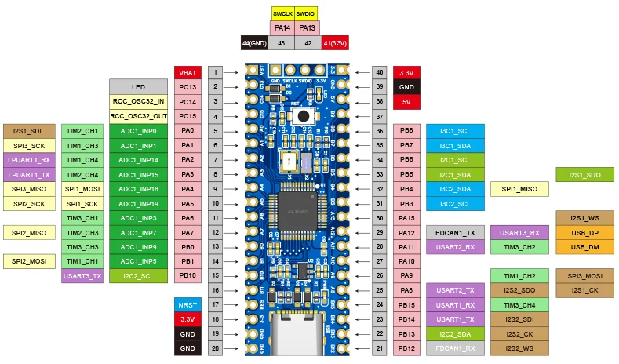

.. zephyr:board:: tq_h503a

Overview
********

The Embedsky TQ-H503A board is an extremely low cost and bare-bones development board featuring an ARM |reg| Cortex |reg|-M33 core-based
STM32H503CBT6 microcontroller, see `STM32H503CB website`_.
This is the 48-pin variant of the STM32H503x series,
see `STM32H503x reference manual`_.
Here are some highlights of the TQ-H503A board:

- STM32H503CB microcontroller with 128 Kbytes of Flash memory and 32 Kbytes of
  SRAM in LQFP48 package

- One user LED
- 32.768 kHz crystal oscillator
- 8 MHz HSE crystal oscillator

Hardware
********

The STM32H503CB belongs to the high-performance microcontroller family
(STM32H5 series) based on the high-performance Arm |reg| Cortex |reg|-M33 32-bit
RISC core. They operate at frequency of up to 250 MHz.

- Core: Arm |reg| Cortex |reg|-M33 CPU with FPU, MPU, 375 DMIPS (Dhrystone 2.1),
  and DSP instructions
- ART Accelerator

- Memories

  - 128 Kbytes of embedded flash memory with ECC, two banks of read-while-write
  - 2-Kbyte OTP (one-time programmable)
  - 32-Kbyte SRAM with ECC
  - 2 Kbytes of backup SRAM (available in the lowest power modes)

- Clock management

  - Internal oscillators: 64 MHz HSI, 48 MHz HSI48, 4 MHz CSI, 32 kHz LSI
  - Two PLLs for system clock, USB, audio, and ADC
  - External oscillators: 4 to 50 MHz HSE, 32.768 kHz LSE

- Embedded regulator (LDO)
- 35 fast I/Os (most 5 V tolerant)

- Analog peripherals

  - 1x 12-bit ADC with up to 2.5 MSPS
  - 1x 12-bit dual-channel DAC
  - 1x ultra-low-power comparator
  - 1x operational amplifier (7 MHz bandwidth)

- 1x Digital temperature sensor

- 11 timers
  - 4x 16-bit
  - 1x 32-bit
  - 2x 16-bit low-power 16-bit timers (available in Stop mode)
  - 2x watchdogs
  - 1x SysTick timer
  - RTC with HW calendar, alarms and calibration

- 16x communication interfaces

  - 2x I2Cs FM + interfaces (SMBus/PMBus |reg|)
  - 2x I3Cs shared with I2C
  - 3x USARTs (ISO7816 interface, LIN, IrDA, modem control)
  - 1x LPUART
  - 3x SPIs including three muxed with full-duplex I2S
  - 3x additional SPI from 3x USART when configured in synchronous mode
  - 1x FDCAN
  - 1x USB 2.0 full-speed host and device

- Two DMA controllers to offload the CPU

- Security

  - HASH (SHA-1, SHA-2), HMAC
  - True random generator
  - 96-bit unique ID
  - Active tamper

- Development support: serial wire debug (SWD) and JTAG interfaces

Supported Features
==================

.. zephyr:board-supported-hw::

Pin Mapping
===========

Available pins:
---------------

Default Zephyr Peripheral Mapping:
----------------------------------

- UART_1 TX/RX : PB14/PB15
- USER_LED : PC13
- I2C1 SCL/SDA : PB6/PB5
- SPI1 SCK/MISO/MOSI : PA5/PB4/PA4 (Routed to footprint for external flash)

Clock Sources
-------------

The board has two external oscillators. The slow clock (LSE) runs at 32.768 kHz. The main clock (HSE) runs at 8 MHz.

By default, the system clock is sourced from the PLL, derived from HSE and set to 250 MHz.

Programming and Debugging
*************************

.. zephyr:board-supported-runners::

Applications for the ``tq_h503a`` board can be built and
flashed in the usual way (see :ref:`build_an_application` and
:ref:`application_run` for more details).

OpenOCD Support
===============

Currently, upstream OpenOCD does not yet support STM32H5 devices. You can check the `OpenOCD official Github mirror`_ for updates.
To use OpenOCD with this board, clone the customized `STMicroelectronics OpenOCD Github`_ repo and build it following the README.
Once compiled, set the and OPENOCD_ROOT variables in
:zephyr_file:`boards/embedsky/tq_h503a/board.cmake` to point to the OpenOCD binary and its scripts,  before
including the common openocd.board.cmake file:

.. code-block:: none

   set(OPENOCD_ROOT "<path_to_openocd_stm32_repo>")
   set(OPENOCD "${OPENOCD_ROOT}/src/openocd" CACHE FILEPATH "" FORCE)
   set(OPENOCD_DEFAULT_PATH ${OPENOCD_ROOT}/tcl)

Flashing
========

The board is configured for flashing using west openocd runner via ST-LINK:

.. code-block:: console

   $ west flash

Flashing an application to TQ-H503A
----------------------------------------

Attach an SWD debugger (ST-LINK) to the 3V3 (3.3V), GND, SCK, and DIO
pins on the board.

Connect the debugger to your host via USB, then build and flash your application. For example, to flash the :zephyr:code-sample:`hello_world` application.

Start a serial host program to connect to the debugger's VCP:

.. code-block:: console

   $ minicom -D /dev/ttyACM0

Then build and flash the app:

.. zephyr-app-commands::
   :zephyr-app: samples/hello_world
   :board: tq_h503a
   :goals: build flash

You should see the following message on the console:

.. code-block:: console

   Hello World! tq_h503a/stm32h503xx

Debugging
=========

You can debug applications in the usual way. Here is an example for the
:zephyr:code-sample:`blinky` application.

.. zephyr-app-commands::
   :zephyr-app: samples/basic/blinky
   :board: tq_h503a
   :goals: debug

References
**********

.. target-notes::

.. _STM32H503CB website:
   https://www.st.com/en/microcontrollers/stm32h503cb.html

.. _STM32H503x reference manual:
   https://www.st.com/resource/en/reference_manual/rm0492-stm32h503-line-armbased-32bit-mcus-stmicroelectronics.pdf

.. _OpenOCD official Github mirror:
   https://github.com/openocd-org/openocd/

.. _STMicroelectronics OpenOCD Github:
   https://github.com/STMicroelectronics/OpenOCD/tree/openocd-cubeide-r6
