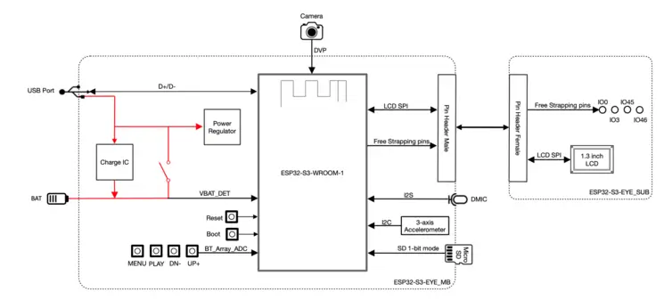
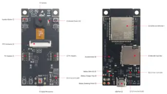
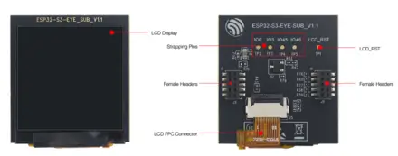

.. zephyr:board:: esp32s3_eye

Overview
********

The ESP32-S3-EYE is a small-sized AI development board produced by [Espressif](https://espressif.com).
It is based on the [ESP32-S3](https://www.espressif.com/en/products/socs/esp32-s3) SoC.
It features a 2-Megapixel camera, an LCD display, and a microphone, which are used for image
recognition and audio processing. ESP32-S3-EYE offers plenty of storage, with an 8 MB Octal PSRAM
and a 8 MB flash.

Hardware
********

The ESP32-S3-EYE board consists of two parts: the main board (ESP32-S3-EYE-MB) that integrates the
ESP32-S3-WROOM-1 module, camera, SD card slot, digital microphone, USB port, and function buttons;
and the sub board (ESP32-S3-EYE-SUB) that contains an LCD display.
The main board and sub board are connected through pin headers.

Block Diagram
-------------

The block diagram below presents main components of the ESP32-S3-EYE-MB main board (on the left)
and the ESP32-S3-EYE-SUB sub board (on the right), as well as the interconnections between
components.

Components on the ESP32-S3-EYE-MB Main Board
--------------------------------------------

.. list-table:: Key Components MB
   :header-rows: 1

   * - No.
     - Key Component
     - Description
   * - 1
     - Camera
     - The camera OV2640 with 2 million pixels has a 66.5° field of view and a maximum resolution of 1600x1200. You can change the resolution when developing applications.
   * - 2
     - Module Power LED
     - The LED (green) turns on when USB power is connected to the board. If it is not turned on, it indicates either the USB power is not supplied, or the 5 V to 3.3 V LDO is broken. Software can configure GPIO3 to set different LED statuses (turned on/off, flashing) for different statuses of the board. Note that GPIO3 must be set up in open-drain mode. Pulling GPIO3 up may burn the LED.
   * - 3
     - Pin Headers
     - Connect the female headers on the sub board.
   * - 4
     - 5 V to 3.3 V LDO
     - Power regulator that converts a 5 V supply into a 3.3 V output for the module.
   * - 5
     - Digital Microphone
     - The digital I2S MEMS microphone features 61 dB SNR and –26 dBFS sensitivity, working at 3.3 V.
   * - 6
     - FPC Connector
     - Connects the main board and the sub board.
   * - 7
     - Function Button
     - There are six function buttons on the board. Users can configure any functions as needed except for the RST button.
   * - 8
     - ESP32-S3-WROOM-1
     - The ESP32-S3-WROOM-1 module embeds the ESP32-S3R8 chip variant that provides Wi-Fi and Bluetooth 5 (LE) connectivity, as well as dedicated vector instructions for accelerating neural network computing and signal processing. On top of the integrated 8 MB Octal SPI PSRAM offered by the SoC, the module also comes with 8 MB flash, allowing for fast data access. ESP32-S3-WROOM-1U module is also supported.
   * - 9
     - MicroSD Card Slot
     - Used for inserting a MicroSD card to expand memory capacity.
   * - 10
     - 3.3 V to 1.5 V LDO
     - Power regulator that converts a 3.3 V supply into a 1.5 V output for the camera.
   * - 11
     - 3.3 V to 2.8 V LDO
     - Power regulator that converts a 3.3 V supply into a 2.8 V output for the camera.
   * - 12
     - USB Port
     - A Micro-USB port used for 5 V power supply to the board, as well as for communication with the chip via GPIO19 and GPIO20.
   * - 13
     - Battery Soldering Points
     - Used for soldering a battery socket to connect an external Li-ion battery that can serve as an alternative power supply to the board. If you use an external battery, make sure it has built-in protection circuit and fuse. The recommended specifications of the battery: capacity > 1000 mAh, output voltage 3.7 V, input voltage 4.2 V – 5 V.
   * - 14
     - Battery Charger Chip
     - 1 A linear Li-ion battery charger (ME4054BM5G-N) in ThinSOT package. The power source for charging is the **USB Port**.
   * - 15
     - Battery Red LED
     - When the USB power is connected to the board and a battery is not connected, the red LED blinks. If a battery is connected and being charged, the red LED turns on. When the battery is fully charged, it turns off.
   * - 16
     - Accelerometer
     - Three-axis accelerometer (QMA7981) for screen rotation, etc.

Components on the ESP32-S3-EYE-SUB Sub Board
--------------------------------------------

.. list-table:: Key Components SUB
   :header-rows: 1

   * - Key Component
     - Description
   * - LCD Display
     - 1.3” LCD display, connected to ESP32-S3 over the SPI bus.
   * - Strapping Pins
     - Four strapping pins led out from the main board. They can be used as testing points.
   * - Female Headers
     - Used for mounting onto the pin headers on the main board.
   * - LCD FPC Connector
     - Connects the sub board and the LCD display.
   * - LCD_RST
     - LCD_RST testing point. You can use it to reset the LCD display with control signals.

Prerequisites
*************

Espressif HAL requires WiFi and Bluetooth binary blobs in order work. Run the command
below to retrieve those files.

.. code-block:: console

   west blobs fetch hal_espressif

.. note::

   It is recommended running the command above after :file:`west update`.

Building & Flashing
*******************

Simple boot
-----------

The board could be loaded using the single binary image, without 2nd stage bootloader.
It is the default option when building the application without additional configuration.

.. note::

   Simple boot does not provide any security features nor OTA updates.

MCUboot bootloader
------------------

User may choose to use MCUboot bootloader instead. In that case the bootloader
must be built (and flashed) at least once.

There are two options to be used when building an application:

1. Sysbuild
2. Manual build

.. note::

   User can select the MCUboot bootloader by adding the following line
   to the board default configuration file.

   .. code:: cfg

      CONFIG_BOOTLOADER_MCUBOOT=y

Sysbuild
--------

The sysbuild makes possible to build and flash all necessary images needed to
bootstrap the board with the ESP32 SoC.

To build the sample application using sysbuild use the command:

.. zephyr-app-commands::
   :tool: west
   :zephyr-app: samples/hello_world
   :board: esp32s3_eye/esp32s3/procpu
   :goals: build
   :west-args: --sysbuild
   :compact:

By default, the ESP32 sysbuild creates bootloader (MCUboot) and application
images. But it can be configured to create other kind of images.

Build directory structure created by sysbuild is different from traditional
Zephyr build. Output is structured by the domain subdirectories:

.. code-block::

  build/
  ├── hello_world
  │   └── zephyr
  │       ├── zephyr.elf
  │       └── zephyr.bin
  ├── mcuboot
  │    └── zephyr
  │       ├── zephyr.elf
  │       └── zephyr.bin
  └── domains.yaml

.. note::

   With ``--sysbuild`` option the bootloader will be re-build and re-flash
   every time the pristine build is used.

For more information about the system build please read the :ref:`sysbuild` documentation.

Manual build
------------

During the development cycle, it is intended to build & flash as quickly possible.
For that reason, images can be built one at a time using traditional build.

The instructions following are relevant for both manual build and sysbuild.
The only difference is the structure of the build directory.

.. note::

   Remember that bootloader (MCUboot) needs to be flash at least once.

Build and flash applications as usual (see :ref:`build_an_application` and
:ref:`application_run` for more details).

.. zephyr-app-commands::
   :zephyr-app: samples/hello_world
   :board: esp32s3_eye/esp32s3/procpu
   :goals: build

The usual ``flash`` target will work with the ``esp32s3_eye/esp32s3/procpu`` board
configuration. Here is an example for the :zephyr:code-sample:`hello_world`
application.

.. zephyr-app-commands::
   :zephyr-app: samples/hello_world
   :board: esp32s3_eye/esp32s3/procpu
   :goals: flash

Open the serial monitor using the following command:

.. code-block:: shell

   west espressif monitor

After the board has automatically reset and booted, you should see the following
message in the monitor:

.. code-block:: console

   ***** Booting Zephyr OS vx.x.x-xxx-gxxxxxxxxxxxx *****
   Hello World! esp32s3_eye/esp32s3/procpu

Debugging
*********

ESP32-S3 modules require patches to OpenOCD that are not upstreamed yet.
Espressif maintains their own fork of the project. The custom OpenOCD can be obtained at
`OpenOCD ESP32`_

The Zephyr SDK uses a bundled version of OpenOCD by default.
You can overwrite that behavior by adding the
``-DOPENOCD=<path/to/bin/openocd> -DOPENOCD_DEFAULT_PATH=<path/to/openocd/share/openocd/scripts>``
parameter when building.

Here is an example for building the :zephyr:code-sample:`hello_world` application.

.. zephyr-app-commands::
   :zephyr-app: samples/hello_world
   :board: esp32s3_eye/esp32s3/procpu
   :goals: build flash
   :gen-args: -DOPENOCD=<path/to/bin/openocd> -DOPENOCD_DEFAULT_PATH=<path/to/openocd/share/openocd/scripts>

You can debug an application in the usual way. Here is an example for the :zephyr:code-sample:`hello_world`
application.

.. zephyr-app-commands::
   :zephyr-app: samples/hello_world
   :board: esp32s3_eye/esp32s3/procpu
   :goals: debug

.. _`OpenOCD ESP32`: https://github.com/espressif/openocd-esp32/releases
