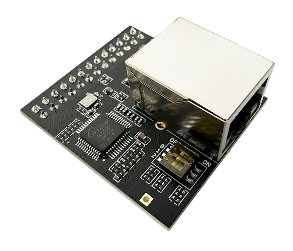

.. zephyr:board:: esp_threadbr

Overview
********

The ESP Thread Border Router / ZigBee Gateway is a developer platform for
building Thread border router and ZigBee gateway applications.
It bridges 802.15.4 mesh networks with IP networks via Wi-Fi or Ethernet.

ESP32-S3 is used as the host SoC, and it provides the Wi-Fi backbone link.
The ``esp_threadbr/esp32s3/procpu/ethernet`` board target enables an
Ethernet backbone link through the on-board expansion header.

The board has an on-board IEEE 802.15.4 capable ESP32-H2 SoC used as a radio
co-processor (RCP). It provides the 802.15.4 PHY and MAC for Thread/ZigBee.
The host ESP32-S3 talks to the RCP over a UART or SPI interface.

Board design allows radio coexistence using Packet Traffic Arbitration (PTA).
It uses dedicated GPIO signals between both SoCs to coordinate radio access
when multiple wireless technologies share the same RF band.

For more information on hardware setup and software architecture, see the
`ESP Thread BR Zigbee GW Guide`_ and the `GitHub repository`_.

Hardware
********

The Wi-Fi based ESP Thread Border Router consists of two SoCs:

* The host Wi-Fi SoC, ESP32-S3.
* The radio co-processor (RCP), which is an ESP32-H2 series SoC.
  The RCP enables the Border Router to access the 802.15.4 physical and MAC layer.

.. note::
   The RCP runs its own firmware, usually based on ESP-IDF.
   This Zephyr board target is for the host, not the RCP.

.. include:: ../../common/soc-esp32s3-features.rst
   :start-after: espressif-soc-esp32s3-features

Expansion Header
================

The board exposes a 2x13 sub-board connector (J4) for expansion modules such as
the Ethernet (W5500) sub-board::

   Conn J4 (2x13)
   ==========================
   Signal    Pin    Signal
   --------------------------
    (GND)   1   2   (GND)
     (5V)   3   4   (3V3)
   GPIO15   5   6   GPIO16
   GPIO03   7   8   GPIO46
   GPIO09   9   10  GPIO14
   GPIO21  11   12  GPIO47
   GPIO48  13   14  GPIO45
   GPIO35  15   16  GPIO36
   GPIO37  17   18  GPIO38
   GPIO39  19   20  GPIO40
   GPIO41  21   22  GPIO42
    U0_RX  23   24  U0_TX
   GPIO02  25   26  GPIO01

``spi2`` and ``i2c0`` are routed to this connector.

Supported Features
==================

.. zephyr:board-supported-hw::

System Requirements
*******************

.. include:: ../../common/system-requirements.rst
   :start-after: espressif-system-requirements

Programming and Debugging
*************************

.. zephyr:board-supported-runners::

.. include:: ../../common/building-flashing.rst
   :start-after: espressif-building-flashing

.. include:: ../../common/board-variants.rst
   :start-after: espressif-board-variants

.. _esp_threadbr_ethernet:

Ethernet
========

   ESP Thread BR / Zigbee GW Ethernet sub-board

Build for the ``esp_threadbr/esp32s3/procpu/ethernet`` board target to enable
the `W5500`_ standalone 10/100 Mbps Ethernet controller with on-board MAC &
PHY, 32 KB of internal TX/RX buffer memory and SPI serial interface, which is
provided by the ESP Thread BR Ethernet sub-board connected to the expansion
header.

For example:

.. zephyr-app-commands::
   :zephyr-app: samples/net/dhcpv4_client
   :board: esp_threadbr/esp32s3/procpu/ethernet
   :goals: build

Debugging
=========

.. include:: ../../common/openocd-debugging.rst
   :start-after: espressif-openocd-debugging

References
**********

.. target-notes::

.. _`ESP Thread BR Zigbee GW Guide`: https://docs.espressif.com/projects/esp-thread-br/en/latest/hardware_platforms.html
.. _`GitHub repository`: https://github.com/espressif/esp-thread-br
.. _W5500: https://wiznet.io/products/iethernet-chips/w5500
