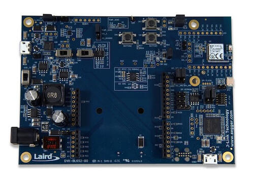
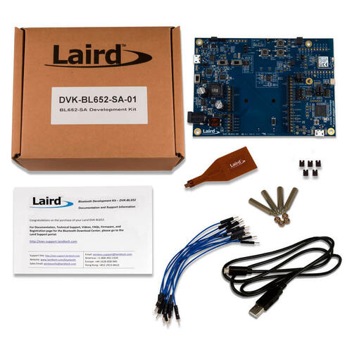

.. _bl652_dvk:

Ezurio BL652 DVK
################

Overview
********

The BL652 Development Kit hardware provides
support for the Ezurio BL652 module powered by a Nordic Semiconductor nRF52832 ARM Cortex-M4F CPU.

This development kit has the following features:

* :abbr:`ADC (Analog to Digital Converter)`
* CLOCK
* FLASH
* :abbr:`GPIO (General Purpose Input Output)`
* :abbr:`I2C (Inter-Integrated Circuit)`
* :abbr:`MPU (Memory Protection Unit)`
* :abbr:`NVIC (Nested Vectored Interrupt Controller)`
* :abbr:`PWM (Pulse Width Modulation)`
* RADIO (Bluetooth Low Energy)
* :abbr:`RTC (nRF RTC System Clock)`
* Segger RTT (RTT Console)
* :abbr:`SPI (Serial Peripheral Interface)`
* :abbr:`UART (Universal asynchronous receiver-transmitter)`
* :abbr:`WDT (Watchdog Timer)`

Available BL652 DVK part numbers:

* DVK-BL652-SA
* DVK-BL652-SC

     BL652 DVK Board

     BL652-SA DVK Box Contents

More information about the board can be found at the
`BL652 Module Website`_.

Hardware
********

Supported Features
==================

The BL652 DVK board configuration supports the following
hardware features:

+-----------+------------+----------------------+
| Interface | Controller | Driver/Component     |
+===========+============+======================+
| ADC       | on-chip    | adc                  |
+-----------+------------+----------------------+
| CLOCK     | on-chip    | clock_control        |
+-----------+------------+----------------------+
| FLASH     | on-chip    | flash                |
+-----------+------------+----------------------+
| GPIO      | on-chip    | gpio                 |
+-----------+------------+----------------------+
| I2C(M)    | on-chip    | i2c                  |
+-----------+------------+----------------------+
| MPU       | on-chip    | arch/arm             |
+-----------+------------+----------------------+
| NVIC      | on-chip    | arch/arm             |
+-----------+------------+----------------------+
| PWM       | on-chip    | pwm                  |
+-----------+------------+----------------------+
| RADIO     | on-chip    | Bluetooth            |
+-----------+------------+----------------------+
| RTC       | on-chip    | system clock         |
+-----------+------------+----------------------+
| RTT       | Segger     | console              |
+-----------+------------+----------------------+
| SPI(M/S)  | on-chip    | spi                  |
+-----------+------------+----------------------+
| UART      | on-chip    | serial               |
+-----------+------------+----------------------+
| WDT       | on-chip    | watchdog             |
+-----------+------------+----------------------+

Other hardware features have not been enabled yet for this board.
See `BL652 Module Website`_.

Connections and IOs
===================

LED
---

* LED1 (blue) = P0.17
* LED2 (blue) = P0.19

Push buttons
------------

* BUTTON1 = SW1 = P0.11
* BUTTON2 = SW2 = P0.15
* Reset = SW3 = boot/reset

External Connectors
-------------------

Arduino Headers
---------------

J33/J23 Power

+-------+--------------+-------------------------+
| PIN # | Signal Name  | NRF52832 Functions      |
+=======+==============+=========================+
| 1     | NC           | N/A                     |
+-------+--------------+-------------------------+
| 2     | IOREF (3v3)  | N/A                     |
+-------+--------------+-------------------------+
| 3     | RESET        | P0.21 / RESET           |
+-------+--------------+-------------------------+
| 4     | 3v3          | N/A                     |
+-------+--------------+-------------------------+
| 5     | 5V           | N/A                     |
+-------+--------------+-------------------------+
| 6     | GND          | N/A                     |
+-------+--------------+-------------------------+
| 7     | GND          | N/A                     |
+-------+--------------+-------------------------+
| 8     | VIN (12V)    | N/A                     |
+-------+--------------+-------------------------+

J31/J16 Analog in

+-------+--------------+-------------------------+
| PIN # | Signal Name  | NRF52832 Functions      |
+=======+==============+=========================+
| 1     | A0           | P0.03 / AIN1            |
+-------+--------------+-------------------------+
| 2     | A1           | P0.04 / AIN2            |
+-------+--------------+-------------------------+
| 3     | A2           | P0.28 / AIN4            |
+-------+--------------+-------------------------+
| 4     | A3           | P0.29 / AIN5            |
+-------+--------------+-------------------------+
| 5     | A4           | P0.30 / AIN6            |
+-------+--------------+-------------------------+
| 6     | A5           | P0.31 / AIN7            |
+-------+--------------+-------------------------+

J30/J15 Digital I/O

+-------+--------------+-------------------------+
| PIN # | Signal Name  | NRF52832 Functions      |
+=======+==============+=========================+
| 1     | D0 (RX)      | P0.11                   |
+-------+--------------+-------------------------+
| 2     | D1 (TX)      | P0.12                   |
+-------+--------------+-------------------------+
| 3     | D2           | P0.13                   |
+-------+--------------+-------------------------+
| 4     | D3           | P0.14 / TRACEDATA[3]    |
+-------+--------------+-------------------------+
| 5     | D4           | P0.15 / TRACEDATA[2]    |
+-------+--------------+-------------------------+
| 6     | D5           | P0.16 / TRACEDATA[1]    |
+-------+--------------+-------------------------+
| 7     | D6           | P0.17                   |
+-------+--------------+-------------------------+
| 8     | D7           | P0.18 / TRACEDATA[3]  / |
|       |              | SWO                     |
+-------+--------------+-------------------------+

J32/J22 Digital I/O

+-------+--------------+-------------------------+
| PIN # | Signal Name  | NRF52832 Functions      |
+=======+==============+=========================+
| 1     | D8           | P0.19                   |
+-------+--------------+-------------------------+
| 2     | D9           | P0.20 / TRACECLK        |
+-------+--------------+-------------------------+
| 3     | D10 (SS)     | P0.22                   |
+-------+--------------+-------------------------+
| 4     | D11 (MOSI)   | P0.23                   |
+-------+--------------+-------------------------+
| 5     | D12 (MISO)   | P0.24                   |
+-------+--------------+-------------------------+
| 6     | D13 (SCK)    | P0.25                   |
+-------+--------------+-------------------------+
| 7     | GND          | N/A                     |
+-------+--------------+-------------------------+
| 8     | AREF         | P0.02 / AIN0            |
+-------+--------------+-------------------------+
| 9     | SDA          | P0.26                   |
+-------+--------------+-------------------------+
| 10    | SCL          | P0.27                   |
+-------+--------------+-------------------------+

Programming and Debugging
*************************

Flashing
========

Follow the instructions in the :ref:`nordic_segger` page to install
and configure all the necessary software. Further information can be
found in :ref:`nordic_segger_flashing`. Then build and flash
applications as usual (see :ref:`build_an_application` and
:ref:`application_run` for more details).

Here is an example for the :zephyr:code-sample:`hello_world` application.

First, run your favorite terminal program to listen for output.

NOTE: On the BL652 DVK, the FTDI USB should be used to access the UART console.

.. code-block:: console

   $ minicom -D <tty_device> -b 115200

Replace :code:`<tty_device>` with the port where the BL652 DVK
can be found. For example, under Linux, :code:`/dev/ttyUSB0`.

Then build and flash the application in the usual way.

.. zephyr-app-commands::
   :zephyr-app: samples/hello_world
   :board: bl652_dvk
   :goals: build flash

Debugging
=========

Refer to the :ref:`nordic_segger` page to learn about debugging Nordic based boards with a
Segger IC.

Testing Bluetooth on the BL652 DVK
**********************************
Many of the Bluetooth examples will work on the BL652 DVK.
Try them out:

* :zephyr:code-sample:`ble_peripheral`
* :zephyr:code-sample:`bluetooth_eddystone`
* :zephyr:code-sample:`bluetooth_ibeacon`

Testing the LEDs and buttons in the BL652 DVK
*********************************************

There are 2 samples that allow you to test that the buttons (switches) and LEDs on
the board are working properly with Zephyr:

* :zephyr:code-sample:`blinky`
* :zephyr:code-sample:`button`

You can build and flash the examples to make sure Zephyr is running correctly on
your board. The button and LED definitions can be found in
:zephyr_file:`boards/ezurio/bl652_dvk/bl652_dvk.dts`.

References
**********

.. target-notes::

.. _BL652 Module Website: https://ezurio.com/wireless-modules/bluetooth-modules/bluetooth-5-modules/bl652-series-bluetooth-v5-nfc
