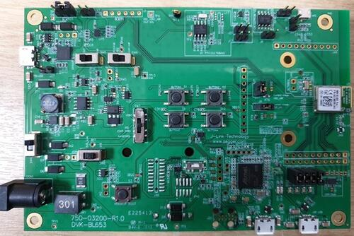

.. _bl653_dvk:

Ezurio BL653 DVK
################

Overview
********

The BL653 Development Kit (453-00039-K1, 453-00041-K1) hardware provides
support for the Ezurio BL653 module powered by a Nordic Semiconductor nRF52833 ARM Cortex-M4F CPU.

This development kit has the following features:

* :abbr:`ADC (Analog to Digital Converter)`
* CLOCK
* FLASH
* :abbr:`GPIO (General Purpose Input Output)`
* :abbr:`I2C (Inter-Integrated Circuit)`
* :abbr:`MPU (Memory Protection Unit)`
* :abbr:`NVIC (Nested Vectored Interrupt Controller)`
* :abbr:`PWM (Pulse Width Modulation)`
* RADIO (Bluetooth Low Energy and 802.15.4)
* :abbr:`RTC (nRF RTC System Clock)`
* Segger RTT (RTT Console)
* :abbr:`SPI (Serial Peripheral Interface)`
* :abbr:`UART (Universal Asynchronous Receiver-Transmitter)`
* :abbr:`USB (Universal Serial Bus)`
* :abbr:`WDT (Watchdog Timer)`

     BL653 Development Kit Board

More information about the board can be found at the
`BL653 website`_.

Hardware
********

Supported Features
==================

The BL653 DVK board configuration supports the following
hardware features:

+-----------+------------+----------------------+
| Interface | Controller | Driver/Component     |
+===========+============+======================+
| ADC       | on-chip    | adc                  |
+-----------+------------+----------------------+
| CLOCK     | on-chip    | clock_control        |
+-----------+------------+----------------------+
| FLASH     | on-chip    | flash                |
+-----------+------------+----------------------+
| GPIO      | on-chip    | gpio                 |
+-----------+------------+----------------------+
| I2C(M)    | on-chip    | i2c                  |
+-----------+------------+----------------------+
| MPU       | on-chip    | arch/arm             |
+-----------+------------+----------------------+
| NVIC      | on-chip    | arch/arm             |
+-----------+------------+----------------------+
| PWM       | on-chip    | pwm                  |
+-----------+------------+----------------------+
| RADIO     | on-chip    | Bluetooth,           |
|           |            | ieee802154           |
+-----------+------------+----------------------+
| RTC       | on-chip    | system clock         |
+-----------+------------+----------------------+
| RTT       | Segger     | console              |
+-----------+------------+----------------------+
| SPI(M/S)  | on-chip    | spi                  |
+-----------+------------+----------------------+
| UART      | on-chip    | serial               |
+-----------+------------+----------------------+
| USB       | on-chip    | usb                  |
+-----------+------------+----------------------+
| WDT       | on-chip    | watchdog             |
+-----------+------------+----------------------+

Other hardware features have not been enabled yet for this board.
See `BL653 website`_
for a complete list of BL653 Development Kit board hardware features.

Connections and IOs
===================

LED
---

* LED1 (blue) = P0.13
* LED2 (blue) = P0.14
* LED3 (blue) = P0.15
* LED4 (blue) = P0.16

Push buttons
------------

* BUTTON1 = SW1 = P0.11
* BUTTON2 = SW2 = P0.12
* BUTTON3 = SW9 = P0.24
* BUTTON4 = SW10 = P0.25
* RESET = SW3 = nReset/IF BOOT

Programming and Debugging
*************************

Applications for the ``bl653_dvk`` board configuration can be built, flashed,
and debugged in the usual way. See :ref:`build_an_application` and
:ref:`application_run` for more details on building and running.

Flashing
========

Follow the instructions in the :ref:`nordic_segger` page to install
and configure all the necessary software. Further information can be
found in :ref:`nordic_segger_flashing`. Then build and flash
applications as usual (see :ref:`build_an_application` and
:ref:`application_run` for more details).

Here is an example for the :ref:`hello_world` application.

First, run your favorite terminal program to listen for output.

NOTE: On the BL653 development board, the FTDI USB should be used to access the UART console.

.. code-block:: console

   $ minicom -D <tty_device> -b 115200

Replace :code:`<tty_device>` with the port where the BL653 development kit
can be found. For example, under Linux, :code:`/dev/ttyUSB0`.

Then build and flash the application in the usual way.

.. zephyr-app-commands::
   :zephyr-app: samples/hello_world
   :board: bl653_dvk
   :goals: build flash

Debugging
=========

Refer to the :ref:`nordic_segger` page to learn about debugging Nordic based boards with a
Segger IC.

Testing Bluetooth on the BL653 DVK
***********************************
Many of the Bluetooth examples will work on the BL653 DVK.
Try them out:

* :ref:`ble_peripheral`
* :ref:`bluetooth-eddystone-sample`
* :ref:`bluetooth-ibeacon-sample`

Testing the LEDs and buttons on the BL653 DVK
************************************************

There are 2 samples that allow you to test that the buttons (switches) and LEDs on
the board are working properly with Zephyr:

* :zephyr:code-sample:`blinky`
* :zephyr:code-sample:`button`

You can build and flash the examples to make sure Zephyr is running correctly on
your board. The button and LED definitions can be found in
:zephyr_file:`boards/ezurio/bl653_dvk/bl653_dvk.dts`.

Using UART1
***********

The following approach can be used when an application needs to use
more than one UART for connecting peripheral devices:

1. Add devicetree overlay file to the main directory of your application:

   .. code-block:: devicetree

      &pinctrl {
         uart1_default: uart1_default {
            group1 {
               psels = <NRF_PSEL(UART_TX, 0, 14)>,
                       <NRF_PSEL(UART_RX, 0, 16)>;
            };
         };
         /* required if CONFIG_PM_DEVICE=y */
         uart1_sleep: uart1_sleep {
            group1 {
               psels = <NRF_PSEL(UART_TX, 0, 14)>,
                       <NRF_PSEL(UART_RX, 0, 16)>;
               low-power-enable;
            };
         };
      };

      &uart1 {
        compatible = "nordic,nrf-uarte";
        current-speed = <115200>;
        status = "okay";
        pinctrl-0 = <&uart1_default>;
        pinctrl-1 = <&uart1_sleep>;
        pinctrl-names = "default", "sleep";
      };

   In the overlay file above, pin P0.16 is used for RX and P0.14 is used for TX

2. Use the UART1 as ``DEVICE_DT_GET(DT_NODELABEL(uart1))``

See :ref:`set-devicetree-overlays` for further details.

Selecting the pins
==================

Pins can be configured in the board pinctrl file. To see the available mappings,
open the `nRF52833 Product Specification`_, chapter 7 'Hardware and Layout'.
In the table 7.1.1 'aQFN73 ball assignments' select the pins marked
'General purpose I/O'.  Note that pins marked as 'low frequency I/O only' can only be used
in under-10KHz applications. They are not suitable for 115200 speed of UART.

References
**********

.. target-notes::

.. _BL653 website: https://www.ezurio.com/wireless-modules/bluetooth-modules/bluetooth-5-modules/bl653-series-bluetooth-51-802154-nfc-module
.. _nRF52833 Product Specification: https://infocenter.nordicsemi.com/pdf/nRF52833_OPS_v0.7.pdf
