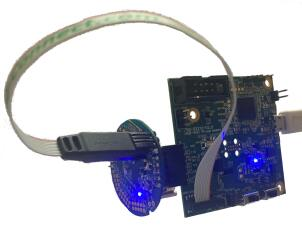

.. zephyr:board:: bl654_sensor_board

Overview
********

The BL654 Sensor Board hardware provides support for the Ezurio
BL654 module which is powered by a Nordic Semiconductor nRF52840 ARM
Cortex-M4F CPU.

This sensor board has the following features:

* :abbr:`ADC (Analog to Digital Converter)`
* CLOCK
* FLASH
* :abbr:`GPIO (General Purpose Input Output)`
* :abbr:`I2C (Inter-Integrated Circuit)`
* :abbr:`MPU (Memory Protection Unit)`
* :abbr:`NVIC (Nested Vectored Interrupt Controller)`
* :abbr:`PWM (Pulse Width Modulation)`
* RADIO (Bluetooth Low Energy and 802.15.4)
* :abbr:`RTC (nRF RTC System Clock)`
* Segger RTT (RTT Console)
* :abbr:`SPI (Serial Peripheral Interface)`
* :abbr:`UART (Universal asynchronous receiver-transmitter)`
* :abbr:`WDT (Watchdog Timer)`

     BL654 Sensor Board connected to USB-SWD Programmer (UART and SWD access)

More information about the BL654 module can be found on the `BL654 website`_,
more information about the USB-SWD Programmer can be found on the
`USB-SWD Programmer website`_.

Hardware
********

Supported Features
==================

.. zephyr:board-supported-hw::

Connections and IOs
===================

LED
---

* LED1 (blue) = P0.16 (active low)

Push button
-----------

* BUTTON1 (SW1) = P1.03 (active high)

Sensor
------

The BL654 Sensor Board has an on-board Bosch BME280
temperature/humidity/pressure sensor which is connected to the BL654 via I2C.

* SCL = P0.27
* SDA = P0.26

More information about the Bosch BME280 sensor can be found on the
`Bosch BME280 sensor website`_.

Powering the sensor
*******************

The sensor can be powered directly from a coin cell or from a voltage supplied
on the UART pins, the board accepts voltage from 1.8v-3.3v. Note that if using a
battery with a UART/debugger connected, the voltage of the UART/debugger (if it
does not automatically sense/adjust) must be within 0.3v of the voltage of the
coin cell to prevent suppression diodes in the nRF52840 silicon being activated
or possible back-powering of the battery.

To power the board from an external source via UART, the solder bridge SB1 must
be blobbed.

Programming and Debugging
*************************

.. zephyr:board-supported-runners::

Applications for the ``bl654_sensor_board`` board configuration can be built,
flashed, and debugged in the usual way. See :ref:`build_an_application` and
:ref:`application_run` for more details on building and running. An external
debugger/programmer is required which can be connected to using a Tag-Connect
TC2030-CTX cable, a Ezurio USB-SWD Programmer board or Segger JLink
programmer can be used to program and debug the BL654 sensor board.

Flashing
========

If using an external JLink, follow the instructions in the :ref:`nordic_segger`
page to install and configure all the necessary software. Further information
can be found in :ref:`nordic_segger_flashing`. Then build and flash applications
as usual (see :ref:`build_an_application` and :ref:`application_run` for more
details). If using a Ezurio USB-SWD Programmer Board, see the
`pyOCD website`_ to find details about the software and how to install it.

Here is an example for the :zephyr:code-sample:`hello_world` application.

First, run your favorite terminal program to listen for output - note that an
external UART is required to be connected to the BL654 sensor board's UART, if
using the Ezurio USB-SWD Programmer Board, the BL654 sensor board
can be plugged in to the UART header. An FTDI cable can also be used - the
voltage of the I/O lines and power line must be between 1.8v and 3.3v, do not
connect an FTDI cable with a 5v power line to the BL654 sensor board.

J3 UART connector pinout (all pins referenced to operating voltage Vdd):

+---------+------+---------------------------------------------+-----------+
| Pin No. | Name | Description                                 | Direction |
+=========+======+=============================================+===========+
| 1       | GND  | GND                                         | (N/A)     |
+---------+------+---------------------------------------------+-----------+
| 2       | RTS  | UART Ready-to-send pin                      | OUT       |
+---------+------+---------------------------------------------+-----------+
| 3       | VDD  | Supply voltage (requires SB1 to be blobbed) | (N/A)     |
+---------+------+---------------------------------------------+-----------+
| 4       | RXD  | UART Receive pin                            | IN        |
+---------+------+---------------------------------------------+-----------+
| 5       | TXD  | UART Transmit pin                           | (N/A)     |
+---------+------+---------------------------------------------+-----------+
| 6       | CTS  | UART Clear-to-send pin                      | IN        |
+---------+------+---------------------------------------------+-----------+

.. code-block:: console

   $ minicom -D <tty_device> -b 115200

Replace :code:`<tty_device>` with the port where the BL654 sensor board
can be found. For example, under Linux, :code:`/dev/ttyACM0`.

The BL654 sensor board needs an external programmer to program it, any SWD
programmer which has a 9-pin ARM debug port can be used with a Tag-Connect
TC2030-CTX cable. If using the Ezurio USB-SWD Programmer Board,
connect the cable to P1 and ensure the board is set to supply power to the
target at 3.3v.

J1 Tag-Connect SWD Pinout:

+---------+--------+-----------------------------------+-----------+
| Pin No. | Name   | Description                       | Direction |
+=========+========+===================================+===========+
| 1       | VDD    | Operating voltage                 | (N/A)     |
+---------+--------+-----------------------------------+-----------+
| 2       | SWDIO  | Serial wire data input/output pin | IN/OUT    |
+---------+--------+-----------------------------------+-----------+
| 3       | nRESET | Module reset pin                  | IN        |
+---------+--------+-----------------------------------+-----------+
| 4       | SWCLK  | Serial wire clock input pin       | IN        |
+---------+--------+-----------------------------------+-----------+
| 5       | GND    | GND                               | (N/A)     |
+---------+--------+-----------------------------------+-----------+
| 6       | SWO    | Serial wire output pin            | OUT       |
+---------+--------+-----------------------------------+-----------+

Then build and flash the application in the usual way.

.. zephyr-app-commands::
   :zephyr-app: samples/hello_world
   :board: bl654_sensor_board
   :goals: build flash

Debugging
=========

Refer to the :ref:`nordic_segger` page to learn about debugging Nordic based
boards if using an external JLink debugger. If using a Ezurio
USB-SWD Programmer Board, pyOCD can be used for debugging.

Testing Bluetooth on the BL654 Sensor Board
*******************************************
Many of the Bluetooth examples will work on the BL654 Sensor Board.
Try them out:

* :zephyr:code-sample:`ble_peripheral`
* :zephyr:code-sample:`bluetooth_eddystone`
* :zephyr:code-sample:`bluetooth_ibeacon`

Testing the LED and button on the BL654 Sensor Board
****************************************************

There are 2 samples that allow you to test that the button (switch) and LED on
the board are working properly with Zephyr:

* :zephyr:code-sample:`blinky`
* :zephyr:code-sample:`button`

You can build and flash the examples to make sure Zephyr is running correctly on
your board. The button and LED definitions can be found in
:zephyr_file:`boards/ezurio/bl654_sensor_board/bl654_sensor_board.dts`.

References
**********

.. target-notes::

.. _Bosch BME280 sensor website: https://www.bosch-sensortec.com/products/environmental-sensors/humidity-sensors-bme280/
.. _BL654 website: https://ezurio.com/wireless-modules/bluetooth-modules/bluetooth-5-modules/bl654-series
.. _pyOCD website: https://github.com/pyocd/pyOCD
.. _USB-SWD Programmer website: https://www.ezurio.com/usb-swd-programmer
