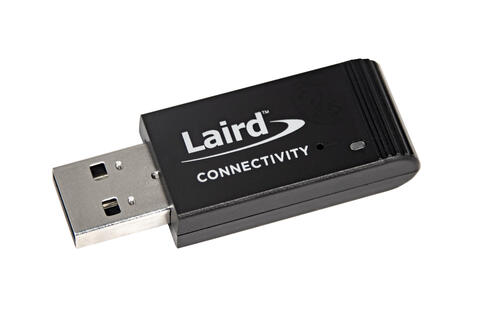

.. _bl654_usb:

Ezurio BL654 USB (451-00004)
############################

Overview
********

The BL654 USB adapter hardware (Ezurio part 451-00004) provides
support for the Ezurio BL654 module powered by a Nordic
Semiconductor nRF52840 ARM Cortex-M4F CPU.

This USB adapter has the following features:

* CLOCK
* FLASH
* :abbr:`GPIO (General Purpose Input Output)`
* :abbr:`MPU (Memory Protection Unit)`
* :abbr:`NVIC (Nested Vectored Interrupt Controller)`
* :abbr:`PWM (Pulse Width Modulation)`
* RADIO (Bluetooth Low Energy and 802.15.4)
* :abbr:`USB (Universal Serial Bus)`
* :abbr:`WDT (Watchdog Timer)`
* :abbr:`RTC (nRF RTC System Clock)`

     BL654 USB Adapter

.. figure:: img/bl654_usb_pcb.jpg
     :align: center
     :alt: 451-00004 Box Contents

     BL654 USB Adapter PCB

More information about the BL654 USB adapter can be found on the `BL654 USB
Dongle Quick Start Guide`_. There is more information on the BL654 range on
the `BL654 website`_.

Hardware
********

Supported Features
==================

The BL654 USB board configuration supports the following
hardware features:

+-----------+------------+----------------------+
| Interface | Controller | Driver/Component     |
+===========+============+======================+
| CLOCK     | on-chip    | clock_control        |
+-----------+------------+----------------------+
| FLASH     | on-chip    | flash                |
+-----------+------------+----------------------+
| GPIO      | on-chip    | gpio                 |
+-----------+------------+----------------------+
| MPU       | on-chip    | arch/arm             |
+-----------+------------+----------------------+
| NVIC      | on-chip    | arch/arm             |
+-----------+------------+----------------------+
| PWM       | on-chip    | pwm                  |
+-----------+------------+----------------------+
| RADIO     | on-chip    | Bluetooth,           |
|           |            | ieee802154           |
+-----------+------------+----------------------+
| RTC       | on-chip    | system clock         |
+-----------+------------+----------------------+
| USB       | on-chip    | usb                  |
+-----------+------------+----------------------+
| WDT       | on-chip    | watchdog             |
+-----------+------------+----------------------+

Other hardware features have not been enabled yet for this board.
See `BL654 website`_
for a complete list of BL654 USB adapter hardware features.

Connections and IOs
===================

LED
---

* LED1 (blue) = P0.13

Push buttons
------------

* RESET = SW1 = nReset

Serial Port
===========

Zephyr console output is available as follows:

- using the USB connector, which may be used to make the console available on PC as
  USB CDC class.

Programming and Debugging
*************************

Applications for the ``bl654_usb`` board configuration can be
built in the usual way (see :ref:`build_an_application` for more details). The
``bl654_usb`` board cannot be used for debugging. The compatible BL654 DVK
board can be used for development. Documentation can be found at the :ref:`bl654_dvk`
site and :zephyr_file:`boards/ezurio/bl654_dvk/doc/bl654_dvk.rst`

Flashing
========

The board supports programming using the built-in bootloader.

The board is factory-programmed with a Ezurio variation of Nordic's
open bootloader from Nordic's nRF5x SDK. With this option, you'll use
Nordic's `nrfutil`_ program to create firmware packages supported by this
bootloader and flash them to the device. Make sure ``nrfutil`` is installed
before proceeding. These instructions were tested with version 6.1.0.

#. With the adapter plugged in, reset the board into the bootloader by pressing
   the RESET button.

   The push button is in a pin-hole on the logo side of the USB adapter.

   .. image:: img/bl654_usb_reset.jpg
      :align: center
      :alt: Location of RESET button

   The blue LED should start a fade pattern, signalling the bootloader is
   running.

#. Compile a Zephyr application; we'll use :zephyr:code-sample:`blinky`.

   .. zephyr-app-commands::
      :app: zephyr/samples/basic/blinky
      :board: bl654_usb
      :goals: build

#. Package the application for the bootloader using ``nrfutil``:

   .. code-block:: console

      nrfutil pkg generate --hw-version 52 --sd-req=0x00 \
              --application build/zephyr/zephyr.hex \
              --application-version 1 blinky.zip

#. Flash it onto the board. Note :file:`/dev/ttyACM0` is for Linux; it will be
   something like ``COMx`` on Windows, and something else on macOS.

   .. code-block:: console

      nrfutil dfu usb-serial -pkg blinky.zip -p /dev/ttyACM0

   When this command exits, observe the blue LED on the board blinking.

Testing Bluetooth on the BL654 USB
***********************************
Many of the Bluetooth examples will work on the BL654 USB.
Try them out:

* :zephyr:code-sample:`ble_peripheral`
* :zephyr:code-sample:`bluetooth_eddystone`
* :zephyr:code-sample:`bluetooth_ibeacon`

Testing the LED on the BL654 USB
************************************************

There is a sample that allows you to test that the LED on
the board is working properly with Zephyr:

* :zephyr:code-sample:`blinky`

You can build and flash the example to make sure Zephyr is running correctly on
your board. The LED definitions can be found in
:zephyr_file:`boards/ezurio/bl654_usb/bl654_usb.dts`.

References
**********

.. target-notes::

.. _BL654 USB Dongle Quick Start Guide: https://www.ezurio.com/documentation/user-guide-bl654-usb-nordic-sdk-zephyr
.. _BL654 website: https://ezurio.com/wireless-modules/bluetooth-modules/bluetooth-5-modules/bl654-series
.. _J-Link Software and documentation pack: https://www.segger.com/jlink-software.html
.. _Creating a secure bootloader image: https://www.ezurio.com/documentation/application-note-creating-secure-bootloader-image-bl654-usb
.. _nrfutil: https://github.com/NordicSemiconductor/pc-nrfutil
