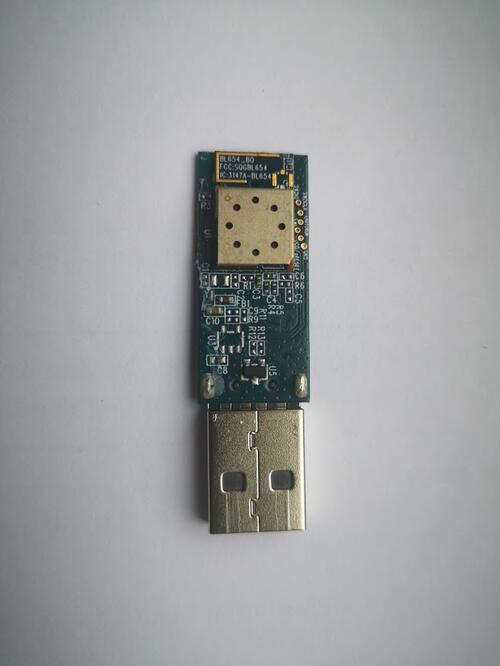

.. zephyr:board:: bl654_usb

Overview
********

The BL654 USB adapter hardware (Ezurio part 451-00004) provides
support for the Ezurio BL654 module powered by a Nordic
Semiconductor nRF52840 ARM Cortex-M4F CPU.

The BL654 USB adapter has the following features:

* CLOCK
* FLASH
* :abbr:`GPIO (General Purpose Input Output)`
* :abbr:`MPU (Memory Protection Unit)`
* :abbr:`NVIC (Nested Vectored Interrupt Controller)`
* :abbr:`PWM (Pulse Width Modulation)`
* RADIO (Bluetooth Low Energy and 802.15.4)
* :abbr:`RTC (nRF RTC System Clock)`
* :abbr:`USB (Universal Serial Bus)`
* :abbr:`WDT (Watchdog Timer)`

     BL654 USB Adapter PCB

More information about the BL654 USB adapter can be found in the `BL654 USB
Dongle Quick Start Guide`_. There is more information on the BL654 range on
the `BL654 website`_.

Hardware
********

The ``bl654_usb`` has two external oscillators. The frequency of
the slow clock is 32.768 kHz. The frequency of the main clock
is 32 MHz.

Supported Features
==================

.. zephyr:board-supported-hw::

See the `BL654 website`_ for a complete list of BL654 USB adapter hardware features.

Connections and IOs
===================

LED
---

* LED1 (blue) = P0.13

Push buttons
------------

* RESET = SW1 = nReset

Serial Port
===========

Zephyr console output is available as follows:

- using the USB connector, which may be used to make the console available on PC as
  USB CDC class.

Programming and Debugging
*************************

.. zephyr:board-supported-runners::

Applications for the ``bl654_usb`` board configuration can be
built in the usual way (see :ref:`build_an_application` for more details). The
``bl654_usb`` board can be used for debugging, but the compatible BL654 DVK
board may be preferable for convenience. Documentation can be found at the :zephyr:board:`bl654_dvk`
site and :zephyr_file:`boards/ezurio/bl654_dvk/doc/bl654_dvk.rst`

Flashing
========

The board supports the following programming options:

1. Using the built-in bootloader only
2. Using an external :ref:`debug probe <debug-probes>`

These instructions use the :ref:`west <west>` tool and assume you are in the
root directory of your :term:`west installation`.

Option 1: Using the Built-In Bootloader Only
--------------------------------------------

The board is factory-programmed with Nordic's bootloader from Nordic's nRF5
SDK. With this option, you'll use Nordic's `nrfutil`_ program to create
firmware packages supported by this bootloader and flash them to the
device. Before proceeding make sure:

* ``nrfutil`` is installed.
* The ``nrf5sdk-tools`` command is installed within ``nrfutil``.

#. With the adapter plugged in, reset the board into the bootloader by pressing
   the RESET button.

   The push button is in a pin-hole on the logo side of the USB adapter.

   .. image:: img/bl654_usb_reset.jpg
      :align: center
      :alt: Location of RESET button

   The blue LED should start a fade pattern, signalling the bootloader is
   running.

#. Compile a Zephyr application; we'll use :zephyr:code-sample:`blinky`.

   .. zephyr-app-commands::
      :app: zephyr/samples/basic/blinky
      :board: bl654_usb
      :goals: build

#. Package the application for the bootloader using ``nrfutil``:

   .. code-block:: console

      nrfutil nrf5sdk-tools pkg generate \
               --hw-version 52 \
               --sd-req=0x00 \
               --application build/zephyr/zephyr.hex \
               --application-version 1 \
               blinky.zip

#. Flash it onto the board. Note :file:`/dev/ttyACM0` is for Linux; it will be
   something like ``COMx`` on Windows, and something else on macOS.

   .. code-block:: console

      nrfutil nrf5sdk-tools dfu usb-serial -pkg blinky.zip -p /dev/ttyACM0

   When this command exits, observe the blue LED on the board blinking,
   instead of the fade pattern used by the bootloader.

For more information, see `Nordic Semiconductor USB DFU`_.

Option 2: Using an External Debug Probe
---------------------------------------

If you have one, you can also use an external :ref:`debug probe <debug-probes>`
to flash and debug Zephyr applications, but you need to solder an SWD header
to the board. Connection points can be found in the `board schematics`_.

For Segger J-Link debug probes, follow the instructions in the
:ref:`nordic_segger` page to install and configure all the necessary
software. Further information can be found in :ref:`nordic_segger_flashing`.

Use the ``bl654_usb/bare`` board variant to build your application.
This variant uses a modified partition table, which does not reserve space for
the onboard USB bootloader.

Then build and flash applications as usual (see :ref:`build_an_application` and
:ref:`application_run` for more details).

Here is an example for the :zephyr:code-sample:`blinky` application.

.. zephyr-app-commands::
   :zephyr-app: samples/basic/blinky
   :board: bl654_usb/nrf52840/bare
   :goals: build flash

Observe the LED on the board blinking.

Debugging
=========

The ``bl654_usb`` board does not have an on-board J-Link debug IC
as some Ezurio development boards, however, instructions from the
:ref:`nordic_segger` page also apply to this board, with the additional step
of connecting an external debugger.

Testing the LED on the BL654 USB
************************************************

There is a sample that allows you to test that the LED on
the board is working properly with Zephyr:

* :zephyr:code-sample:`blinky`

You can build and flash the example to make sure Zephyr is running correctly on
your board. The LED definitions can be found in
:zephyr_file:`boards/ezurio/bl654_usb/bl654_usb.dts`.

Testing Bluetooth on the BL654 USB
***********************************
Many of the Bluetooth examples will work on the BL654 USB.
Try them out:

* :zephyr:code-sample:`ble_peripheral`
* :zephyr:code-sample:`bluetooth_eddystone`
* :zephyr:code-sample:`bluetooth_ibeacon`

References
**********

.. target-notes::

.. _BL654 USB Dongle Quick Start Guide:
   https://www.ezurio.com/documentation/user-guide-bl654-usb-nordic-sdk-zephyr
.. _BL654 website:
   https://ezurio.com/wireless-modules/bluetooth-modules/bluetooth-5-modules/bl654-series
.. _J-Link Software and documentation pack:
   https://www.segger.com/jlink-software.html
.. _Nordic Semiconductor USB DFU:
   https://docs.nordicsemi.com/bundle/sdk_nrf5_v17.1.0/page/sdk_app_serial_dfu_bootloader.html
.. _nrfutil:
   https://www.nordicsemi.com/Products/Development-tools/nrf-util
.. _board schematics:
   https://www.ezurio.com/documentation/schematics-usb-adapter-bl654-451-00004
