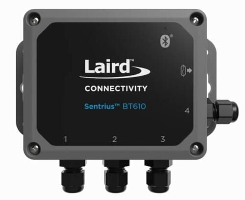
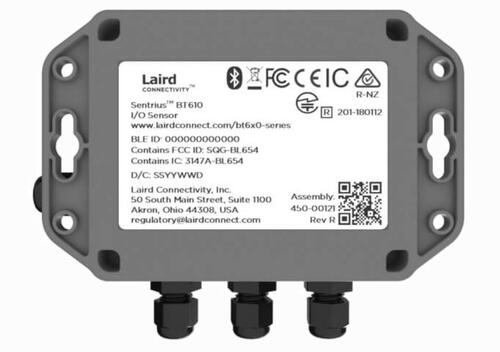
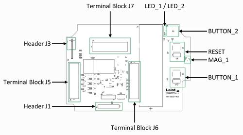

.. _bt610:

Ezurio Sentrius BT610 Sensor
############################

Overview
********

The Sentrius™ BT610 Sensor is a battery powered, Bluetooth v5 Long Range
integrated sensor platform that uses a Nordic Semiconductor nRF52840 ARM
Cortex-M4F CPU.

The sensor has the following features:

* :abbr:`ADC (Analog to Digital Converter)`
* CLOCK
* FLASH
* :abbr:`GPIO (General Purpose Input Output)`
* :abbr:`I2C (Inter-Integrated Circuit)`
* :abbr:`MPU (Memory Protection Unit)`
* :abbr:`NVIC (Nested Vectored Interrupt Controller)`
* :abbr:`PWM (Pulse Width Modulation)`
* :abbr:`QSPI (Quad Serial Peripheral Interface)`
* RADIO (Bluetooth Low Energy and 802.15.4)
* :abbr:`RTC (nRF RTC System Clock)`
* Segger RTT (RTT Console)
* :abbr:`SPI (Serial Peripheral Interface)`
* :abbr:`UART (Universal Asynchronous Receiver-Transmitter)`
* :abbr:`WDT (Watchdog Timer)`

     Sentrius BT610 Sensor, front view

     Sentrius BT610 Sensor, rear view

More information about the board can be found at the
`Sentrius BT610 website`_.

Hardware
********

Supported Features
==================

The BT610 Sensor supports the following
hardware features:

+-----------+------------+----------------------+
| Interface | Controller | Driver/Component     |
+===========+============+======================+
| ADC       | on-chip    | adc                  |
+-----------+------------+----------------------+
| CLOCK     | on-chip    | clock_control        |
+-----------+------------+----------------------+
| FLASH     | on-chip    | flash                |
+-----------+------------+----------------------+
| GPIO      | on-chip    | gpio                 |
+-----------+------------+----------------------+
| I2C(M)    | on-chip    | i2c                  |
+-----------+------------+----------------------+
| MPU       | on-chip    | arch/arm             |
+-----------+------------+----------------------+
| NVIC      | on-chip    | arch/arm             |
+-----------+------------+----------------------+
| PWM       | on-chip    | pwm                  |
+-----------+------------+----------------------+
| QSPI      | on-chip    | qspi                 |
+-----------+------------+----------------------+
| RADIO     | on-chip    | Bluetooth,           |
|           |            | ieee802154           |
+-----------+------------+----------------------+
| RTC       | on-chip    | system clock         |
+-----------+------------+----------------------+
| RTT       | Segger     | console              |
+-----------+------------+----------------------+
| SPI(M)    | on-chip    | spi                  |
+-----------+------------+----------------------+
| UART      | on-chip    | serial               |
+-----------+------------+----------------------+
| WDT       | on-chip    | watchdog             |
+-----------+------------+----------------------+

     Sentrius BT610 Sensor, board layout

Connections and IOs
===================

LED
---

Two LEDs are visible through the BT610 housing lid. Note that the LEDs can be
driven either directly, or via PWM. PWM should be used when current consumption
is required to be minimised.

* LED_1 (red) = LED0 = P1.07 (Red LED 1)
* LED_2 (green) = LED1 = P1.03 (Green LED 2)

* LED_PWM_1 (red) = LED0PWM = P1.07 (Red PWM LED 1)
* LED_PWM_2 (green) = LED1PWM = P1.03 (Green PWM LED 2)

Push button
------------

The BT610 incorporates three mechanical push buttons. Note these are only
accessible with the housing cover removed.

Two of the buttons are available for use via the board DTS file, as follows.

* BUTTON_1 = SW0 = P0.24 (Boot button SW1)
* BUTTON_2 = SW1 = P1.01 (Tamper switch SW2)

A third mechanical push button is provided to allow reset of the on-board
microcontroller.

Magnetoresistive sensor
-----------------------

The BT610 incorporates a Honeywell SM351LT magnetoresistive sensor. Refer to
the `Honeywell SM351LT datasheet`_ for further details.

* MAG_1 = SW2 = P1.15 (SM3531LT_0)

External flash memory
---------------------

A 64Mbit external flash memory part is available for storage of application
images and data. Refer to the `Macronix MX25R6435FZNIL0 datasheet`_ for further
details.

The flash memory is connected to the on-board QSPI device controller.

* MX25R64 = QSPI

Voltage reference
-----------------

A precision 2.5V voltage reference is provided on the V_REF input for use
during AD measurements.

This can deliver up to 50mA peak and 20mA continuous current.

Sensor connectivity
-------------------

The BT610 incorporates three terminal blocks J5, J6 & J7 that allow
connectivity to its sensor inputs, as follows.

Terminal Block J5
-----------------

+-----------+------------------------+----------------------------+-----------+
| Pin No.   | Name                   | Description                | Direction |
+===========+========================+============================+===========+
| 1         | EXT_SPI_CS_2           | External SPI CS 2          | OUT       |
+-----------+------------------------+----------------------------+-----------+
| 2         | GND                    | GND                        | (N/A)     |
+-----------+------------------------+----------------------------+-----------+
| 3         | AIN4                   | Analog Input 4             | IN        |
+-----------+------------------------+----------------------------+-----------+
| 4         | AIN3                   | Analog Input 3             | IN        |
+-----------+------------------------+----------------------------+-----------+
| 5         | GND                    | GND                        | (N/A)     |
+-----------+------------------------+----------------------------+-----------+
| 6         | AIN2                   | Analog Input 2             | IN        |
+-----------+------------------------+----------------------------+-----------+
| 7         | AIN1                   | Analog Input 1             | IN        |
+-----------+------------------------+----------------------------+-----------+
| 8         | GND                    | GND                        | (N/A)     |
+-----------+------------------------+----------------------------+-----------+
| 9         | DIN2                   | Digital Input 2            | IN        |
+-----------+------------------------+----------------------------+-----------+
| 10        | DO2                    | Digital Output 2           | OUT       |
+-----------+------------------------+----------------------------+-----------+

Terminal Block J6
-----------------

+-----------+------------------------+----------------------------+-----------+
| Pin No.   | Name                   | Description                | Direction |
+===========+========================+============================+===========+
| 1         | DO1                    | Digital Output 1           | OUT       |
+-----------+------------------------+----------------------------+-----------+
| 2         | DIN1                   | Digital Input 1            | IN        |
+-----------+------------------------+----------------------------+-----------+
| 3         | GND                    | GND                        | (N/A)     |
+-----------+------------------------+----------------------------+-----------+
| 4         | THERM4                 | Thermistor Input 4         | IN        |
+-----------+------------------------+----------------------------+-----------+
| 5         | THERM3                 | Thermistor Input 3         | IN        |
+-----------+------------------------+----------------------------+-----------+
| 6         | GND                    | GND                        | (N/A)     |
+-----------+------------------------+----------------------------+-----------+
| 7         | THERM2                 | Thermistor Input 2         | IN        |
+-----------+------------------------+----------------------------+-----------+
| 8         | THERM1                 | Thermistor Input 1         | IN        |
+-----------+------------------------+----------------------------+-----------+
| 9         | GND                    | GND                        | (N/A)     |
+-----------+------------------------+----------------------------+-----------+
| 10        | B+ OUT                 | Ext. sensor power supply   | (N/A)     |
+-----------+------------------------+----------------------------+-----------+

Terminal Block J7
-----------------

+-----------+------------------------+----------------------------+-----------+
| Pin No.   | Name                   | Description                | Direction |
+===========+========================+============================+===========+
| 1         | UART_1_RTS             | UART 1 RTS                 | IN        |
+-----------+------------------------+----------------------------+-----------+
| 2         | UART_1_CTS             | UART 1 CTS                 | OUT       |
+-----------+------------------------+----------------------------+-----------+
| 3         | UART_1_RXD             | UART 1 RXD                 | IN        |
+-----------+------------------------+----------------------------+-----------+
| 4         | UART_1_TXD             | UART 1 TXD                 | OUT       |
+-----------+------------------------+----------------------------+-----------+
| 5         | EXT_I2C_SCL            | External I2C SCL           | OUT       |
+-----------+------------------------+----------------------------+-----------+
| 6         | EXT_I2C_SDA            | External I2C SDA           | IN/OUT    |
+-----------+------------------------+----------------------------+-----------+
| 7         | EXT_SPI_CLK/TRACEDATA3 | Ext. SPI CLK/TRACE DATA 3  | OUT       |
+-----------+------------------------+----------------------------+-----------+
| 8         | EXT_SPI_MISO           | External SPI MISO          | IN        |
+-----------+------------------------+----------------------------+-----------+
| 9         | EXT_SPI_MOSI           | External SPI MOSI          | OUT       |
+-----------+------------------------+----------------------------+-----------+
| 10        | EXT_SPI_CS_1           | External SPI CS 1          | OUT       |
+-----------+------------------------+----------------------------+-----------+

Analog inputs
-------------

The four external Analog Inputs are multiplexed to a single host
microcontroller AD input, AIN_1, via a TI TMUX1204 multiplexer.

Refer to the `TI TMUX1204 datasheet`_ for further details.

Signals up to 12V, to a maximum of 50mA, can be applied to the external Analog
Inputs.

External Analog Input connections are made to the multiplexer as follows.

+--------------+--------------+
| Input        | MUX Input    |
+==============+==============+
| AIN1         | S1           |
+--------------+--------------+
| AIN2         | S2           |
+--------------+--------------+
| AIN3         | S3           |
+--------------+--------------+
| AIN4         | S4           |
+--------------+--------------+

A TI TCA9538 port expander is used to determine the mode of each Analog Input,
for either voltage or current measurement, and also to control the mutliplexer.
A high level applied to the appropriate expander port pin enables the
associated analog input as a current input; when a low logic level is applied,
voltage measurement mode is selected.

Refer to the `TI TCA9538 datasheet`_ for further details.

The expander port connections are as follows.

+--------------+---------------+
| Pin          | Function      |
+==============+===============+
| P0           | AIN1 mode     |
+--------------+---------------+
| P1           | AIN2 mode     |
+--------------+---------------+
| P2           | AIN3 mode     |
+--------------+---------------+
| P3           | AIN4 mode     |
+--------------+---------------+
| P4           | MUX A0        |
+--------------+---------------+
| P5           | MUX A1        |
+--------------+---------------+
| P6           | (N/C)         |
+--------------+---------------+
| P7           | (N/C)         |
+--------------+---------------+

The following illustrates some possible configuration values for the port
expander. Note that it is possible for combinations of voltage and current
measurement to be applied such that some external Analog Inputs measure current
and others voltage. This is not shown below.

+----------------+------------------------------+
| Expander value | Selected Analog Input & mode |
+================+==============================+
| b'00000000'    | AIN1, voltage measurement    |
+----------------+------------------------------+
| b'00000001'    | AIN1, current measurement    |
+----------------+------------------------------+
| b'00010000'    | AIN2, voltage measurement    |
+----------------+------------------------------+
| b'00010010'    | AIN2, current measurement    |
+----------------+------------------------------+
| b'00100000'    | AIN3, voltage measurement    |
+----------------+------------------------------+
| b'00100100'    | AIN3, current measurement    |
+----------------+------------------------------+
| b'00110000'    | AIN4, voltage measurement    |
+----------------+------------------------------+
| b'00111000'    | AIN4, current measurement    |
+----------------+------------------------------+

Circuitry associated with the analog input measurements can be disabled when
not in use.

A GPIO is used to control this behaviour, as shown below.

+----------------+-----------+
| ANALOG_ENABLE  | Behaviour |
+================+===========+
| 0              | Disabled  |
+----------------+-----------+
| 1              | Enabled   |
+----------------+-----------+

Thermistor inputs
-----------------

The four external thermistor inputs are connected to a single AD input, AIN_2,
via a TI TMUX1204 multiplexer.

Refer to the `TI TMUX1204 datasheet`_ for further details.

External analog input connections are made to the multiplexer as follows.

+--------------+--------------+
| Input        | MUX Input    |
+==============+==============+
| THERM1       | S1           |
+--------------+--------------+
| THERM2       | S2           |
+--------------+--------------+
| THERM3       | S3           |
+--------------+--------------+
| THERM4       | S4           |
+--------------+--------------+

The same port expander used to select external analog inputs is also used to
select external thermistor inputs.

The table below defines possible values that can be written.

+----------------+-----------------------+
| Expander value | Selected Analog Input |
+================+=======================+
| b'00000000'    | THERM1                |
+----------------+-----------------------+
| b'00010000'    | THERM2                |
+----------------+-----------------------+
| b'00100000'    | THERM3                |
+----------------+-----------------------+
| b'00110000'    | THERM4                |
+----------------+-----------------------+

A GPIO line is used to enable electronics associated with thermistor
measurement. This is controlled as shown below.

+----------------+-----------------------+
| THERM_ENABLE   | Behaviour             |
+================+=======================+
| 0              | Enabled               |
+----------------+-----------------------+
| 1              | Disabled              |
+----------------+-----------------------+

Note the thermistor circuit must be calibrated before use. A suggested method
for achieving this is described in the
`BT610 Zephyr Application Thermistor Calibration`_ application note.

Digital inputs
--------------

Two external digital inputs are available for connection to external signals.
For the digital level being applied to be detected, an appropriate output pin
must first be set. This approach is taken to ensure supporting circuitry can be
powered down when the input state is not being determined. When in use, the
external digital input level can be read from the appropriate input pin.

The output and input pins required are as follows.

+----------------+----------------+
| Enable Pin     | Input Read Pin |
+================+================+
| DIN_1_ENABLE   | DIN_1          |
+----------------+----------------+
| DIN_2_ENABLE   | DIN_2          |
+----------------+----------------+

Digital outputs
---------------

Two external digital outputs are available to provide signals to or to directly
drive external equipment.

To provide a high level on the external digital output, a high logic level is
applied to the appropriate host microcontroller output.

The output pins required are as follows.

+----------------+--------------------------+
| Output Pin     | External Sensor Terminal |
+================+==========================+
| DO_1_MCU       | DO1                      |
+----------------+--------------------------+
| DO_2_MCU       | DO2                      |
+----------------+--------------------------+

External power supply
---------------------

Power can be supplied to external sensors via the B+ OUT terminal. This is
enabled by setting the BATTERY_OUTPUT_ENABLE GPIO line. In addition, the
external supply can be boosted to 5V by setting the HIGH_SUPPLY_ENABLE GPIO
line. When 5V is not selected, the external power supply follows the
battery voltage.

Up to 50mA peak and 20mA continuous current can be delivered by the External
Power Supply.

External sensor I2C port
------------------------

External I2C sensors can be connected on the external I2C port. Note that
external I2C sensors should be powered from the B+ terminal to ensure applied
voltage levels match those expected internally by the board.

Required pins are as follows.

+-------------+--------------------------+
| Output Pin  | External Sensor Terminal |
+=============+==========================+
| SCL_PIN     | EXT_I2C_SCL              |
+-------------+--------------------------+
| SDA_PIN     | EXT_I2C_SDA              |
+-------------+--------------------------+

External sensor SPI port
------------------------

Up to 2 external SPI sensors can be connected on the external SPI port. Note
that external SPI sensors should be powered from the B+ terminal to ensure
applied voltage levels match those expected internally by the board.

Required pins are as follows.

+-------------+--------------------------+
| Output Pin  | External Sensor Terminal |
+=============+==========================+
| SCK_PIN     | EXT_I2C_SCL              |
+-------------+--------------------------+
| MOSI_PIN    | EXT_I2C_SDA              |
+-------------+--------------------------+
| MISO_PIN    | EXT_SPI_MISO             |
+-------------+--------------------------+
| SDA_PIN     | EXT_I2C_SDA              |
+-------------+--------------------------+
| CS_GPIOS    | EXT_I2C_SDA              |
+-------------+--------------------------+
| CS_GPIOS    | EXT_I2C_SDA              |
+-------------+--------------------------+

Programming and Debugging
*************************

Applications for the ``bt610`` board configuration can be
built and flashed in the usual way (see :ref:`build_an_application`
and :ref:`application_run` for more details); however, the standard
debugging targets are not currently available.

The BT610 features a 10 way header, J3, for connection of a
programmer/debugger, with pinout as follows.

+-----------+------------+----------------------+
| Pin No.   | Name       | Description          |
+===========+============+======================+
| 1         | 3.3V       | Power Supply, 3.3V   |
+-----------+------------+----------------------+
| 2         | SWDIO      | Data Input/Output    |
+-----------+------------+----------------------+
| 3         | GND        | GND                  |
+-----------+------------+----------------------+
| 4         | SWDCLK     | Clock Pin            |
+-----------+------------+----------------------+
| 5         | GND        | GND                  |
+-----------+------------+----------------------+
| 6         | SWO        | Trace Output Pin     |
+-----------+------------+----------------------+
| 7         | (N/C)      | Not Connected        |
+-----------+------------+----------------------+
| 8         | (N/C)      | Not Connected        |
+-----------+------------+----------------------+
| 9         | GND        | GND                  |
+-----------+------------+----------------------+
| 10        | nRESET     | Reset Pin            |
+-----------+------------+----------------------+

Access to the sensor debug UART is facilitated by a 6 pin header, J1, with
pinout as follows.

+-----------+------------+----------------------+-----------+
| Pin No.   | Name       | Description          | Direction |
+===========+============+======================+===========+
| 1         | GND        | GND                  | N/A       |
+-----------+------------+----------------------+-----------+
| 2         | UART_0_RTS | UART 0 RTS Pin       | IN        |
+-----------+------------+----------------------+-----------+
| 3         | 3.3V       | Power Supply, 3.3V   | N/A       |
+-----------+------------+----------------------+-----------+
| 4         | UART_0_RX  | UART 0 RX Pin        | IN        |
+-----------+------------+----------------------+-----------+
| 5         | UART_0_TX  | UART 0 TX Pin        | OUT       |
+-----------+------------+----------------------+-----------+
| 6         | UART_0_CTS | UART 0 CTS Pin       | OUT       |
+-----------+------------+----------------------+-----------+

Note that pin 3 requires a solder bridge to be closed to enable powering of the
BT610 board via the UART connector.

Flashing
========

Follow the instructions in the :ref:`nordic_segger` page to install
and configure all the necessary software. Further information can be
found in :ref:`nordic_segger_flashing`. Then build and flash
applications as usual (see :ref:`build_an_application` and
:ref:`application_run` for more details).

Here is an example for the :zephyr:code-sample:`hello_world` application.

First, run your favorite terminal program to listen for output.

NOTE: On the BT610, the UART lines are at TTL levels and must be passed through
an appropriate line driver circuit for translation to RS232 levels. Refer to
the `MAX3232 datasheet`_ for a suitable driver IC.

.. code-block:: console

   $ minicom -D <tty_device> -b 115200

Replace :code:`<tty_device>` with the port where the BT610 can be found. For
example, under Linux, :code:`/dev/ttyUSB0`.

Then build and flash the application in the usual way.

.. zephyr-app-commands::
   :zephyr-app: samples/hello_world
   :board: bt610
   :goals: build flash

Note that an external debugger is required to perform application flashing.

Debugging
=========

The ``bt610`` board does not have an on-board J-Link debug IC
as some nRF5x development boards, however, instructions from the
:ref:`nordic_segger` page also apply to this board, with the additional step
of connecting an external debugger.

Testing Bluetooth on the BT610
***********************************
Many of the Bluetooth examples will work on the BT610.
Try them out:

* :zephyr:code-sample:`ble_peripheral`
* :zephyr:code-sample:`bluetooth_eddystone`
* :zephyr:code-sample:`bluetooth_ibeacon`

Testing the LEDs and buttons on the BT610
*****************************************

There are 2 samples that allow you to test that the buttons (switches) and LEDs
on the board are working properly with Zephyr:

* :zephyr:code-sample:`blinky`
* :zephyr:code-sample:`button`

You can build and flash the examples to make sure Zephyr is running correctly
on your board. The button, LED and sensor device definitions can be found in
:zephyr_file:`boards/ezurio/bt610/bt610.dts`.

References
**********

.. target-notes::

.. _Sentrius BT610 website: https://www.ezurio.com/iot-devices/iot-sensors/sentrius-bt610-io-sensor
.. _Honeywell SM351LT datasheet: https://sensing.honeywell.com/honeywell-sensing-nanopower-series-datasheet-50095501-c-en.pdf
.. _MAX3232 datasheet: https://www.ti.com/lit/ds/symlink/max3232.pdf
.. _TI TMUX1204 datasheet: https://www.ti.com/lit/gpn/TMUX1204
.. _TI TCA9538 datasheet: https://www.ti.com/lit/gpn/TCA9538
.. _Macronix MX25R6435FZNIL0 datasheet: https://www.macronix.com/Lists/Datasheet/Attachments/7913/MX25R6435F,%20Wide%20Range,%2064Mb,%20v1.5.pdf
.. _BT610 Zephyr Application Thermistor Calibration: https://www.ezurio.com/technology/bt610-thermistor-coefficient-calculator
