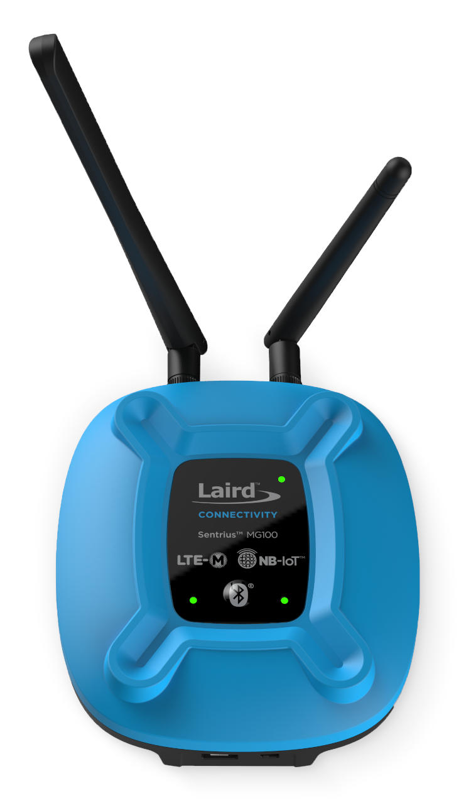

.. _mg100:

Ezurio Sentrius™ MG100 Gateway
##############################

Overview
********
The Sentrius™ MG100 Gateway offers a compact, out of box Bluetooth to low power cellular gateway
solution.

Based on the Pinnacle 100 socket modem, the Sentrius™ MG100 gateway captures data from any
Bluetooth 5 modules or devices and sends it to the cloud via a global low power cellular
(LTE-M/NB-IoT) connection. The MG100 seamlessly incorporates a powerful Cortex M4F controller,
full Bluetooth 5 connectivity, and dual-mode LTE-M/NB-IoT capabilities. The MG100 has full regulatory
and network certifications and End Device carrier approvals.

Develop your application directly on the integrated Cortex M4F microcontroller using Zephyr RTOS,
enabling your application development with a secure, open source RTOS with more than just kernel
services. Remotely debug your fleet of devices with the `Memfault Platform`_. Take advantage of the
Zephyr community and Ezurio’s `Canvas Software Suite`_ to accelerate your development.
covering all aspects of the product's capabilities and hardware interfaces. The MG100 also delivers
complete antenna flexibility with internal or external antenna options available, and the optional
battery backup provides uninterrupted reporting of remote Bluetooth sensor data.

More information about the board can be found at the `MG100 website`_.

The MG100 hardware provides support for the Nordic Semiconductor `nRF52840`_ ARM Cortex-M4F CPU,
`Sierra Wireless HL7800`_
and the following devices:

* :abbr:`ADC (Analog to Digital Converter)`
* CLOCK
* FLASH
* :abbr:`GPIO (General Purpose Input Output)`
* :abbr:`I2C (Inter-Integrated Circuit)`
* :abbr:`MPU (Memory Protection Unit)`
* :abbr:`NVIC (Nested Vectored Interrupt Controller)`
* :abbr:`PWM (Pulse Width Modulation)`
* RADIO (Bluetooth Low Energy and 802.15.4)
* :abbr:`RTC (nRF RTC System Clock)`
* :abbr:`SPI (Serial Peripheral Interface)`
* :abbr:`UART (Universal asynchronous receiver-transmitter)`
* :abbr:`WDT (Watchdog Timer)`
* :abbr:`QSPI (Quad Serial Peripheral Interface)`
* :abbr:`LIS3DH (ST Micro 3-axis MEMS accelerometer)`
* :abbr:`HL7800 (Sierra Wireless HL7800 LTE-M1/NB-IoT modem)`
* :abbr:`SD Card`

     MG100 (450-00054-K1)

Hardware
********

Supported Features
==================

The MG100 board configuration supports the following
hardware features:

+-----------+------------+----------------------+
| Interface | Controller | Driver/Component     |
+===========+============+======================+
| ADC       | on-chip    | adc                  |
+-----------+------------+----------------------+
| CLOCK     | on-chip    | clock_control        |
+-----------+------------+----------------------+
| FLASH     | on-chip    | flash                |
+-----------+------------+----------------------+
| GPIO      | on-chip    | gpio                 |
+-----------+------------+----------------------+
| I2C(M)    | on-chip    | i2c                  |
+-----------+------------+----------------------+
| MPU       | on-chip    | arch/arm             |
+-----------+------------+----------------------+
| NVIC      | on-chip    | arch/arm             |
+-----------+------------+----------------------+
| PWM       | on-chip    | pwm                  |
+-----------+------------+----------------------+
| RADIO     | on-chip    | Bluetooth,           |
|           |            | ieee802154           |
+-----------+------------+----------------------+
| RTC       | on-chip    | system clock         |
+-----------+------------+----------------------+
| SPI(M/S)  | on-chip    | spi                  |
+-----------+------------+----------------------+
| UART      | on-chip    | serial               |
+-----------+------------+----------------------+
| WDT       | on-chip    | watchdog             |
+-----------+------------+----------------------+
| QSPI      | on-chip    | qspi/MX25R64(8MB)    |
+-----------+------------+----------------------+
| LIS3DH    | I2C(M)     | sensor/lis3dh        |
+-----------+------------+----------------------+
| HL7800    | UART       | HL7800 modem driver  |
+-----------+------------+----------------------+
| SDMMC     | SPI(M)     | SD Card via SPI      |
+-----------+------------+----------------------+

See `MG100 website`_ for a complete list
of MG100 hardware features.

Connections and IOs
===================

LED
---

* LED1 (red)   = P1.7
* LED2 (blue)  = P1.6
* LED3 (green) = P1.5

Push buttons
------------

* BUTTON1 = P0.3

External flash memory
---------------------

A 64Mbit external flash memory part is available for storage of application
images and data. Refer to the `Macronix MX25R6435F datasheet`_ for further
details.

The flash memory is connected to the on-board QSPI device controller.

* MX25R64 = QSPI

SCK = P0.19
IO0 = P0.20
IO1 = P0.21
IO2 = P0.22
IO3 = P0.23
CSN = P0.17

LIS3DH Motion Sensor
--------------------

Motion sensor to detect if the gateway moves.

IRQ IO  = P0.28
I2C SDA = P0.26
I2C SCL = P0.27

SD Card
-------

SD card used to store large amounts of data.

SPI CS   = P0.29
SPI SCK  = P1.09
SPI MOSI = P0.11
SPI MISO = P0.12

Programming and Debugging
*************************

Applications for the ``mg100`` board configuration can be
built and flashed in the usual way. (see :ref:`build_an_application`
and :ref:`application_run` for more details)

The `Ezurio USB-SWD Programming Kit`_ contains all the necessary
hardware to enable programming and debugging an MG100.

Flashing
========

Follow the instructions in the :ref:`nordic_segger` page to install
and configure all the necessary software. Further information can be
found in :ref:`nordic_segger_flashing`. Then build and flash
applications as usual (see :ref:`build_an_application` and
:ref:`application_run` for more details).

Here is an example for the :zephyr:code-sample:`hello_world` application.

First, run your favorite terminal program to listen for output.

.. note:: On the MG100,
   the USB connector should be used to access the UART console.

.. code-block:: console

   $ minicom -D <tty_device> -b 115200

Replace :code:`<tty_device>` with the port where the board MG100
can be found. For example, under Linux, :code:`/dev/ttyUSB0`.

Then build and flash the application in the usual way.

.. zephyr-app-commands::
   :zephyr-app: samples/hello_world
   :board: mg100
   :goals: build flash

Debugging
=========

Refer to the :ref:`nordic_segger` page to learn about debugging Nordic boards with a
Segger IC.

Software
********

Canvas Software Suite
==============================
The MG100 is a supported hardware platform for `Canvas Software Suite`_.

Testing Bluetooth on the MG100
==============================
Many of the Bluetooth examples will work on the MG100.
Try them out:

* :zephyr:code-sample:`ble_peripheral`
* :zephyr:code-sample:`bluetooth_eddystone`
* :zephyr:code-sample:`bluetooth_ibeacon`

Testing the LEDs and buttons in the MG100
====================================================

There are 2 samples that allow you to test that the buttons (switches) and LEDs on
the board are working properly with Zephyr:

.. code-block:: console

   samples/basic/blinky
   samples/basic/button

You can build and flash the examples to make sure Zephyr is running correctly on
your board. The button and LED definitions can be found in
:zephyr_file:`boards/ezurio/mg100/mg100.dts`.

References
**********

.. target-notes::

.. _MG100 website: https://www.ezurio.com/iot-devices/iot-gateways/sentrius-mg100-gateway-lte-mnb-iot-and-bluetooth-5
.. _nRF52840 Product Specification: https://infocenter.nordicsemi.com/pdf/nRF52840_PS_v1.1.pdf
.. _Sierra Wireless HL7800: https://source.sierrawireless.com/devices/hl-series/hl7800/#sthash.641qTTwA.dpbs
.. _J-Link Software and documentation pack: https://www.segger.com/jlink-software.html
.. _Macronix MX25R6435F datasheet: https://www.macronix.com/Lists/Datasheet/Attachments/7913/MX25R6435F,%20Wide%20Range,%2064Mb,%20v1.5.pdf
.. _Ezurio USB-SWD Programming Kit: https://www.ezurio.com/wireless-modules/programming-kits/usb-swd-programming-kit
.. _Memfault Platform: https://docs.memfault.com/docs/mcu/pinnacle-100-guide
.. _nRF52840: https://www.nordicsemi.com/products/nrf52840
.. _Canvas Software Suite: https://www.ezurio.com/canvas/software-suite
