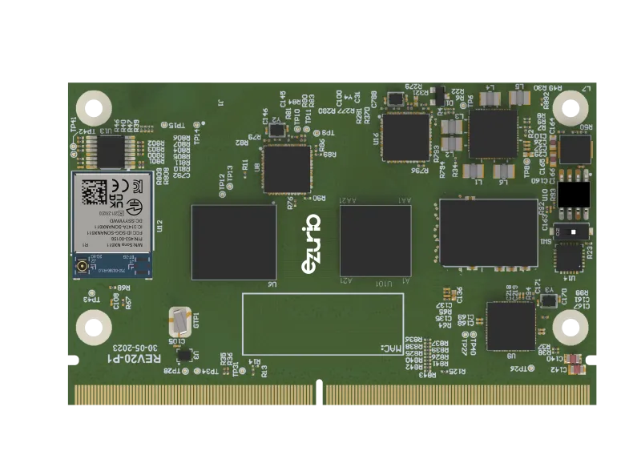

.. zephyr:board:: nitrogen93_smarc

Overview
********

The Ezurio Nitrogen93 SMARC is a SMARC 2.x form-factor System on Module (SOM)
based on the NXP i.MX93 applications processor. It is designed to be mounted
on a SMARC carrier board, such as the Ezurio Universal SMARC Carrier Board (``smarc_car_brd``
shield).

i.MX93 MPU is composed of one cluster of 2x Cortex(R)-A55 cores and a single
Cortex(R)-M33 core. Only the Cortex(R)-A55 cores are currently supported by
this board port.

- Board features:

  - RAM: 2GB LPDDR4
  - Wireless (``nx611`` variant only):

    - NXP IW611 SoC, supporting dual-band (2.4 GHz/5 GHz) 1x1 Wi-Fi 6,
      Bluetooth 5.4
  - Connectivity, exposed through the SMARC connector:

    - GbE0/GbE1, USB, SDIO, I2S, I2C, SPI, CAN, UART, GPIO

.. note::

   The Nitrogen93 SMARC module has no JTAG debug connector. Zephyr images
   can only be loaded and started through U-Boot (or, in the future,
   Linux remoteproc). ``west flash`` and ``west debug`` are not supported
   on this board.

   Ezurio Nitrogen93 SMARC (NX611 variant)

Supported Features
==================

.. zephyr:board-supported-hw::

System Clock
-------------

This board configuration uses a system clock frequency of 24 MHz.
Cortex-A55 Core runs up to 1.7 GHz.

Serial Port
-----------

This board configuration uses LPUART1 (SMARC SER1) as the console/shell
UART. It is expected to be exposed on the carrier board.

Programming and Debugging (A55)
********************************

The Nitrogen93 SMARC module has no JTAG connector, so ``west flash`` and
``west debug`` are not available for this board. Zephyr is always started
from U-Boot on the A55 core, either by loading the image over TFTP or by
booting it from an SD card.

Option 1: Boot Zephyr Over TFTP
================================

Build the sample, for example :zephyr:code-sample:`hello_world`:

.. zephyr-app-commands::
   :zephyr-app: samples/hello_world
   :host-os: unix
   :board: nitrogen93_smarc/mimx9352/a55
   :goals: build

Serve the resulting ``build/zephyr/zephyr.bin`` over TFTP from the host
(for example with ``tftp-now serve -root build/zephyr``), then from the
U-Boot prompt on the board:

.. code-block:: console

    dhcp && setenv serverip <host-ip> && tftp 0xd0000000 zephyr.bin && go 0xd0000000

.. note::

   U-Boot must support network booting for the TFTP method to work.

Option 2: Boot Zephyr From an SD Card
======================================

Copy ``zephyr.bin`` to the root of the first FAT partition of an SD card,
insert it into the board, and from the U-Boot prompt run:

.. code-block:: console

    load mmc 1:1 0xd0000000 zephyr.bin && go 0xd0000000
