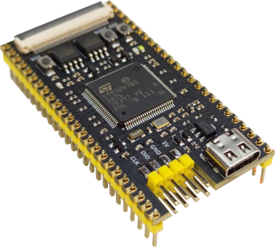
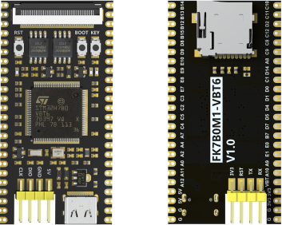

.. _fk7b0m1_vbt6:

FANKE FK7B0M1-VBT6
##################

Overview
********

The FK7B0M1-VBT6 core board by FANKE Technology Co., Ltd. is an advanced microcontroller
platform based on the STMicroelectronics Arm® Cortex®-M7 core STM32H7B0VBT6 microcontroller.
This board is an ideal solution for developers looking to create high-performance
applications, especially in the field of Human-Machine Interface (HMI), leveraging its
robust capabilities and support for sophisticated display and touch technologies.

The FK7B0M1-VBT6 is designed as a reference design for user application development before
transitioning to the final product, significantly simplifying the development process.
Its wide range of hardware features, including advanced display and touch capabilities,
make it exceptionally suitable for HMI applications, allowing for comprehensive evaluation
and testing of peripherals and functionalities.

     FK7B0M1-VBT6 (Credit: FANKE Technology Co., Ltd)

Hardware
********

FK7B0M1-VBT6 provides the following hardware components:

- STM32H7B6VB in LQFP100 package
- ARM 32-bit Cortex-M7 CPU with FPU
- 280 MHz max CPU frequency
- VDD from 1.62 V to 3.6 V
- 128 KB Flash
- ~1.4 MB SRAM max (1.18 Mbytes user SRAM + 64 Kbytes ITCM RAM + 128 Kbytes DTCM RAM + 4 Kbytes SRAM in Backup domain)
- Main clock: External 25MHz crystal oscillator.
- RTC: 32.768kHz crystal oscillator.
- 32-bit timers(2)
- 16-bit timers(12)
- 1 reset button, 1 user button, and 1 BOOT button
- 1 user LED
- External 64-Mbit QSPI (W25Q64) NOR Flash memory.
- External 64-Mbit SPI (W25Q64) NOR Flash memory.
- USB OTG Full Speed and High Speed(1)
- 1 micro SD card
- 1 RGB LCD interface
- SWD and serial port accessibility through a pin header
- Bring out 39 IO ports

More information about STM32H7B0VB can be found here:

- `STM32H7B0VB on www.st.com`_

Supported Features
==================

The Zephyr fk7b0m1_vbt6 board configuration supports the following hardware
features:

+-------------+------------+-------------------------------------+
| Interface   | Controller | Driver/Component                    |
+=============+============+=====================================+
| NVIC        | on-chip    | nested vector interrupt controller  |
+-------------+------------+-------------------------------------+
| FLASH       | on-chip    | flash memory                        |
+-------------+------------+-------------------------------------+
| UART        | on-chip    | serial port                         |
+-------------+------------+-------------------------------------+
| PINMUX      | on-chip    | pinmux                              |
+-------------+------------+-------------------------------------+
| GPIO        | on-chip    | gpio                                |
+-------------+------------+-------------------------------------+
| RNG         | on-chip    | True Random number generator        |
+-------------+------------+-------------------------------------+
| Backup SRAM | on-chip    | Backup SRAM                         |
+-------------+------------+-------------------------------------+
| SPI         | on-chip    | spi bus                             |
+-------------+------------+-------------------------------------+
| OCTOSPI     | on-chip    | octospi                             |
+-------------+------------+-------------------------------------+

Other hardware features are not yet supported on this Zephyr port.

The default configuration per core can be found in
:zephyr_file:`boards/fanke/fk7b0m1_vbt6/fk7b0m1_vbt6_defconfig`

Pin Mapping
===========

FK7B0M1-VBT6 board has 5 GPIO controllers. These controllers are responsible for pin muxing,
input/output, pull-up, etc.

     FK7B0M1-VBT6 (Credit: FANKE Technology Co., Ltd)

Default Zephyr Peripheral Mapping:
----------------------------------

The FK7B0M1-VBT6 board is configured as follows

- UART_1 TX/RX : PA9/PA10 (available on the header pins)
- User LED (blue) : PC1
- User PB : PC13
- SPI1 NCS/CLK/MISO/MOSI : PA15/PB3/PB4/PB5 (NOR Flash)
- QuadSPI NCS/CLK/IO0/IO1/IO2/IO3 : PB6/PB2/PD11/PD12/PE2/PD13 (NOR Flash)
- USB DM/DP : PA11/PA12

System Clock
============

The FK7B0M1-VBT6 System Clock could be driven by an internal or external oscillator,
as well as by the main PLL clock. By default the system clock is driven by the PLL clock at 280MHz,
driven by an 25MHz external crystal oscillator.

Serial Port
===========

The Zephyr console output is assigned to UART1. The default communication settings are 115200 8N1.

Programming and Debugging
*************************

Applications for the ``fk7b0m1_vbt6`` board configuration can be built and flashed in the usual
way (see :ref:`build_an_application` and :ref:`application_run` for more details).

Flashing
========

The FK7B0M1-VBT6 board does not include an on-board debugger. As a result, it requires
an external debugger, such as ST-Link, for programming and debugging purposes.

The board provides header pins for the Serial Wire Debug (SWD) interface.

Flashing an application to FK7B0M1-VBT6
---------------------------------------

To begin, connect the ST-Link Debug Programmer to the FK7B0M1-VBT6 board using the SWD
interface. Next, connect the ST-Link to your host computer via a USB port.
Once this setup is complete, you can proceed to build and flash your application to the board

Here is an example for the :ref:`hello_world` application.

.. zephyr-app-commands::
   :zephyr-app: samples/hello_world
   :board: fk7b0m1_vbt6
   :goals: build flash

Run a serial host program to connect with your board:

.. code-block:: console

   $ minicom -D /dev/ttyACM0 -b 115200

Then, press the RESET button, you should see the following message:

.. code-block:: console

   Hello World! fk7b0m1_vbt6

Debugging
=========

This current Zephyr port does not support debugging.

References
**********

.. target-notes::
.. _STM32H7B0VB on www.st.com: https://www.st.com/en/microcontrollers/stm32h7b0vb.html
