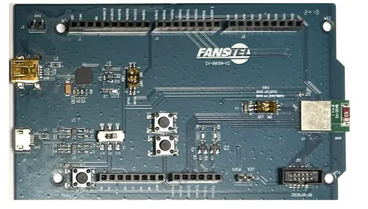

.. zephyr:board:: fanstel_ev_bm15

Overview
********

The Fanstel EV-BM15 is an evaluation board based on the Nordic Semiconductor nRF54L15 SoC.
It is designed for development and evaluation of Bluetooth Low Energy (BLE)
and other wireless applications.

Hardware
********

- Nordic nRF54L15 SoC
- On-board LEDs and buttons
- UART interface
- GPIO headers for expansion

Supported Features
==================

.. zephyr:board-supported-hw::

Connections and IOs
===================

The following table summarizes the available peripherals:

+--------+----------------+-------------------------+
| Name   | Pin            | Description             |
+========+================+=========================+
| LED0   | P1.11          | User LED                |
| LED1   | P1.12          | User LED                |
| BTN0   | P1.05          | User Button             |
| BTN1   | P1.06          | User Button             |
| UART   | P1.13, P1.14   | Console UART (TX/RX)    |
+--------+----------------+-------------------------+

Programming and Debugging
*************************

.. zephyr:board-supported-runners::

Flashing
========

To flash an application to the board, run:

.. code-block:: console

   west flash

Debugging
=========

Debugging is supported using standard Zephyr tools such as SEGGER J-Link.

References
**********

- `Nordic nRF54L15 Product Specification <https://www.nordicsemi.com/>`_
- `Fanstel official website <https://www.fanstel.com>`_
