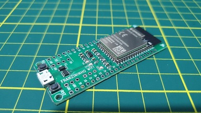

.. _esp32s2_franzininho:

ESP32-S2 Franzininho
####################

Overview
********

Franzininho is an educational development board based on ESP32-S2 which is a highly integrated, low-power, single-core Wi-Fi Microcontroller SoC,
designed to be secure and cost-effective, with a high performance and a rich set of IO capabilities. [1]_

The features include the following:

- RSA-3072-based secure boot
- AES-XTS-256-based flash encryption
- Protected private key and device secrets from software access
- Cryptographic accelerators for enhanced performance
- Protection against physical fault injection attacks
- Various peripherals:

  - 43x programmable GPIOs
  - 14x configurable capacitive touch GPIOs
  - USB OTG
  - LCD interface
  - camera interface
  - SPI
  - I2S
  - UART
  - ADC
  - DAC
  - LED PWM with up to 8 channels

System requirements
===================

Prerequisites
-------------

Espressif HAL requires WiFi and Bluetooth binary blobs in order work. Run the command
below to retrieve those files.

.. code-block:: console

   west blobs fetch hal_espressif

.. note::

   It is recommended running the command above after :file:`west update`.

Building & Flashing
*******************

Simple boot
===========

The board could be loaded using the single binary image, without 2nd stage bootloader.
It is the default option when building the application without additional configuration.

.. note::

   Simple boot does not provide any security features nor OTA updates.

MCUboot bootloader
==================

User may choose to use MCUboot bootloader instead. In that case the bootloader
must be built (and flashed) at least once.

There are two options to be used when building an application:

1. Sysbuild
2. Manual build

.. note::

   User can select the MCUboot bootloader by adding the following line
   to the board default configuration file.

   .. code:: cfg

      CONFIG_BOOTLOADER_MCUBOOT=y

Sysbuild
========

The sysbuild makes possible to build and flash all necessary images needed to
bootstrap the board with the ESP32 SoC.

To build the sample application using sysbuild use the command:

.. zephyr-app-commands::
   :tool: west
   :zephyr-app: samples/hello_world
   :board: esp32s2_franzininho
   :goals: build
   :west-args: --sysbuild
   :compact:

By default, the ESP32 sysbuild creates bootloader (MCUboot) and application
images. But it can be configured to create other kind of images.

Build directory structure created by sysbuild is different from traditional
Zephyr build. Output is structured by the domain subdirectories:

.. code-block::

  build/
  ├── hello_world
  │   └── zephyr
  │       ├── zephyr.elf
  │       └── zephyr.bin
  ├── mcuboot
  │    └── zephyr
  │       ├── zephyr.elf
  │       └── zephyr.bin
  └── domains.yaml

.. note::

   With ``--sysbuild`` option the bootloader will be re-build and re-flash
   every time the pristine build is used.

For more information about the system build please read the :ref:`sysbuild` documentation.

Manual build
============

During the development cycle, it is intended to build & flash as quickly possible.
For that reason, images can be built one at a time using traditional build.

The instructions following are relevant for both manual build and sysbuild.
The only difference is the structure of the build directory.

.. note::

   Remember that bootloader (MCUboot) needs to be flash at least once.

Build and flash applications as usual (see :ref:`build_an_application` and
:ref:`application_run` for more details).

.. zephyr-app-commands::
   :zephyr-app: samples/hello_world
   :board: esp32s2_franzininho
   :goals: build

The usual ``flash`` target will work with the ``esp32s2_franzininho`` board
configuration. Here is an example for the :zephyr:code-sample:`hello_world`
application.

.. zephyr-app-commands::
   :zephyr-app: samples/hello_world
   :board: esp32s2_franzininho
   :goals: flash

Open the serial monitor using the following command:

.. code-block:: shell

   west espressif monitor

After the board has automatically reset and booted, you should see the following
message in the monitor:

.. code-block:: console

   ***** Booting Zephyr OS vx.x.x-xxx-gxxxxxxxxxxxx *****
   Hello World! esp32s2_franzininho

References
**********

.. [1] https://www.espressif.com/en/products/socs/esp32-s2
.. _`ESP32S2 Technical Reference Manual`: https://espressif.com/sites/default/files/documentation/esp32-s2_technical_reference_manual_en.pdf
.. _`ESP32S2 Datasheet`: https://www.espressif.com/sites/default/files/documentation/esp32-s2_datasheet_en.pdf
