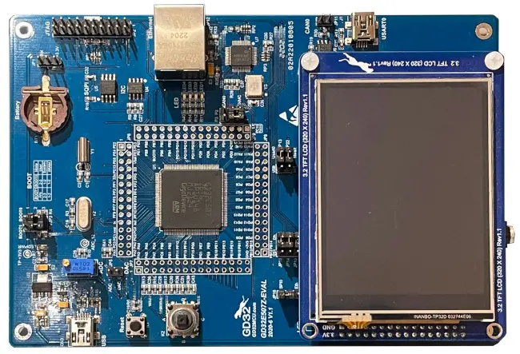

.. _gd32e507z_eval:

GigaDevice GD32E507Z-EVAL
#########################

Overview
********

The GD32E507Z-EVAL board is a hardware platform that enables prototyping
on GD32E507ZE Cortex-M33 High Performance MCU.

The GD32E507ZE features a single-core ARM Cortex-M33 MCU which can run up
to 180 MHz with flash accesses zero wait states, 512kiB of Flash, 128kiB of
SRAM and 112 GPIOs.

Hardware
********

- GD32E507ZET6 MCU
- AT24C02C 2Kb EEPROM
- GD25Q16 16Mbit SPI and QSPI NOR Flash
- GD9FU1G8F2A 1Gbit NAND Flash
- Micron MT48LC16M16A2P-6AIT 256Mbit SDRAM
- 4 x User LEDs
- 1 x Joystick (L/R/U/D/C)
- 1 x USART (connected to USB VCOM at J1 connector)
- 1 x POT connected to an ADC input
- Headphone interface
- USB FS connector
- 1 x CAN (includes SN65HVD230 PHY)
- Ethernet Interface
- 3.2" RGB-LCD (320x240)
- GD-Link on board programmer
- J-Link/JTAG connector

For more information about the GD32E507 SoC and GD32E507Z-EVAL board:

- `GigaDevice Cortex-M33 High Performance SoC Website`_
- `GD32E507X Datasheet`_
- `GD32E50X User Manual`_
- `GD32E507Z-EVAL User Manual`_

Supported Features
==================

The board configuration supports the following hardware features:

.. list-table::
   :header-rows: 1

   * - Peripheral
     - Kconfig option
     - Devicetree compatible
   * - EXTI
     - :kconfig:option:`CONFIG_GD32_EXTI`
     - :dtcompatible:`gd,gd32-exti`
   * - GPIO
     - :kconfig:option:`CONFIG_GPIO`
     - :dtcompatible:`gd,gd32-gpio`
   * - NVIC
     - N/A
     - :dtcompatible:`arm,v8m-nvic`
   * - PWM
     - :kconfig:option:`CONFIG_PWM`
     - :dtcompatible:`gd,gd32-pwm`
   * - SYSTICK
     - N/A
     - N/A
   * - USART
     - :kconfig:option:`CONFIG_SERIAL`
     - :dtcompatible:`gd,gd32-usart`

Serial Port
===========

The GD32E507Z-EVAL board has one serial communication port. The default port
is USART0 with TX connected at PA9 and RX at PA10. USART0 is exposed as a
virtual COM port via the J1 USB connector.

Programming and Debugging
*************************

Before programming your board make sure to configure boot jumpers as
follows:

- JP3/4: Select 2-3 for both (boot from user memory)

Using GD-Link or J-Link
=======================

The board comes with an embedded GD-Link programmer. It can be used with pyOCD
provided you install the necessary CMSIS-Pack:

.. code-block:: console

   pyocd pack install gd32e507ze

J-Link can also be used to program the board using the JTAG interface exposed in
the JP2 header.

#. Build the Zephyr kernel and the :zephyr:code-sample:`hello_world` sample application:

   .. zephyr-app-commands::
      :zephyr-app: samples/hello_world
      :board: gd32e507z_eval
      :goals: build
      :compact:

#. Run your favorite terminal program to listen for output. On Linux the
   terminal should be something like ``/dev/ttyUSB0``. For example:

   .. code-block:: console

      minicom -D /dev/ttyUSB0 -o

   The -o option tells minicom not to send the modem initialization
   string. Connection should be configured as follows:

      - Speed: 115200
      - Data: 8 bits
      - Parity: None
      - Stop bits: 1

#. To flash an image:

   .. zephyr-app-commands::
      :zephyr-app: samples/hello_world
      :board: gd32e507z_eval
      :goals: flash
      :compact:

   You should see "Hello World! gd32e507z_eval" in your terminal.

#. To debug an image:

   .. zephyr-app-commands::
      :zephyr-app: samples/hello_world
      :board: gd32e507z_eval
      :goals: debug
      :compact:

.. _GigaDevice Cortex-M33 High Performance SoC Website:
   https://www.gigadevice.com/products/microcontrollers/gd32/arm-cortex-m33/high-performance-line/

.. _GD32E507X Datasheet:
   https://gd32mcu.com/download/down/document_id/252/path_type/1

.. _GD32E50X User Manual:
   https://www.gd32mcu.com/download/down/document_id/249/path_type/1

.. _GD32E507Z-EVAL User Manual:
   https://www.gd32mcu.com/data/documents/evaluationBoard/GD32E50x_Demo_Suites_V1.2.1.rar
