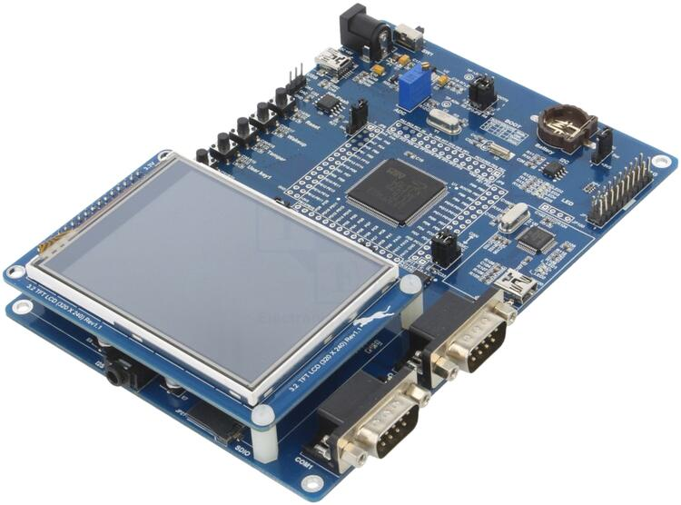

.. _gd32f403z_eval:

GigaDevice GD32F403Z-EVAL
#########################

Overview
********

The GD32F403Z-EVAL board is a hardware platform that enables design and debug
of the GigaDevice F403 Cortex-M4F High Performance MCU.

The GD32F403ZE features a single-core ARM Cortex-M4F MCU which can run up
to 168-MHz with flash accesses zero wait states, 512kiB of Flash, 96kiB of
SRAM and 112 GPIOs.

Hardware
********

- USB interface with mini-USB connector
- 4 user LEDs
- 4 user push buttons
- Reset Button
- CAN port
- ADC connected to a potentiometer
- 2 DAC channels
- GD25Q40 4Mib SPI Flash
- HY27UF081G2A 1GiB NAND Flash
- AT24C02C 2KiB EEPROM
- 3.2 TFT LCD (320x240)
- PCM1770 Stereo DAC with Headphone Amplifier
- Micro-SDHC interface
- GD-Link interface

  - CMSIS-DAP swd debug interface over USB HID.

For more information about the GD32F403 SoC and GD32F403Z-Eval board:

- `GigaDevice Cortex-M4F High Performance SoC Website`_
- `GD32F403 Datasheet`_
- `GD32F403 Reference Manual`_
- `GD32F403Z Eval Schematics`_
- `GD32 ISP Console`_

Supported Features
==================

The board configuration supports the following hardware features:

+-----------+------------+-----------------------+
| Interface | Controller | Driver/Component      |
+===========+============+=======================+
| EXTI      | on-chip    | EXTI interrupt        |
|           |            | controller            |
+-----------+------------+-----------------------+
| GPIO      | on-chip    | gpio                  |
+-----------+------------+-----------------------+
| NVIC      | on-chip    | nested vectored       |
|           |            | interrupt controller  |
+-----------+------------+-----------------------+
| PWM       | on-chip    | PWM                   |
+-----------+------------+-----------------------+
| SYSTICK   | on-chip    | system clock          |
+-----------+------------+-----------------------+
| UART      | on-chip    | serial port-polling   |
+-----------+------------+-----------------------+
| ADC       | on-chip    | ADC                   |
+-----------+------------+-----------------------+

Serial Port
===========

The GD32F403Z-EVAL board has 5 serial communication ports. The default port
is UART0 at PIN-9 and PIN-10.

Programming and Debugging
*************************

Before program your board make sure to configure boot setting and serial port.
The default serial port is USART0.  This port uses header JP-5/6 to route
signals between USB VBUS/ID and USART J2.

+--------+--------+------------+
| Boot-0 | Boot-1 | Function   |
+========+========+============+
|  1-2   |  1-2   | SRAM       |
+--------+--------+------------+
|  1-2   |  2-3   | Bootloader |
+--------+--------+------------+
|  2-3   |  Any   | Flash      |
+--------+--------+------------+

+------+------+-------------+
| JP-5 | JP-6 | Function    |
+======+======+=============+
| 1-2  | 1-2  | USART0 / J2 |
+------+------+-------------+
| 2-3  | 2-3  | USB VBUS/ID |
+------+------+-------------+
| open | open | Free        |
+------+------+-------------+

Using GD-Link
=============

The GD32F403Z-EVAL includes an onboard programmer/debugger (GD-Link) which
allow flash programming and debug over USB. There are also program and debug
headers J1 and J100 that can be used with any ARM compatible tools.

#. Build the Zephyr kernel and the :ref:`hello_world` sample application:

   .. zephyr-app-commands::
      :zephyr-app: samples/hello_world
      :board: gd32f403z_eval
      :goals: build
      :compact:

#. Run your favorite terminal program to listen for output. Under Linux the
   terminal should be :code:`/dev/ttyUSB0`. For example:

   .. code-block:: console

      $ minicom -D /dev/ttyUSB0 -o

   The -o option tells minicom not to send the modem initialization
   string. Connection should be configured as follows:

      - Speed: 115200
      - Data: 8 bits
      - Parity: None
      - Stop bits: 1

#. To flash an image:

   .. zephyr-app-commands::
      :zephyr-app: samples/hello_world
      :board: gd32f403z_eval
      :goals: flash
      :compact:

   You should see "Hello World! gd32f403z_eval" in your terminal.

#. To debug an image:

   .. zephyr-app-commands::
      :zephyr-app: samples/hello_world
      :board: gd32f403z_eval
      :goals: debug
      :compact:

Using ROM bootloader
====================

The GD32F403 MCU have a ROM bootloader which allow flash programming.  User
should install `GD32 ISP Console`_ software at some Linux path.  The recommended
is :code:`$HOME/.local/bin`.

#. Build the Zephyr kernel and the :ref:`hello_world` sample application:

   .. zephyr-app-commands::
      :zephyr-app: samples/hello_world
      :board: gd32f403z_eval
      :goals: build
      :compact:

#. Enable board bootloader:

   - Remove boot-0 jumper
   - press reset button

#. To flash an image:

   .. code-block:: console

      west build -b gd32f403z_eval samples/hello_world
      west flash -r gd32isp [--port=/dev/ttyUSB0]

#. Run your favorite terminal program to listen for output. Under Linux the
   terminal should be :code:`/dev/ttyUSB0`. For example:

   .. code-block:: console

      $ minicom -D /dev/ttyUSB0 -o

   The -o option tells minicom not to send the modem initialization
   string. Connection should be configured as follows:

      - Speed: 115200
      - Data: 8 bits
      - Parity: None
      - Stop bits: 1

   Press reset button

   You should see "Hello World! gd32f403z_eval" in your terminal.

.. _GigaDevice Cortex-M4F High Performance SoC Website:
	https://www.gigadevice.com/products/microcontrollers/gd32/arm-cortex-m4/high-performance-line/gd32f403-series/

.. _GD32F403 Datasheet:
	https://gd32mcu.com/data/documents/datasheet/GD32F403xx_Datasheet_Rev1.3.pdf

.. _GD32F403 Reference Manual:
	https://gd32mcu.com/data/documents/userManual/GD32F403_User_Manual_Rev2.6.pdf

.. _GD32F403Z Eval Schematics:
	http://www.gd32mcu.com/download/down/document_id/270/path_type/1

.. _GD32 ISP Console:
	http://www.gd32mcu.com/download/down/document_id/175/path_type/1
