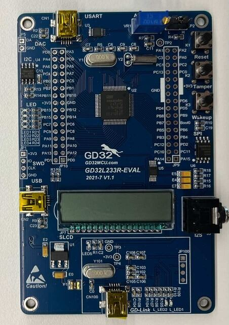

.. _gd32l233r_eval:

GigaDevice GD32L233R-EVA
#########################

Overview
********

The GD32L233R-EVAL board is a hardware platform that enables design and debug
of the GigaDevice GD32L233 Cortex-M23 Low Power MCU.

The GD32RCT6 features a single-core ARM Cortex-M4F MCU which can run up
to 64-MHz with flash accesses zero wait states, 256kB of Flash, 32kB of
SRAM and 59 GPIOs.

Hardware
********

- GD32L233RCT6 MCU
- AT24C02C 2Kb EEPROM
- 4 x User LEDs
- 2 x User Push buttons
- 1 x USART (Mini-USB)
- 1 x POT connected to an ADC input
- Headphone interface
- SLCD segment code screen
- GD-Link on board programmer
- J-Link/SWD connector

For more information about the GD32L233 SoC and GD32L233R-EVAL board:

- `GigaDevice Cortex-M23 Low Power SoC Website`_
- `GD32L233xx Datasheet`_
- `GD32L23x User Manual`_
- `GD32L23x Demo Suites`_

Supported Features
==================

The board configuration supports the following hardware features:

.. list-table::
   :header-rows: 1

   * - Peripheral
     - Kconfig option
     - Devicetree compatible
   * - EXTI
     - :kconfig:option:`CONFIG_GD32_EXTI`
     - :dtcompatible:`gd,gd32-exti`
   * - GPIO
     - :kconfig:option:`CONFIG_GPIO`
     - :dtcompatible:`gd,gd32-gpio`
   * - NVIC
     - N/A
     - :dtcompatible:`arm,v8m-nvic`
   * - SYSTICK
     - N/A
     - N/A
   * - USART
     - :kconfig:option:`CONFIG_SERIAL`
     - :dtcompatible:`gd,gd32-usart`
   * - PINMUX
     - :kconfig:option:`CONFIG_PINCTRL`
     - :dtcompatible:`gd,gd32-pinctrl-af`
   * - ADC
     - :kconfig:option:`CONFIG_ADC`
     - :dtcompatible:`gd,gd32-adc`

Serial Port
===========

The GD32L233R-EVAL board has one serial communication port. The default port
is USART1 with TX connected at PA2 and RX at PA3. USART1 have connect to a
CH04E serial connector with Mini-USB.

Programming and Debugging
*************************

Using J-Link
=============

The GD32L233R-EVAL includes an onboard programmer/debugger (GD-Link) which
allows flash programming and debugging over USB. There is also a SWD header
which can be used with tools like Segger J-Link(latest version required).

#. Build the Zephyr kernel and the :ref:`hello_world` sample application:

   .. zephyr-app-commands::
      :zephyr-app: samples/hello_world
      :board: gd32l233r_eval
      :goals: build
      :compact:

#. Run your favorite terminal program to listen for output. On Linux the
   terminal should be something like ``/dev/ttyUSB0``. For example:

   .. code-block:: console

      minicom -D /dev/ttyUSB0 -o

   The -o option tells minicom not to send the modem initialization
   string. Connection should be configured as follows:

      - Speed: 115200
      - Data: 8 bits
      - Parity: None
      - Stop bits: 1

#. To flash an image:

   .. zephyr-app-commands::
      :zephyr-app: samples/hello_world
      :board: gd32l233r_eval
      :goals: flash
      :compact:

   You should see "Hello World! gd32l233r_eval" in your terminal.

#. To debug an image:

   .. zephyr-app-commands::
      :zephyr-app: samples/hello_world
      :board: gd32l233r_eval
      :goals: debug
      :compact:

.. _GigaDevice Cortex-M23 Low Power SoC Website:
   https://www.gigadevice.com/products/microcontrollers/gd32/arm-cortex-m23/low-power-line/

.. _GD32L233xx Datasheet:
   https://gd32mcu.com/download/down/document_id/289/path_type/1

.. _GD32L23x User Manual:
   https://gd32mcu.com/download/down/document_id/293/path_type/1

.. _GD32L23x Demo Suites:
   https://gd32mcu.com/download/down/document_id/292/path_type/1
