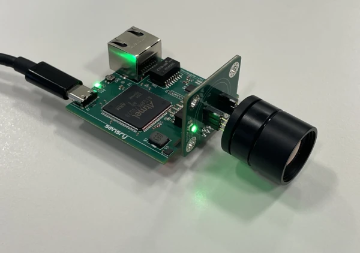

.. zephyr:board:: htpa_eval

.. _htpa_eval:

Overview
********

The Heimann HTPA Eval Board (rev0) is a development platform for the
Heimann Thermopile Sensor Array (HTPA) family sensors. Array sensors
range from 8x8 pixels to 160x120 pixels, each with calibrated per
pixel temperature output.
Zephyr support is available as ``htpa_eval`` board with different
soc variants: ATSAME70Q20B, ATSAME70Q21, and ATSAME70Q21B.
The default target shown below is ATSAME70Q20B.

   Heimann HTPA Eval Board (rev0)

Hardware
********

- ATSAME70Q20B/Q21/Q21B ARM Cortex-M7 processor
- 12 MHz crystal oscillator => SOC @ 300MHz
- 32.768 kHz crystal oscillator
- 1 MiB or 2 MiB internal flash, depending on SoC variant
- 384 KiB RAM
- 1 MiB external SRAM
- Ethernet interface
- USB high-speed controller
- RGB status LEDs
- Camera power and indicator LEDs
- User push-button
- JTAG debug interface

Supported Features
==================

.. zephyr:board-supported-hw::

Connections and IOs
===================

UART0 is routed as the Zephyr console on this board.
For board-specific connector and signal details, refer to the board schematic
and hardware documentation.

System Clock
============

The ATSAME70 MCU is configured to use the 12 MHz external oscillator on the
board with the on-chip PLL to generate a 300 MHz system clock.

Programming and Debugging
*************************

.. zephyr:board-supported-runners::

ROM and Boot Behavior
=====================

Factory-new SAME70 devices boot the `SAM-BA`_ boot loader from ROM rather
than the flashed image. Boot selection is controlled by the GPNVM1
(``General-Purpose NVM bit 1``) flag:

- GPNVM1 = 0 boots the ROM SAM-BA loader
- GPNVM1 = 1 boots from flash

If GPNVM0 is set, the device cannot be programmed via the SAM-BA loader.
A full chip erase is required, which clears the flash and GPNVM bits.
Note: J-Link (the preferred flash option) can program and debug at all time.

OpenOCD and J-Link
==================

The recommended flashing path uses the `OpenOCD tool`_ together with a
`J-Link`_ debug probe. This path automatically sets GPNVM1 to 1 after
programming, so the device boots the flashed image on reset.

Flashing the Zephyr project through OpenOCD requires the `OpenOCD tool`_, which
is built into Zephyr.

Flashing
========

#. Build and flash the :zephyr:code-sample:`hello_world` application for the
   ATSAME70Q20B variant:

   .. zephyr-app-commands::
      :zephyr-app: samples/hello_world
      :board: htpa_eval/same70q20b
      :goals: build flash

   The other supported variants are ``htpa_eval/same70q21`` and
   ``htpa_eval/same70q21b``.

#. Connect your serial terminal to the board console at 115200 8N1.

   You should see ``Hello World! htpa_eval`` in your terminal.

SAM-BA CLI
==========

The board also supports SAM-BA uploads over the external UART interface.
This path is useful when you want to work without a debug probe.

Before using the SAM-BA CLI, assert the board's flash erase jumper so the
device can be erased and recovered if needed. The flash erase signal is
``PB12``. The board's ``R7`` resistor can be shorted while the board is
booting to trigger the flash erase sequence. After the erase sequence is
complete, you can upload the image with the SAM-BA command-line tools over
the board's UART0 serial connection.

Debugging
=========

You can debug an application in the usual way. Here is an example for the
:zephyr:code-sample:`hello_world` application.

.. zephyr-app-commands::
   :zephyr-app: samples/hello_world
   :board: htpa_eval/same70q20b
   :maybe-skip-config:
   :goals: debug

References
**********

.. target-notes::

.. _OpenOCD tool:
   http://openocd.org/

.. _J-Link:
   https://www.segger.com/jlink/

.. _SAM-BA:
   https://www.microchip.com/developmenttools/ProductDetails/PartNO/SAM-BA%20In-system%20Programmer
