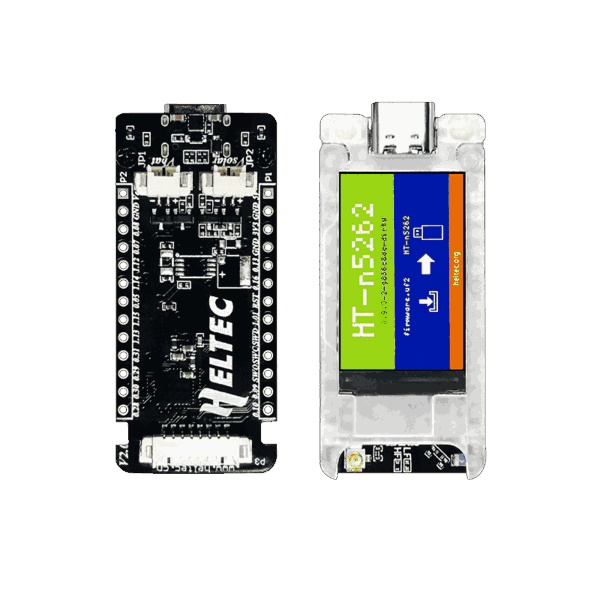
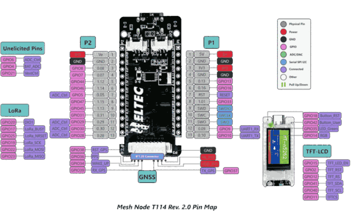

.. zephyr:board:: heltec_mesh_node_t114

Overview
********

The Heltec Mesh Node T114 (version 2.0) is built around the Nordic
Semiconductor nRF52840 ARM Cortex-M4F CPU. The board support enables:

* :abbr:`ADC (Analog to Digital Converter)`
* CLOCK
* FLASH
* :abbr:`GPIO (General Purpose Input Output)`
* :abbr:`MPU (Memory Protection Unit)`
* :abbr:`NVIC (Nested Vectored Interrupt Controller)`
* RADIO (Bluetooth Low Energy and 802.15.4)
* :abbr:`RTC (nRF RTC System Clock)`
* :abbr:`SPI (Serial Peripheral Interface)`
* :abbr:`USB (Universal Serial Bus)`
* :abbr:`WDT (Watchdog Timer)`

Additional SoC peripherals such as I2C, PWM, UART1 and QSPI are routed on
the board and can be enabled by applications or overlays as needed.

The board also integrates:

* Semtech SX1262 LoRa modem
* 1.14-inch ST7789V TFT-LCD (135x240)
* Two WS2812B NeoPixel LEDs
* Battery voltage monitor via ADC
* Vext regulator for external peripherals

Hardware
********

   Heltec Mesh Node T114 v2.0

- nRF52840 ARM Cortex-M4F processor at 64 MHz
- 1 MB flash memory and 256 KB of SRAM
- Footprint for 2 MB external QSPI flash (MX25R1635F)
- Semtech SX1262 LoRa modem
- 1.14-inch ST7789V TFT-LCD (135x240)
- 2 WS2812B NeoPixel LEDs
- 1 user LED (green)
- 1 user button
- USB Type-C connector
- SWD connector
- 8-pin GNSS connector (1.25 mm pitch)
- 2-pin solar panel connector (1.25 mm pitch)
- 2-pin LiPo battery connector (1.25 mm pitch)
- 2x13-pin 2.54 mm header
- Integrated PCB antenna and U.FL connector for LoRa

Supported Features
==================

.. zephyr:board-supported-hw::

Connections and IOs
===================

Pinout
------

   Pinout diagram (Rev. 2.0)

LED
---

* LED0 (green) = P1.03

NeoPixel
--------

* RGB LED data = P0.14 (2 LEDs in chain, GRB order)

Push buttons
------------

* BUTTON = P1.10

LoRa (SX1262)
-------------

* CS    = P0.24
* SCK   = P0.19
* MOSI  = P0.22
* MISO  = P0.23
* RESET = P0.25
* BUSY  = P0.17
* DIO1  = P0.20
* DIO2  = TX enable (internal RF switch)
* DIO3  = TCXO 1.8 V

Display (ST7789V)
-----------------

* CS            = P0.11
* DC (RS)       = P0.12
* RESET         = P0.02
* SCK           = P1.08
* MOSI          = P1.09
* Backlight EN  = P0.15 (active low)
* Display EN    = P0.03 (active low)

The default orientation places the USB connector at the bottom
when reading text normally. If the image appears upside down for
your mechanical layout, apply the provided overlay to rotate
180 degrees::

   west build ... -- -DEXTRA_DTC_OVERLAY_FILE=\
   boards/heltec/heltec_mesh_node_t114/heltec_mesh_node_t114-display-rotate-180.overlay

UART1 (GNSS)
------------

* TX = P1.05
* RX = P1.07

I2C0
----

* SDA = P0.26
* SCL = P0.27

I2C1
----

* SDA = P0.16
* SCL = P0.13

QSPI Flash (MX25R1635F)
-----------------------

.. note::
   The QSPI flash shares pins with the 2x13-pin header P2.
   Enable it only when the header pins are not used for other purposes.
   Some boards may not have the MX25R1635F populated.

* SCK  = P1.14
* CS   = P1.15
* IO0  = P1.12 (MOSI)
* IO1  = P1.13 (MISO)
* IO2  = P0.07 (WP)
* IO3  = P0.05 (HOLD)

Battery monitor
---------------

* ADC input = P0.04 (AIN2)
* ADC enable = P0.06 (controls voltage divider)
* Voltage divider ratio = 100 kΩ / 390 kΩ

Vext regulator
--------------

* Enable = P0.21 (active high)
* Powers the 3V3 rail on the GNSS and header connectors

.. note::
   The Vext regulator is disabled by default. External peripherals such as
   the NeoPixel LEDs, LoRa modem, and GNSS module require Vext to be
   enabled. Applications can enable it via a Devicetree overlay with
   ``regulator-boot-on`` or through the regulator API at runtime.

Programming and Debugging
*************************

.. zephyr:board-supported-runners::

Flashing
========

The board ships with the HT-n5262 UF2 bootloader. It is flashed by copying
a UF2 file to the mass storage device that appears when the board is in
bootloader mode.

UF2 target
----------

The Heltec Mesh Node T114 ships with the HT-n5262 UF2 bootloader. The
bootloader requires the Nordic S140 SoftDevice v6.1.1 to be present so
that the application is loaded at address ``0x26000``.

Build the :zephyr:code-sample:`blinky` sample for the UF2 target:

.. zephyr-app-commands::
   :zephyr-app: samples/basic/blinky
   :board: heltec_mesh_node_t114/nrf52840/uf2
   :goals: build
   :compact:

#. Connect the board to your host computer using USB.

#. Double-press the reset button to enter bootloader mode. A mass storage
device named ``HT-n5262`` should appear on the host.

#. Copy the UF2 file to the mass storage device. On macOS, use ``cp -X``
   to avoid extended attributes issues.

   .. code-block:: console

      cp -X build/zephyr/zephyr.uf2 /Volumes/HT-n5262/

#. The board will reset automatically and run the application.

References
**********

.. target-notes::
