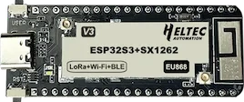
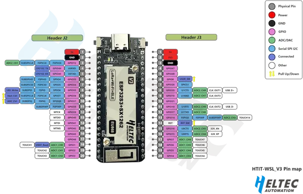

.. heltec_wireless_stick_lite_v3:

HelTec Wireless Stick Lite (V3)
###############################

Overview
********

HelTec Wireless Stick Lite (V3) is a development board with Wi-Fi, Bluetooth and LoRa support. It is designed and produced by HelTec Automation(TM). [1]_

   HelTec Wireless Stick Lite (V3) (Credit: Chengdu HelTec Automation Technology Co., Ltd.)

Hardware
********

The main hardware features are:

- ESP32-S3FN8 low-power MCU-based SoC (dual-core Xtensa® 32-bit LX7 microprocessor, five stage pipeline rack Structure, main frequency up to 240 MHz).
- Semtech SX1262 LoRa node chip
- Type-C USB interface with a complete voltage regulator, ESD protection, short circuit protection, RF shielding, and other protection measures (note: you need an USB-A to USB-C cable if you want to power-up the board from USB).
- Onboard SH1.25-2 battery interface, integrated lithium battery management system (charge and discharge management, overcharge protection, battery power detection, USB / battery power automatic switching).
- Integrated WiFi and Bluetooth interfaces with 2.4GHz metal spring antenna and reserved IPEX (U.FL) interface for LoRa use.
- Integrated CP2102 USB to serial port chip, convenient for program downloading, debugging information printing.
- Good RF circuit design and low-power design.

Supported Features
==================
- LoRa via SPI
- UART0 (USB Serial via CP2102)
- UART1
- I2C
- CAN (optional, need to enable)
- PWM LED
- User Switch / Button

Connections and IOs
===================

   Pinout (Credit: Chengdu HelTec Automation Technology Co., Ltd.)

.. table:: HelTec Wireless Stick Lite (V3) Pinout
   :widths: auto

   +--------+---------+-----------------------------+
   | Header | Function| Description                 |
   +========+=========+=============================+
   | J2.1   | Ve      |                             |
   +--------+---------+-----------------------------+
   | J2.2   | GND     |                             |
   +--------+---------+-----------------------------+
   | J2.3   |         |                             |
   +--------+---------+-----------------------------+
   | J2.4   | U0RXD   | Zephyr Console+Shell        |
   +--------+---------+-----------------------------+
   | J2.5   | U0TXD   | Zephyr Console+Shell        |
   +--------+---------+-----------------------------+
   | J2.6   |         |                             |
   +--------+---------+-----------------------------+
   | J2.7   |         |                             |
   +--------+---------+-----------------------------+
   | J2.8   | GPIO35  | PWM LED Control             |
   +--------+---------+-----------------------------+
   | J2.9   | GPIO36  | Vext Control                |
   +--------+---------+-----------------------------+
   | J2.10  | GPIO37  | ADC Control                 |
   +--------+---------+-----------------------------+
   | J2.11  |         |                             |
   +--------+---------+-----------------------------+
   | J2.12  | GPIO39  |                             |
   +--------+---------+-----------------------------+
   | J2.13  | GPIO40  |                             |
   +--------+---------+-----------------------------+
   | J2.14  | GPIO41  |                             |
   +--------+---------+-----------------------------+
   | J2.15  | GPIO42  |                             |
   +--------+---------+-----------------------------+
   | J2.16  | GPIO45  |                             |
   +--------+---------+-----------------------------+
   | J2.17  | GPIO46  |                             |
   +--------+---------+-----------------------------+
   | J2.18  | ADC1_CH0| Battery Voltage Measurement |
   +--------+---------+-----------------------------+
   | J2.19  |         |                             |
   +--------+---------+-----------------------------+
   | J2.20  |         |                             |
   +--------+---------+-----------------------------+
   | J3.1   | 5V      |                             |
   +--------+---------+-----------------------------+
   | J3.2   | 3V3     |                             |
   +--------+---------+-----------------------------+
   | J3.3   | GND     |                             |
   +--------+---------+-----------------------------+
   | J3.4   | GPIO47  |                             |
   +--------+---------+-----------------------------+
   | J3.5   | GPIO48  |                             |
   +--------+---------+-----------------------------+
   | J3.6   | GPIO0   | User Switch                 |
   +--------+---------+-----------------------------+
   | J3.7   |         |                             |
   +--------+---------+-----------------------------+
   | J3.8   |         |                             |
   +--------+---------+-----------------------------+
   | J3.9   | U1RXD   | UART 1                      |
   +--------+---------+-----------------------------+
   | J3.10  | GPIO21  |                             |
   +--------+---------+-----------------------------+
   | J3.11  |         |                             |
   +--------+---------+-----------------------------+
   | J3.12  | U1TXD   | UART 1                      |
   +--------+---------+-----------------------------+
   | J3.13  |         |                             |
   +--------+---------+-----------------------------+
   | J3.14  | NC      | Reset Switch                |
   +--------+---------+-----------------------------+
   | J3.15  |         |                             |
   +--------+---------+-----------------------------+
   | J3.16  |         |                             |
   +--------+---------+-----------------------------+
   | J3.17  |         |                             |
   +--------+---------+-----------------------------+
   | J3.18  |         |                             |
   +--------+---------+-----------------------------+
   | J3.19  | TWAI_TX | CAN (optional)              |
   +--------+---------+-----------------------------+
   | J3.20  | TWAI_RX | CAN (optional)              |
   +--------+---------+-----------------------------+

System requirements
*******************

Prerequisites
=============

Espressif HAL requires WiFi and Bluetooth binary blobs in order work. Run the command
below to retrieve those files.

.. code-block:: console

   west blobs fetch hal_espressif

.. note::

   It is recommended running the command above after :file:`west update`.

Programming and Debugging
*************************

Simple boot
===========

The board could be loaded using the single binary image, without 2nd stage bootloader.
It is the default option when building the application without additional configuration.

.. note::

   Simple boot does not provide any security features nor OTA updates.

MCUboot bootloader
==================

User may choose to use MCUboot bootloader instead. In that case the bootloader
must be built (and flashed) at least once.

There are two options to be used when building an application:

1. Sysbuild
2. Manual build

.. note::

   User can select the MCUboot bootloader by adding the following line
   to the board default configuration file.

   .. code:: cfg

      CONFIG_BOOTLOADER_MCUBOOT=y

Sysbuild
========

The sysbuild makes possible to build and flash all necessary images needed to
bootstrap the board with the EPS32-S3 SoC.

To build the sample application using sysbuild use the command:

.. zephyr-app-commands::
   :tool: west
   :zephyr-app: samples/hello_world
   :board: heltec_wireless_stick_lite_v3
   :goals: build
   :west-args: --sysbuild
   :compact:

By default, the ESP32S3 sysbuild creates bootloader (MCUboot) and application
images. But it can be configured to create other kind of images.

Build directory structure created by sysbuild is different from traditional
Zephyr build. Output is structured by the domain subdirectories:

.. code-block::

  build/
  ├── hello_world
  │   └── zephyr
  │       ├── zephyr.elf
  │       └── zephyr.bin
  ├── mcuboot
  │    └── zephyr
  │       ├── zephyr.elf
  │       └── zephyr.bin
  └── domains.yaml

.. note::

   With ``--sysbuild`` option the bootloader will be re-build and re-flash
   every time the pristine build is used.

For more information about the system build please read the :ref:`sysbuild` documentation.

Manual build
============

During the development cycle, it is intended to build & flash as quickly possible.
For that reason, images can be built one at a time using traditional build.

The instructions following are relevant for both manual build and sysbuild.
The only difference is the structure of the build directory.

.. note::

   Remember that bootloader (MCUboot) needs to be flash at least once.

Build and flash applications as usual (see :ref:`build_an_application` and
:ref:`application_run` for more details).

.. zephyr-app-commands::
   :zephyr-app: samples/hello_world
   :board: heltec_wireless_stick_lite_v3/esp32s3/procpu
   :goals: build

The usual ``flash`` target will work with the ``heltec_wireless_stick_lite_v3`` board
configuration. Here is an example for the :ref:`hello_world`
application.

.. zephyr-app-commands::
   :zephyr-app: samples/hello_world
   :board: heltec_wireless_stick_lite_v3/esp32s3/procpu
   :goals: flash

Open the serial monitor using the following command:

.. code-block:: shell

   west espressif monitor

After the board has automatically reset and booted, you should see the following
message in the monitor:

.. code-block:: console

   ***** Booting Zephyr OS vx.x.x-xxx-gxxxxxxxxxxxx *****
   Hello World! heltec_wireless_stick_lite_v3

Debugging
=========

As with much custom hardware, the ESP32S3 modules require patches to
OpenOCD that are not upstreamed yet. Espressif maintains their own fork of
the project. The custom OpenOCD can be obtained at `OpenOCD ESP32`_.

The Zephyr SDK uses a bundled version of OpenOCD by default. You can overwrite that behavior by adding the
``-DOPENOCD=<path/to/bin/openocd> -DOPENOCD_DEFAULT_PATH=<path/to/openocd/share/openocd/scripts>``
parameter when building.

Here is an example for building the :ref:`hello_world` application.

.. zephyr-app-commands::
   :zephyr-app: samples/hello_world
   :board: heltec_wireless_stick_lite_v3/esp32s3/procpu
   :goals: build flash
   :gen-args: -DOPENOCD=<path/to/bin/openocd> -DOPENOCD_DEFAULT_PATH=<path/to/openocd/share/openocd/scripts>

You can debug an application in the usual way. Here is an example for the :ref:`hello_world` application.

.. zephyr-app-commands::
   :zephyr-app: samples/hello_world
   :board: heltec_wireless_stick_lite_v3/esp32s3/procpu
   :goals: debug

References
**********

- `Heltec Wireless Stick Lite (v3) Pinout Diagram <https://resource.heltec.cn/download/Wireless_Stick_Lite_V3/HTIT-WSL_V3.png>`_
- `Heltec Wireless Stick Lite (v3) Schematic Diagrams <https://resource.heltec.cn/download/Wireless_Stick_Lite_V3/HTIT-WSL_V3_Schematic_Diagram.pdf>`_
- `ESP-IDF Programming Guide <https://docs.espressif.com/projects/esp-idf/en/latest/esp32s3/api-reference/index.html>`_
- `esptool documentation <https://github.com/espressif/esptool/blob/master/README.md>`_
- `OpenOCD ESP32 <https://github.com/espressif/openocd-esp32/releases>`_

.. [1] https://heltec.org/project/wireless-stick-lite-v2/
