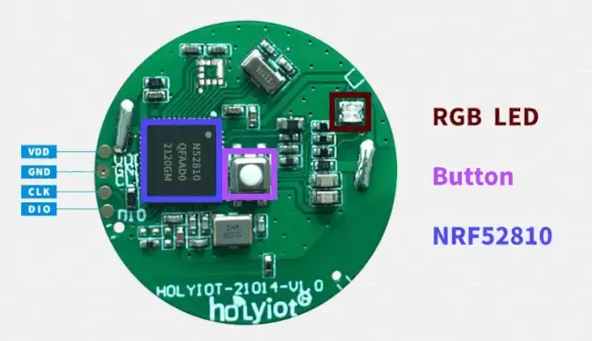

.. zephyr:board:: holyiot_21014

Overview
********

The Holyiot_ 21014 module is built around the Nordic Semiconductor
`nRF52810`_ Arm Cortex-M4 SoC with 192 KiB of flash and 24 KiB of RAM. The
module have one user button and an RGB LED.

     Holyiot 21014 module

Supported Features
==================

.. zephyr:board-supported-hw::

Connections and IOs
===================

* Button: ``P0.31``
* RGB LED: ``P0.29`` (red), ``P0.30`` (green), ``P0.28`` (blue)
* SPI0: ``P0.5`` (SCK), ``P0.2`` (MOSI), ``P0.3`` (MISO)

Programming and Debugging
*************************

.. zephyr:board-supported-runners::

The board must be programmed using an external SWD probe (for example, a Segger
J-Link) connected to the SWDIO, SWCLK, VDD, and GND pads.

Flashing
========

Follow the instructions in the :ref:`nordic_segger` page to install and
configure the required software. Then build and flash applications as usual
(see :ref:`build_an_application` and :ref:`application_run` for more details).

Here is an example for the :zephyr:code-sample:`blinky` application:

.. zephyr-app-commands::
   :zephyr-app: samples/basic/blinky
   :board: holyiot_21014
   :goals: build flash

Testing the LED and button
==========================

You can test the board peripherals with the following samples:

.. code-block:: console

   samples/basic/blinky
   samples/basic/button

References
**********

.. target-notes::

.. _Holyiot: http://www.holyiot.com
.. _nRF52810: https://www.nordicsemi.com/Products/Low-power-short-range-wireless/nRF52810
