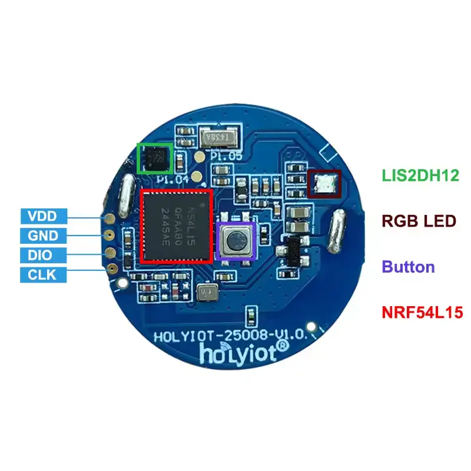

.. zephyr:board:: holyiot_25008

Overview
********

The Holyiot 25008 module is based on the Nordic Semiconductor nRF54L15 SoC.
It includes a 32 MHz crystal (HFXO), a 32.768 kHz crystal (LFXO), one RGB LED,
one push button, and an LIS2DH12 accelerometer.

     Holyiot 25008 module

Supported Features
==================

.. zephyr:board-supported-hw::

Connections and IOs
===================

* UART: ``P1.04`` (TX), ``P1.05`` (RX)
* Button: ``P1.13``
* RGB LED: ``P2.09`` (red), ``P1.10`` (green), ``P2.07`` (blue)
* LIS2DH12 (SPI): ``P2.01`` (SCK), ``P2.02`` (MOSI), ``P2.04`` (MISO),
  ``P2.05`` (CS), ``P2.00`` (INT1), ``P2.03`` (INT2)

Programming and Debugging
*************************

.. zephyr:board-supported-runners::

The board must be programmed using an external SWD probe connected to SWDIO,
SWCLK, VDD, and GND.

Flashing
========

Here is an example for the :zephyr:code-sample:`blinky` application:

.. zephyr-app-commands::
   :zephyr-app: samples/basic/blinky
   :board: holyiot_25008/nrf54l15/cpuapp
   :goals: build flash

References
**********

.. target-notes::

.. _Holyiot: http://www.holyiot.com
.. _nRF54L15: https://www.nordicsemi.com/Products/nRF54-series/nRF54L15
