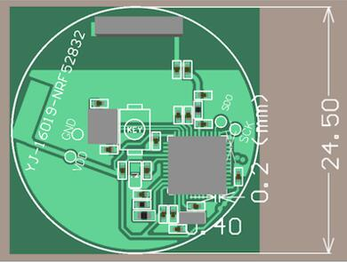

.. zephyr:board:: holyiot_yj16019

Overview
********

The `Holyiot`_ YJ-16019 hardware provides support for the Nordic
Semiconductor nRF52832 ARM Cortex-M4 CPU and the following devices:

* CLOCK
* FLASH
* :abbr:`GPIO (General Purpose Input Output)`
* :abbr:`MPU (Memory Protection Unit)`
* :abbr:`NVIC (Nested Vectored Interrupt Controller)`
* :abbr:`PWM (Pulse Width Modulation)`
* RADIO (Bluetooth Low Energy)
* :abbr:`RTC (nRF RTC System Clock)`
* Segger RTT (RTT Console)
* :abbr:`WDT (Watchdog Timer)`

The board is equipped with one LED, one push button, and is powered by
a CR2032 coin cell. The `Nordic Semiconductor Infocenter`_
contains the processor's information and the datasheet.

Hardware
********

The nRF52832 of the Holyiot YJ-16019 is clocked by an external crystal with a frequency of 32 MHz
(Y1). The 32.768 kHz crystal (Y2) shown on the board schematics is not mounted.

Supported Features
==================

.. zephyr:board-supported-hw::

Connections and IOs
===================

LED and push button
-------------------

* Push button = P0.28
* LED = P0.29

Programming and Debugging
*************************

Applications for the ``holyiot_yj16019`` board configuration can be
built and flashed in the usual way (see :ref:`build_an_application`
and :ref:`application_run` for more details); however, an external
Segger J-Link is required since the board does not have any on-board
debug IC.

The following pins of the Segger J-Link must be connected to the following test
pads on the PCB (see image):

* VTref = VCC
* GND = GND
* SWDIO = SDO
* SWCLK = SCK

     Holyiot YJ-16019 PCB (Credit: Holyiot)

Flashing
========

Follow the instructions in the :ref:`nordic_segger` page to install
and configure all the necessary software. Further information can be
found in :ref:`nordic_segger_flashing`. Then build and flash
applications as usual (see :ref:`build_an_application` and
:ref:`application_run` for more details).

Here is an example for the :zephyr:code-sample:`blinky` application.

.. zephyr-app-commands::
   :zephyr-app: samples/basic/blinky
   :board: holyiot_yj16019
   :goals: build flash

Debugging
=========

Refer to the :ref:`nordic_segger` page to learn about debugging Nordic
nRF52x-based boards with a Segger debugger.

Testing the LED and button on the Holyiot YJ-16019
**************************************************

There are 2 samples that allow you to test that the button and LED on
the board are working properly with Zephyr:

.. code-block:: console

   samples/basic/blinky
   samples/basic/button

You can build and flash the examples to make sure Zephyr is running
correctly on your board. The button and LED definitions can be found
in :zephyr_file:`boards/holyiot/yj16019/holyiot_yj16019.dts`.

References
**********

.. target-notes::

.. _Holyiot: http://www.holyiot.com
.. _Nordic Semiconductor Infocenter: https://infocenter.nordicsemi.com
