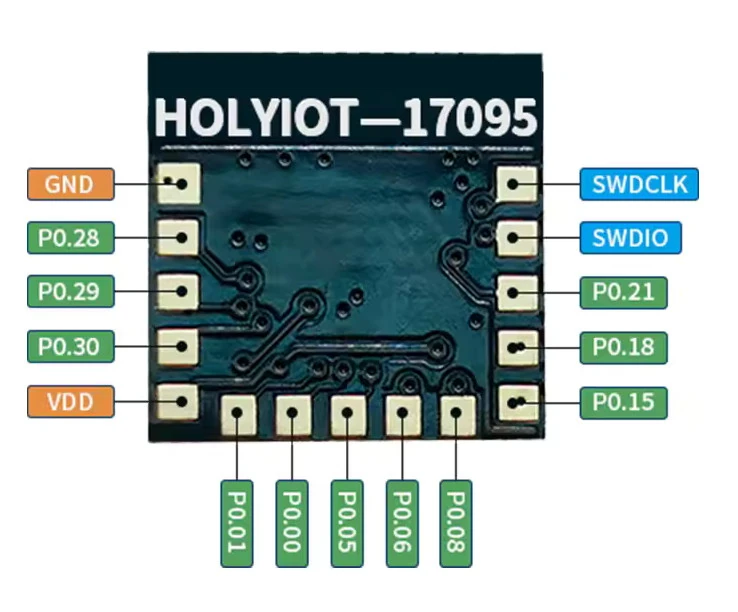

.. zephyr:board:: holyiot_yj17095

Overview
********

The `Holyiot`_ YJ-17095 hardware features the Nordic Semiconductor nRF52832 ARM Cortex-M4 CPU and the following devices:

* CLOCK
* FLASH
* :abbr:`GPIO (General Purpose Input Output)`
* :abbr:`MPU (Memory Protection Unit)`
* :abbr:`NVIC (Nested Vectored Interrupt Controller)`
* :abbr:`PWM (Pulse Width Modulation)`
* RADIO (Bluetooth Low Energy)
* :abbr:`RTC (nRF RTC System Clock)`
* Segger RTT (RTT Console)
* :abbr:`WDT (Watchdog Timer)`

The board does not contain peripherals for direct physical interaction, but it has an on-board 2.4 GHz antenna for
Bluetooth Low Energy (BLE) communication. There are 11 GPIO pins accessible via solder pads on the board, in addition to
pins for power supply and SWD programming. The `Nordic Semiconductor Infocenter`_ contains the processor's information
and the datasheet. The boards measures 9.4mm by 9.25mm.

Hardware
********

The nRF52832 of the Holyiot YJ-17095 is clocked by an external crystal with a frequency of 32 MHz.

Supported Features
==================

.. zephyr:board-supported-hw::

Connections and IOs
===================

     Holyiot YJ-17095 PCB and pin out (Credit: Holyiot)

Programming and Debugging
*************************

.. zephyr:board-supported-runners::

The boards can be programmed and debugged using an external programming and debugging tool, such as a Segger J-Link
(see :ref:`build_an_application` and :ref:`application_run` for more details).

The following pins of the Segger J-Link must be connected to the following test
pads on the PCB (see image):

* VTref = VDD
* GND = GND
* SWDIO = SWDIO
* SWCLK = SWCLK

Flashing
========

Follow the instructions in the :ref:`nordic_segger` page to install and configure all the necessary software. Further
information can be found in :ref:`nordic_segger_flashing`. Then build and flash applications as usual
(see :ref:`build_an_application` and :ref:`application_run` for more details).

Here is an example for the :zephyr:code-sample:`blinky` application. Since there is not LED mounted on the PCB the
toggling GPIO can be measured on ``P0.29`` with a multimeter or an oscilloscope.

.. zephyr-app-commands::
   :zephyr-app: samples/basic/blinky
   :board: holyiot_yj17095
   :goals: build flash

Debugging
=========

Refer to the :ref:`nordic_segger` page to learn about debugging Nordic nRF52x-based boards with a Segger debugger.

Testing Bluetooth Low Energy (BLE) connectivity
***********************************************

The easiest way to test the Bluetooth Low Energy (BLE) connectivity of the board is to build and flash the
:zephyr:code-sample:`ble_periodic_adv` application.

.. zephyr-app-commands::
   :zephyr-app: samples/bluetooth/periodic_adv
   :board: holyiot_yj17095
   :goals: build flash

References
**********

.. target-notes::

.. _Holyiot: http://www.holyiot.com
.. _Nordic Semiconductor Infocenter: https://infocenter.nordicsemi.com
