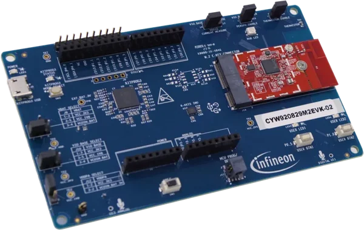

.. zephyr:board:: cyw920829m2evk_02

Overview
********

The `CYW920829M2EVK-02`_ is an evaluation kit for the AIROC™ CYW20829
Bluetooth® LE MCU, featuring an Arm® Cortex®-M33 core running at
96 MHz. It is designed for Bluetooth® Low Energy applications including
industrial IoT, smart home, asset tracking, beacons, sensors, and medical
devices.

Key features include 2048 KB flash, 1024 KB SRAM, Bluetooth® LE with
10 dBm TX output power (no external PA required), and a comprehensive set of
on-board sensors and peripherals.

The board supports Arduino Uno R3 headers and includes an onboard `KitProg3`_
programmer/debugger with micro-B USB connectivity.

The CYW920829M2EVK-02 supports multiple SoC variants:

+------------------------------------------+------------------+
| Build Target                             | SoC Variant      |
+==========================================+==================+
| ``cyw920829m2evk_02/cyw20829b0lkml``     | CYW20829 B0LKML  |
+------------------------------------------+------------------+
| ``cyw920829m2evk_02/cyw20829b1010``      | CYW20829 B1010   |
+------------------------------------------+------------------+
| ``cyw920829m2evk_02/cyw20829b1340``      | CYW20829 B1340   |
+------------------------------------------+------------------+

Hardware
********

- **SoC:** AIROC CYW20829 Bluetooth® LE MCU (56-pin QFN)
- **CPU:** Arm® Cortex®-M33 at 96 MHz
- **Flash:** 2048 KB
- **SRAM:** 1024 KB
- **Wireless:** Bluetooth® LE (10 dBm TX, no external PA required)
- **Sensors:** 6-axis IMU, thermistor, analog mic, digital mic
- **USB:** Micro-B (power, programming, USB-UART bridge)
- **Expansion:** Arduino Uno R3 compatible headers
- **User I/O:** RGB LED, two user LEDs, two user switches
- **Debug:** Onboard KitProg3 (SWD + USB-UART)
- **Power:** USB powered (3.3V operating)

For more information about the CYW20829 SoC and CYW920829M2EVK-02 board:

- `CYW20829 SoC Website`_
- `CYW920829M2EVK-02 Board Website`_

Kit Contents
============

- CYW20829 evaluation board (CYW9BTM2BASE3 + CYW920829M2IPA2)
- USB Type-A to Micro-B cable
- Six jumper wires
- Quick start guide

Supported Features
==================

.. zephyr:board-supported-hw::

Connections and IOs
===================

LEDs
----

+---------+--------------------+
| Name    | GPIO Pin           |
+=========+====================+
| LED0    | P1.1 (active low)  |
+---------+--------------------+
| LED1    | P5.2 (active low)  |
+---------+--------------------+

Push Buttons
------------

+---------+---------------------------+
| Name    | GPIO Pin                  |
+=========+===========================+
| SW1     | P0.5 (active low, pullup) |
+---------+---------------------------+
| SW2     | P1.0 (active low, pullup) |
+---------+---------------------------+

Default Zephyr Peripheral Mapping
----------------------------------

+-----------+-----------------+----------------------------+
| Pin       | Function        | Usage                      |
+===========+=================+============================+
| P3.3      | SCB2 UART TX    | Console TX                 |
+-----------+-----------------+----------------------------+
| P3.2      | SCB2 UART RX    | Console RX                 |
+-----------+-----------------+----------------------------+
| P3.1      | SCB2 UART RTS   | Console RTS                |
+-----------+-----------------+----------------------------+
| P3.0      | SCB2 UART CTS   | Console CTS                |
+-----------+-----------------+----------------------------+
| P1.1      | GPIO            | LED0                       |
+-----------+-----------------+----------------------------+
| P5.2      | GPIO            | LED1                       |
+-----------+-----------------+----------------------------+
| P0.5      | GPIO            | Button SW1                 |
+-----------+-----------------+----------------------------+
| P1.0      | GPIO            | Button SW2                 |
+-----------+-----------------+----------------------------+

System Clock
============

The AIROC CYW20829 uses the Internal High-frequency Oscillator (IHO) as the
clock source. The clock path is:

- **FLL**: IHO → 96 MHz
- **CLK_HF0**: 96 MHz (system clock)

Serial Port
============

The AIROC CYW20829 has multiple SCB (Serial Communication Block) interfaces.
The Zephyr console output is assigned to **SCB2** (``uart2``), which is routed
through the KitProg3 USB-UART bridge with hardware flow control.

Default communication settings are **115200 8N1**.

Prerequisites
*************

The CYW920829M2EVK-02 requires binary blobs (e.g., Bluetooth controller
firmware) to be fetched before building:

.. code-block:: console

   west blobs fetch hal_infineon

.. note::

   MCUboot image signing on this board requires cysecuretools (Edge Protect
   Tools). Install with: ``pip install cysecuretools``

Building
********

Here is an example for the :zephyr:code-sample:`hello_world` application.

.. zephyr-app-commands::
   :zephyr-app: samples/hello_world
   :board: cyw920829m2evk_02/cyw20829b0lkml
   :goals: build

Programming and Debugging
*************************

.. zephyr:board-supported-runners::

The `CYW920829M2EVK-02`_ includes an onboard programmer/debugger (`KitProg3`_)
which can be used to program and debug the AIROC CYW20829 Cortex-M33 core.

The CYW920829M2EVK-02 also supports RTT via a SEGGER J-Link device, under the
target name ``cyw20829_tm``. This can be enabled by building with the
``rtt-console`` snippet or setting the following Kconfig values:
``CONFIG_UART_CONSOLE=n``, ``CONFIG_RTT_CONSOLE=y``, and
``CONFIG_USE_SEGGER_RTT=y``.

.. code-block:: shell

   west build -p always -b cyw920829m2evk_02/cyw20829b0lkml samples/basic/blinky -S rtt-console

.. note::

   For RTT control block, do not use "Auto Detection". Instead, set the search
   range to: RAM RangeStart at 0x20000000 and RAM RangeSize of 0x3d000.

Infineon OpenOCD Installation
=============================

The `ModusToolbox™ Programming Tools`_ package includes Infineon OpenOCD.
Alternatively, a standalone installation can be done by downloading the
`Infineon OpenOCD`_ release for your system and extracting the files to a
location of your choice.

.. note::

   Linux requires device access rights to be set up for KitProg3. This is
   handled automatically by the ModusToolbox™ Programming Tools installation.
   When doing a standalone OpenOCD installation, this can be done
   manually by executing the script ``openocd/udev_rules/install_rules.sh``.

Configuring a Console
=====================

Connect a USB cable from your PC to the KitProg3 micro-B USB connector (J5)
on the `CYW920829M2EVK-02`_.Use the serial terminal of your choice (minicom, PuTTY,
etc.) with the following settings:

- **Speed:** 115200
- **Data:** 8 bits
- **Parity:** None
- **Stop bits:** 1

Flashing
========

.. tabs::

   .. group-tab:: Windows

      One time, set the Infineon OpenOCD path:

      .. code-block:: shell

         west config build.cmake-args -- "-DOPENOCD=path/to/infineon/openocd/bin/openocd.exe"

      Build and flash the application:

      .. code-block:: shell

         west build -b cyw920829m2evk_02/cyw20829b0lkml -p always samples/hello_world
         west flash

   .. group-tab:: Linux

      One time, set the Infineon OpenOCD path:

      .. code-block:: shell

         west config build.cmake-args -- -DOPENOCD=path/to/infineon/openocd/bin/openocd

      Build and flash the application:

      .. code-block:: shell

         west build -b cyw920829m2evk_02/cyw20829b0lkml -p always samples/hello_world
         west flash

You should see the following message on the console:

.. code-block:: console

   *** Booting Zephyr OS build vX.Y.Z ***
   Hello World! cyw920829m2evk_02

Debugging
=========

.. zephyr-app-commands::
   :zephyr-app: samples/hello_world
   :board: cyw920829m2evk_02/cyw20829b0lkml
   :goals: debug

Once the GDB console starts, you may set breakpoints and perform standard
GDB debugging on the AIROC CYW20829 Cortex-M33 core.

Operate in SECURE Lifecycle Stage
*********************************

The device lifecycle stage (LCS) is a key aspect of the security of the AIROC
CYW20829 Bluetooth® MCU. The lifecycle stages follow a strict, irreversible
progression dictated by the programming of the eFuse bits (changing the value
from "0" to "1"). This system is used to protect the device's data and code at
the level required by the user. SECURE is the lifecycle stage of a secured
device.

Follow the instructions in `AN239590 Provision CYW20829 to SECURE LCS`_ to
transition the device to SECURE LCS. In the SECURE LCS stage, the protection
state is set to secure. A secured device will only boot if the authentication
of its flash content is successful.

The following configuration options can be used to build for a device which has
been provisioned to SECURE LCS and configured to use an encrypted flash
interface:

- :kconfig:option:`CONFIG_INFINEON_SECURE_LCS`: Enable if the target device is
  in SECURE LCS
- :kconfig:option:`CONFIG_INFINEON_SECURE_POLICY`: Path to the policy JSON file,
  which was created for provisioning the device to SECURE LCS (refer to section
  3.2 "Key creation" of `AN239590 Provision CYW20829 to SECURE LCS`_)
- :kconfig:option:`CONFIG_INFINEON_SMIF_ENCRYPTION`: Enable to use encrypted
  flash interface when provisioned to SECURE LCS

Here is an example for building the :zephyr:code-sample:`blinky` sample
application for SECURE LCS:

.. zephyr-app-commands::
   :goals: build
   :board: cyw920829m2evk_02/cyw20829b0lkml
   :zephyr-app: samples/basic/blinky
   :west-args: -p always
   :gen-args: -DCONFIG_INFINEON_SECURE_LCS=y -DCONFIG_INFINEON_SECURE_POLICY=\"policy/policy_secure.json\"

Using MCUboot
*************

CYW20829 devices are supported by the Cypress MCU bootloader (MCUBootApp) from
the `Cypress branch of MCUboot`_.

Building Cypress MCU Bootloader MCUBootApp
==========================================

Please refer to the `CYW20829 platform description`_ and follow the
instructions to understand the MCUBootApp building process for normal/secure
silicon and its overall usage as a bootloader. Place keys and policy-related
folders in the cypress directory ``mcuboot/boot/cypress/``.

Ensure the default memory map matches the memory map of the Zephyr application
(refer to partitions of flash0 in
:zephyr_file:`boards/infineon/cyw920829m2evk_02/cyw920829m2evk_02-memory_map.dtsi`).

You can use ``west flash`` to flash MCUBootApp:

.. code-block:: shell

   # Flash MCUBootApp.hex
   west flash --no-rebuild --hex-file /path/to/cypress/mcuboot/boot/cypress/MCUBootApp/out/CYW20829/Debug/MCUBootApp.hex

.. note::

   ``west flash`` requires an existing Zephyr build directory which can be
   created by first building any Zephyr application for the target board.

Build Zephyr Application with MCUboot
======================================

Here is an example for building and flashing the :zephyr:code-sample:`blinky`
sample application for MCUboot:

.. zephyr-app-commands::
   :goals: build flash
   :board: cyw920829m2evk_02/cyw20829b0lkml
   :zephyr-app: samples/basic/blinky
   :west-args: -p always
   :gen-args: -DCONFIG_BOOTLOADER_MCUBOOT=y -DCONFIG_MCUBOOT_SIGNATURE_KEY_FILE=\"/path/to/cypress/mcuboot/boot/cypress/keys/cypress-test-ec-p256.pem\"

If you use :kconfig:option:`CONFIG_MCUBOOT_ENCRYPTION_KEY_FILE` to generate an
encrypted image then the final hex will be ``zephyr.signed.encrypted.hex`` and
the corresponding bin file will be ``zephyr.signed.encrypted.bin``. Use these
files for flashing and OTA uploading respectively.

For example, to build and flash an encrypted :zephyr:code-sample:`blinky`
sample application image for MCUboot:

.. zephyr-app-commands::
   :goals: build flash
   :board: cyw920829m2evk_02/cyw20829b0lkml
   :zephyr-app: samples/basic/blinky
   :west-args: -p always
   :gen-args: -DCONFIG_BOOTLOADER_MCUBOOT=y -DCONFIG_MCUBOOT_SIGNATURE_KEY_FILE=\"/path/to/cypress/mcuboot/boot/cypress/keys/cypress-test-ec-p256.pem\" -DCONFIG_MCUBOOT_ENCRYPTION_KEY_FILE=\"/path/to/cypress/mcuboot/enc-ec256-pub.pem\"
   :flash-args: --hex-file build/zephyr/zephyr.signed.encrypted.hex

References
**********

.. _CYW920829M2EVK-02:
    https://www.infineon.com/cms/en/product/promopages/airoc20829/

.. _CYW20829 SoC Website:
    https://www.infineon.com/cms/en/product/wireless-connectivity/airoc-bluetooth-le-bluetooth-multiprotocol/airoc-bluetooth-le/cyw20829/

.. _CYW920829M2EVK-02 Board Website:
    https://www.infineon.com/cms/en/product/evaluation-boards/cyw920829m2evk-02/

.. _CYW920829M2EVK-02 BT User Guide:
    https://www.infineon.com/cms/en/product/wireless-connectivity/airoc-bluetooth-le-bluetooth-multiprotocol/airoc-bluetooth-le/cyw20829/#!?fileId=8ac78c8c8929aa4d018a16f726c46b26

.. _CYW20829 platform description:
    https://github.com/mcu-tools/mcuboot/blob/v1.9.4-cypress/boot/cypress/platforms/CYW20829.md

.. _Cypress branch of MCUboot:
    https://github.com/mcu-tools/mcuboot/tree/cypress

.. _AN239590 Provision CYW20829 to SECURE LCS:
    https://www.infineon.com/dgdl/Infineon-AN239590_Provision_CYW20829_CYW89829_to_Secure_LCS-ApplicationNotes-v02_00-EN.pdf?fileId=8ac78c8c8d2fe47b018e3677dd517258

.. _ModusToolbox™ Programming Tools:
    https://softwaretools.infineon.com/tools/com.ifx.tb.tool.modustoolboxprogtools

.. _Infineon OpenOCD:
    https://github.com/Infineon/openocd/releases/latest

.. _KitProg3:
    https://github.com/Infineon/KitProg3
