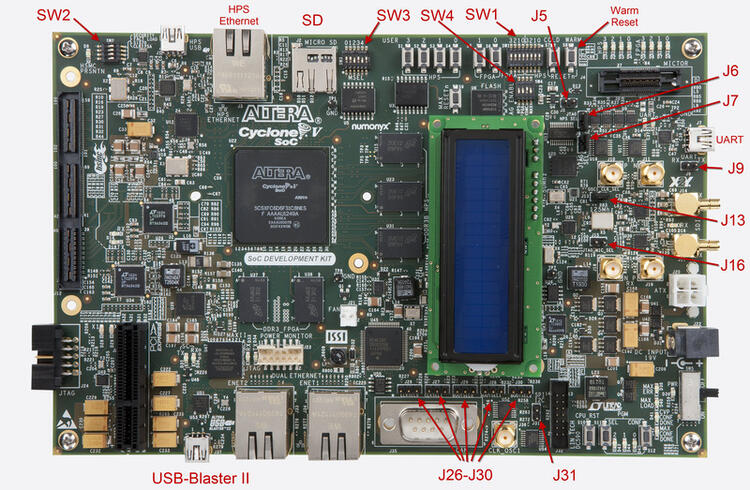
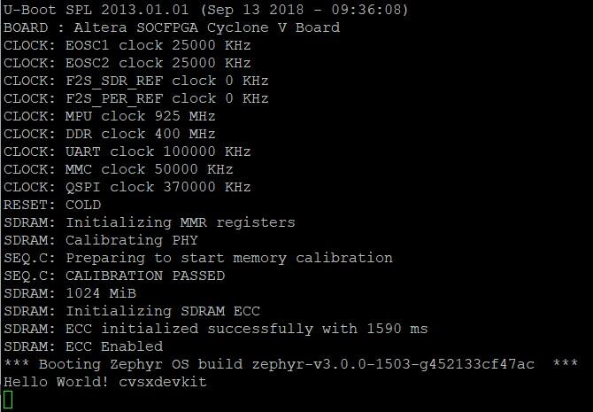
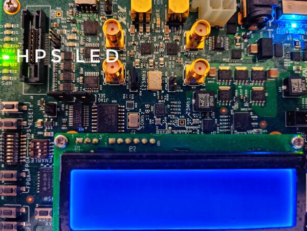

.. _cyclonev_socdk:

Intel® Cyclone® V SoC Development Kit
#####################################

Overview
********

The Zephyr kernel is supported on the Intel® Cyclone® V SoC Development Kit,
using its Hard Processor System (HPS) CPU.

   Intel®'s Cyclone® V SoC FPGA DevKit  (Credit: Intel®)

Hardware
********

Jumpers and DIP Switch settings
===============================

Recommended board settings are the same as the GSRD for Cyclone® V
SoC Development Board.

There are two sets of switches on the back of the board. Of particular
importance is SW2. First, the board jumpers need to be configured as follows:

* J5 : Open
* J6 : Short
* J7 : Short
* J9 : Open
* J13: Short
* J16: Open
* J26: Short pins 1-2
* J27: Short pins 2-3
* J28: Short pins 1-2
* J29: Short pins 2-3
* J30: Short pins 1-2
* J31: Open

Then, the board switches need to be configured as follows:

* SW1: All OFF
* SW2: All OFF
* SW3: ON-OFF-ON-OFF-ON-ON
* SW4: OFF-OFF-ON-ON

Other switches are user switches, their position is application-specific.
Refer to the development kit user manual for specifics about jumpers and switches

Necessary Software
==================

You will need the Intel® Quartus® Prime SDK in order to work with this device. The
`Intel® Quartus® Prime Lite Edition <https://www.intel.com/content/www/us/en/software-kit/684215/intel-quartus-prime-lite-edition-design-software-version-21-1-for-linux.html>`_
for Linux may be obtained without charge.

For your convenience using the SDK tools (such as ``quartus_pgm``),
you should put the binaries provided by the SDK
in your path. Below is an example, adjust ALTERA_BASE to where you installed the
SDK:

.. code-block:: console

   export QUARTUS_ROOTDIR=/opt/intelFPGA_lite/21.1
   export PATH=$PATH:$QUARTUS_ROOTDIR/quartus/bin:$QUARTUS_ROOTDIR/programmer/bin

You may need to adjust your udev rules so that you can talk to the USB Blaster
II peripheral, which is the built-in JTAG interface for this device.

The following works for Ubuntu:

.. code-block:: console

   # For Altera USB-Blaster permissions.
   SUBSYSTEM=="usb",\
   ENV{DEVTYPE}=="usb_device",\
   ATTR{idVendor}=="09fb",\
   ATTR{idProduct}=="6010",\
   MODE="0666",\
   NAME="bus/usb/$env{BUSNUM}/$env{DEVNUM}",\
   RUN+="/bin/chmod 0666 %c"
   SUBSYSTEM=="usb",\
   ENV{DEVTYPE}=="usb_device",\
   ATTR{idVendor}=="09fb",\
   ATTR{idProduct}=="6810",\
   MODE="0666",\
   NAME="bus/usb/$env{BUSNUM}/$env{DEVNUM}",\
   RUN+="/bin/chmod 0666 %c"

You can test connectivity with the SDK jtagconfig tool, you should see something
like:

.. code-block:: console

   $ jtagconfig
   1) USB-BlasterII [1-5]
     4ba00477   SOCVHPS
     02D020DD   5ZSEBA6(.|ES)/5CSEMA6/..

Golden Reference Design
=======================

The Golden System Reference Design (GSRD) provides a set of essential hardware
and software system components that can be used as a starting point for various
custom user designs.

The Zephyr support for Cyclone® V SoC Development Kit is based on GSRD hardware.
Please refer to `Intel® Cyclone® V SoC GSRD <https://rocketboards.org/foswiki/Documentation/CycloneVSoCGSRD>`_

The hardware use for this release is based on Intel® Quartus® version 21.1
the hardware files can be found `here <https://releases.rocketboards.org/release/2018.05/gsrd/hw/cv_soc_devkit_ghrd.tar.gz>`_

The directory "cv_soc_devkit_ghrd" contains the necessary files to create
a Intel® Quartus® project:

* ghrd_top.v : top level Verilog (HDL) file for the GSRD
* soc_system.qpf : Quartus® Prime Project File
* soc_system.qsf : Quartus® Prime Settings File
* soc_system.qsys : Platform Designer file (contains the SoC system)
* soc_system.sopcinfo : SOPC Information file contains details about modules instantiated in the project, parameter names and values.
* soc_system_timing.sdc : Synopsys Design Constraint FILE.
* output_files/soc_system.sof : FPGA configuration file.

Flash this FPGA file (.sof) using the ``quartus_pgm`` SDK tool with the FPGA
configuration file soc_system.sof:

.. code-block:: console

   $ quartus_pgm -m jtag -o "p;path/to/soc_system.sof"

This system is composed by the HPS, ARM Cortex-A9. In this example the UART, timer,
USB, I2C, DDR memory are exposed. Please double check the peripheral you intend to
use have its corresponding driver support.
You can find more information of the Cyclone® V SoC Devkit GSRD in RocketBoards
or consult the "Cyclone® V Hard Processor System Technical Reference Manual"

Console Output
==============

16550 UART
----------

By default, the kernel is configured to send console output to the 16550 UART.
You can monitor this on your workstation by connecting to the top right mini USB
port on the board (J8/UART) (it will show up in /dev as a ttyUSB node), and then running
minicom/PuTTy with flow control disabled, 115200-8N1 settings.

Programming and Debugging
*************************

Flashing
========

Flashing Kernel into the board
------------------------------

The usual ``flash`` target will work with the ``cyclonev_socdk`` board
configuration. Here is an example for the :zephyr:code-sample:`hello_world`
application.

``Important!!!`` : Before flashing the board a ``preloader`` is required,
you can download `cv_soc_devkit_ghrd.tar.gz <https://releases.rocketboards.org/release/2018.05/gsrd/hw/cv_soc_devkit_ghrd.tar.gz>`_,
extract the file and copy ``cv_soc_devkit_ghrd/software/preloader/uboot-socfpga/spl/u-boot-spl``
to :zephyr_file:`boards/intel/socfpga_std/cyclonev_socdk/support/`

.. zephyr-app-commands::
   :zephyr-app: samples/hello_world
   :board: cyclonev_socdk
   :goals: flash

Refer to :ref:`build_an_application` and :ref:`application_run` for
more details.

This provisions the Zephyr kernel and the CPU configuration onto the board,
using the customized OpenOCD runner script :zephyr_file:`scripts/west_commands/runners/intel_cyclonev.py`
After it completes the kernel will immediately boot using the GSRD preloader.
Notice that there a lot of helper files to ``flash`` the application with
OpenOCD and GDB Debbuger (Zephyr SDK must be installed in your machine).
This files should be located in :zephyr_file:`boards/intel/socfpga_std/cyclonev_socdk/support/` including:

* blaster_6810.hex : USB-BlasterII firmware
* tmp_preloader_dl_cmd.txt : GDB helper file to load the preloader
* tmp_appli_dl_cmd.gdb : GDB helper file to load the zephyr.elf file
* tmp_appli_debug_cmd.gdb : GDB helper file to load the zephyr.elf file while debugging
* openocd.cfg : sources configuration files for OpenOCD
* download_all.gdb : GDB helper file to load the preloader
* u-boot-spl : Cyclone® V SoC DevKit GSRD preloader (copied from GSRD: cv_soc_devkit_ghrd.tar.gz)

The following image shows the expected output (UART) after executing "west flash" using
the "hello world" sample design:

   UART output after "west flash" example (Credit: Intel®)

Debugging
=========

The Zephyr SDK includes a GDB server which can be used to debug a Cyclone® V
SoC Development Kit board.
You can either debug a running image that was flashed onto the device in User
Flash Memory (UFM), or load an image over the JTAG using GDB.

Debugging With Flashed Image
----------------------------

You can debug an application in the usual way.  Here is an example.

.. zephyr-app-commands::
   :zephyr-app: samples/hello_world
   :board: cyclonev_socdk
   :goals: debug

You will see output similar to the following:

.. code-block:: console

   -- west debug: rebuilding
   ninja: no work to do.
   -- west debug: using runner intel_cyclonev
   -- runners.intel_cyclonev: OpenOCD GDB server running on port 3333; no thread info available
   Open On-Chip Debugger 0.11.0+dev-00244-g7e3dbbbe2 (2021-11-18-07:14)
   Licensed under GNU GPL v2
   For bug reports, read http://openocd.org/doc/doxygen/bugs.html
   Info : only one transport option; autoselect 'jtag'
   cycv_dbginit
   Info : Listening on port 6666 for tcl connections
   Info : Listening on port 4444 for telnet connections
   Info : Altera USB-Blaster II (uninitialized) found
   Info : Loading firmware...
   Info : Waiting for reenumerate...
   Info : Waiting for reenumerate...
   Info : Altera USB-Blaster II found (Firm. rev. = 1.39)
   Info : This adapter doesn't support configurable speed
   Info : JTAG tap: fpgasoc.fpga.tap tap/device found: 0x02d020dd (mfg: 0x06e (Altera), part: 0x2d02, ver: 0x0)
   Info : JTAG tap: fpgasoc.cpu tap/device found: 0x4ba00477 (mfg: 0x23b (ARM Ltd), part: 0xba00, ver: 0x4)
   Info : DAP transaction stalled (WAIT) - slowing down
   Info : DAP transaction stalled (WAIT) - slowing down
   Info : fpgasoc.cpu.0: hardware has 6 breakpoints, 4 watchpoints
   Info : starting gdb server for fpgasoc.cpu.0 on 3333
   Info : Listening on port 3333 for gdb connections
   Info : accepting 'gdb' connection on tcp/3333
   Info : fpgasoc.cpu.0 rev 0, partnum c09, arch f, variant 3, implementor 41
   Info : fpgasoc.cpu.0: MPIDR level2 0, cluster 0, core 0, multi core, no SMT
   target halted in ARM state due to debug-request, current mode: Supervisor
   cpsr: 0x600001d3 pc: 0x00002fa4
   MMU: disabled, D-Cache: disabled, I-Cache: enabled
   warning: No executable has been specified and target does not support
   determining executable automatically.  Try using the "file" command.
   0x00002fa4 in ?? ()
   Restoring section .text (0xffff0000 to 0xffff6f84)
   Info : DAP transaction stalled (WAIT) - slowing down
   Warn : keep_alive() was not invoked in the 1000 ms timelimit. GDB alive packet not sent! (1469 ms). Workaround: increase "set remotetimeout" in GDB
   Restoring section .rodata (0xffff6f84 to 0xffff8af9)
   Restoring section .data (0xffff8b00 to 0xffff99d4)
   Info : DAP transaction stalled (WAIT) - slowing down
   Hardware assisted breakpoint 1 at 0xffff147e
   Info : fpgasoc.cpu.0 rev 0, partnum c09, arch f, variant 3, implementor 41
   fpgasoc.cpu.0 rev 0, partnum c09, arch f, variant 3, implementor 41

   Temporary breakpoint 1, 0xffff147e in spl_boot_device ()
   [Inferior 1 (Remote target) detached]
   Info : dropped 'gdb' connection
   shutdown command invoked
   Open On-Chip Debugger 0.11.0+dev-00244-g7e3dbbbe2 (2021-11-18-07:14)
   Licensed under GNU GPL v2
   For bug reports, read http://openocd.org/doc/doxygen/bugs.html
   Info : only one transport option; autoselect 'jtag'
   cycv_dbginit
   Info : Listening on port 6666 for tcl connections
   Info : Listening on port 4444 for telnet connections
   Info : Altera USB-Blaster II found (Firm. rev. = 1.39)
   Info : This adapter doesn't support configurable speed
   Info : JTAG tap: fpgasoc.fpga.tap tap/device found: 0x02d020dd (mfg: 0x06e (Altera), part: 0x2d02, ver: 0x0)
   Info : JTAG tap: fpgasoc.cpu tap/device found: 0x4ba00477 (mfg: 0x23b (ARM Ltd), part: 0xba00, ver: 0x4)
   Info : DAP transaction stalled (WAIT) - slowing down
   Info : DAP transaction stalled (WAIT) - slowing down
   Info : fpgasoc.cpu.0: hardware has 6 breakpoints, 4 watchpoints
   Info : fpgasoc.cpu.0 rev 0, partnum c09, arch f, variant 3, implementor 41
   Info : fpgasoc.cpu.0: MPIDR level2 0, cluster 0, core 0, multi core, no SMT
   Info : starting gdb server for fpgasoc.cpu.0 on 3333
   Info : Listening on port 3333 for gdb connections
   Info : accepting 'gdb' connection on tcp/3333
   warning: No executable has been specified and target does not support
   determining executable automatically.  Try using the "file" command.
   0xffff147c in ?? ()
   warning: /home/demo/zephyrproject/zephyr/boards/intel/socfpga_std/cyclonev_socdk/support/tmp_appli_debug_cmd.gdb: No such file or directory
   [Inferior 1 (Remote target) detached]
   Info : dropped 'gdb' connection
   shutdown command invoked
   Open On-Chip Debugger 0.11.0+dev-00244-g7e3dbbbe2 (2021-11-18-07:14)
   Licensed under GNU GPL v2
   For bug reports, read http://openocd.org/doc/doxygen/bugs.html
   Info : only one transport option; autoselect 'jtag'
   cycv_dbginit
   Info : Listening on port 6666 for tcl connections
   Info : Listening on port 4444 for telnet connections
   Info : Altera USB-Blaster II found (Firm. rev. = 1.39)
   Info : This adapter doesn't support configurable speed
   Info : JTAG tap: fpgasoc.fpga.tap tap/device found: 0x02d020dd (mfg: 0x06e (Altera), part: 0x2d02, ver: 0x0)
   Info : JTAG tap: fpgasoc.cpu tap/device found: 0x4ba00477 (mfg: 0x23b (ARM Ltd), part: 0xba00, ver: 0x4)
   Info : DAP transaction stalled (WAIT) - slowing down
   Info : DAP transaction stalled (WAIT) - slowing down
   Info : fpgasoc.cpu.0: hardware has 6 breakpoints, 4 watchpoints
   Reading symbols from /home/demo/zephyrproject/zephyr/build/zephyr/zephyr.elf...
   Info : fpgasoc.cpu.0 rev 0, partnum c09, arch f, variant 3, implementor 41
   Info : fpgasoc.cpu.0: MPIDR level2 0, cluster 0, core 0, multi core, no SMT
   Info : starting gdb server for fpgasoc.cpu.0 on 3333
   Info : Listening on port 3333 for gdb connections
   Remote debugging using :3333
   Info : accepting 'gdb' connection on tcp/3333
   main () at /home/demo/zephyrproject/zephyr/samples/hello_world/src/main.c:11
   11              printk("Hello World! %s\n", CONFIG_BOARD);
   (gdb)

Try other examples
==================
There are varios examples that can be downloaded to the Cyclone® V SoC FPGA
Development Kit Board. Try to ``blink`` an LED from the HPS side of the chip:

.. zephyr-app-commands::
   :zephyr-app: samples/basic/blinky
   :board: cyclonev_socdk
   :goals: flash

   HPS LED0 blinking example (Credit: Intel®)

Try writing characters to the LCD display connected to the i2c bus:

.. zephyr-app-commands::
   :zephyr-app: samples/drivers/lcd_cyclonev_socdk
   :board: cyclonev_socdk
   :goals: flash

References
**********

* `Cyclone® V Hard Processor System Technical Reference Manual <https://www.intel.com/content/dam/www/programmable/us/en/pdfs/literature/hb/cyclone-v/cv_54001.pdf>`_
* `Cyclone® V SoC Development Kit and Intel® SoC FPGA Embedded Development Suite <https://www.intel.com/content/www/us/en/products/details/fpga/development-kits/cyclone/v-sx.html>`_
* `Cyclone® V SoC GSRD in RocketBoards.org <https://rocketboards.org/foswiki/Documentation/CycloneVSoCGSRD>`_
* `Intel® FPGA Software Download Center <https://www.intel.com/content/www/us/en/collections/products/fpga/software/downloads.html>`_
* `Embedded Peripherals IP User Guide <https://www.altera.com/content/dam/altera-www/global/en_US/pdfs/literature/ug/ug_embedded_ip.pdf>`_
* `Quartus II Scripting Reference Manual <https://www.altera.com/content/dam/altera-www/global/en_US/pdfs/literature/manual/tclscriptrefmnl.pdf>`_
