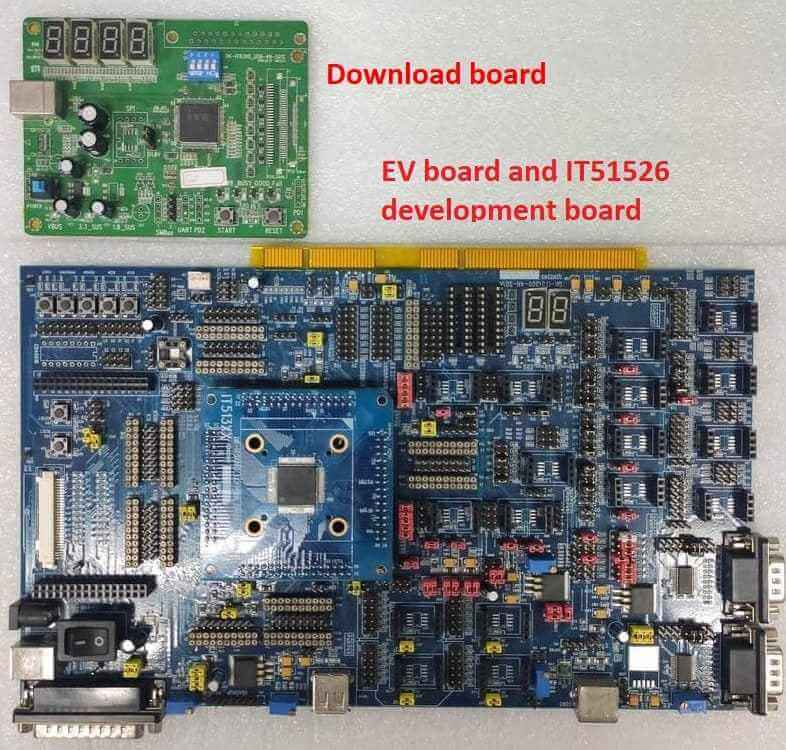

.. zephyr:board:: it515xx_evb

Overview
********

The IT51XXX is a 32-bit RISC-V microcontroller.
And a highly integrated embedded controller with system functions.
It is suitable for mobile system applications. The picture below is
the IT51526 development board (also known as it515xx_evb) and its debug card.

To find out more about ITE, visit our World Wide Web at:`ITE's website`_

Hardware
********
The IT51XXX series contains different chip types(ex, it51526, it51527),
and they support different hardware features.
Listing the IT51526 hardware features as following:

- RISC-V RV32IMC instruction set
- 4KB instruction cache size
- 128KB SRAM in total
- Built-in 32.768 kHz clock generator
- Embedded Flash, 512K/1024K-byte e-flash
- eSPI, SPI, BRAM, KBC, PECI, UART
- GPIO, PWM, ADC, INTC, WUC, Timer, Watchdog, KB scan, JTAG
- Support 3 Voltage Comparator
- Support Cryptographic Engine
- 9 SMBus hosts, 3 targets, with 12 SMBus channels, compatible with I2C
- I3C host: Support two I3C controllers, compliant with the MIPI I3C v1.0 SEPC.
- Two-wire serial interface up to 12.5MHz using Push-Pull.
- Support SDR, IBI, Hot-Join.
- I3C target: Support SDR, FIFO co-use DLM. Support Push-Pull output.

Supported Features
==================

.. zephyr:board-supported-hw::

Programming and debugging on it51526
************************************

In order to upload the application to the device,
you'll need our flash tool and Download board.
You can get them at: `ITE's website`_.

Wiring
=======
#. Connect the Download Board to your host computer using the USB cable.

#. Connect the it515xx_evb to the evolution motherboard.

#. Connect the Download Board J5 to J38(GPC1 & GPC2) on the evolution motherboard.

#. Connect the USB to UART wire to J38(GPC7) and J41(GPE6) on the evolution motherboard.

   .. image:: it515xx_evb_wiring.jpg
        :align: center
        :alt: it515xx_evb wiring

   .. note:: Be careful during connection!
    Use separate wires to connect I2C pins with pins on the it515xx_evb board.
    Wiring connection is described in the table below.

    +-------------+---------------+
    |   J5        | it515xx_evb   |
    |   Connector | J38 Connector |
    +=============+===============+
    |      2      |      C1       |
    +-------------+---------------+
    |      3      |      C2       |
    +-------------+---------------+
    |      4      |      GND      |
    +-------------+---------------+

    For USB to UART cable, connect the evolution motherboard as below:

    +-------------+---------------+
    | USB to UART | Evolution     |
    | cable       | motherboard   |
    |             | J38 and J41   |
    |             | Connector     |
    +=============+===============+
    |     RX      |      C7       |
    +-------------+---------------+
    |     TX      |      E6       |
    +-------------+---------------+
    |     GND     |      GND      |
    +-------------+---------------+

Building
========

#. Build :zephyr:code-sample:`hello_world` application as you would normally do
   (see :`Zephyr Getting Started Guide`_):.

   .. zephyr-app-commands::
      :board: it515xx_evb
      :zephyr-app: samples/hello_world
      :goals: build

#. The file :file:`zephyr.bin` will be created by west.

Flashing
========

Windows
--------

Use the winflash tool to program a zephyr application
to the it515xx board flash.

#. Open the winflash tool and make sure the order you open the switch is right.
   First, turn on the Download board switch.
   Second, turn on the it515xx_evb board switch.
   Then, configure your winflash tool like below.

    .. figure:: WinFlashTool_P2.jpg
          :align: center

    .. figure:: WinFlashTool_P4.jpg

#. Using the winflash tool flash ``zephyr.bin`` into your ITE board.
   First, click the ``Load`` button and select your ``zephyr.bin`` file.
   Second, click ``run`` to flash the image into board.

    .. figure:: WinFlashTool_P3.jpg
          :align: center

#. At this point, you have flashed your image into ITE board and
   it will work if you turn on the ITE board. You can use a terminal program
   to verify flashing worked correctly.

   For example, open device manager to find the USB Serial Port(COM4) and use your
   terminal program to connect it(Speed: 115200).

    .. figure:: WinFlashTool_P1.jpg
          :align: center

#. Turn on the it515xx_evb board switch, you should see ``"Hello World! it515xx_evb"``
   sent by the board. If you don't see this message, press the Reset button and the
   message should appear.

Ubuntu
--------

#. Run your favorite terminal program to listen for output.
   Under Linux the terminal should be :code:`/dev/ttyUSB0`. Do not close it.

   For example:

   .. code-block:: console

      $ minicom -D /dev/ttyUSB0 -b 115200

#. Open a second terminal window and use the Linux flash tool to flash your board.

   .. code-block:: console

      $ sudo ~/itetool/ite -f build/zephyr/zephyr.bin

   .. note:: The source code of ITE tool can be downloaded here:
    https://www.ite.com.tw/upload/2024_01_23/6_20240123162336wu55j1Rjm4.bz2

#. Split first and second terminal windows to view both of them.
   You should see ``"Hello World! it515xx_evb"`` in the first terminal window.
   If you don't see this message, press the Reset button and the message should appear.

Debugging
=========

it515xx_evb board can be debugged by connecting USB to UART. We can write commands and
read messages through minicom in the Ubuntu terminal.

Troubleshooting
===============

#. If the flash tool reports a failure, re-plug the 8390 Download board or
   power cycle the it515xx_evb board and try again.

References
==========

.. target-notes::

.. _ITE's website: https://www.ite.com.tw/en
.. _Zephyr Getting Started Guide: https://docs.zephyrproject.org/latest/getting_started/index.html
