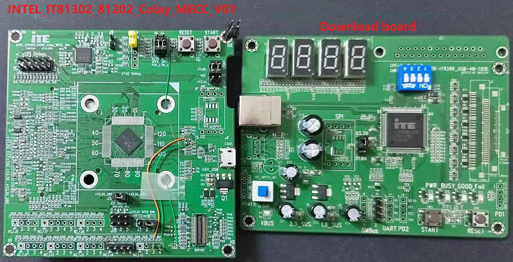

.. zephyr:board:: it8xxx2_evb

Overview
********

The IT8XXX2 is a 32-bit RISC-V Micro-controller.
And a highly integrated embedded controller with system functions.
It is suitable for mobile system applications. The picture below is
the IT81302 MECC board (also known as it8xxx2_evb) and its debug card.

To find out more about ITE, visit our World Wide Web at:`ITE's website`_

Hardware
********
The IT8XXX2 series contains different chip types(ex, it81302, it83202),
and they support different hardware features.
Listing the IT81302 hardware features as following:

- RISC-V RV32IMAFC instruction set
- 4KB instruction cache size
- 60KB SDRAM in total
- Built-in 32.768 kHz clock generator
- PWM, eSPI, LPC, FLASH, UART, GPIO, Timer, Watchdog, ADC, JTAG
- 6 SMBus channels, with 3 DMA controllers, compatible with I2C
- SPI master/slave
- USB Type-c CC Logic
- USB Power Delivery
- Support KB scan

Supported Features
==================

.. zephyr:board-supported-hw::

Hardware reworks
****************

Before using the it8xxx2_evb, some hardware rework is needed. The HW rework
guide can be found in ITE's website.
https://www.ite.com.tw/upload/2024_01_15/6_20240115100309cgdjgcLzX3.pdf

Programming and debugging on it83202
************************************

In order to upload the application to the device,
you'll need our flash tool and Download board.
You can get them at: `ITE's website`_.

Wiring
=======
#. Connect the Download Board to your host computer using the USB cable.

#. Connect the it8xxx2_evb to your host computer or a 5V1A USB power supply.

#. Connect the Download Board J5 to J8 on the it8xxx2_evb board.

#. Connect the USB to UART wire to it8xxx2_evb.

   .. image:: it8xxx2_evb_wiring.jpg
        :align: center
        :alt: it8xxx2_evb wiring

   .. note:: Be careful during connection!
    Use separate wires to connect I2C pins with pins on the it8xxx2_evb board.
    Wiring connection is described in the table below.

    +-------------+---------------+
    |   J5        | it8xxx2_evb   |
    |   Connector | J8 Connector  |
    +=============+===============+
    |      2      |       1       |
    +-------------+---------------+
    |      3      |       3       |
    +-------------+---------------+
    |      4      |       5       |
    +-------------+---------------+

    For USB to UART cable, connect the it8xxx2_evb as below:

    +-------------+---------------+
    | USB to UART | it8xxx2_evb   |
    | cable       | J5 Connector  |
    +=============+===============+
    |     RX      |     J5.3      |
    +-------------+---------------+
    |     TX      |     J5.4      |
    +-------------+---------------+
    |     GND     | eSPI Debug.10 |
    +-------------+---------------+

Building
========

#. Build :zephyr:code-sample:`hello_world` application as you would normally do
   (see :`Zephyr Getting Started Guide`_):.

   .. zephyr-app-commands::
      :board: it8xxx2_evb
      :zephyr-app: samples/hello_world
      :goals: build

#. The file :file:`zephyr.bin` will be created by west.

Flashing
========

Windows
--------

Use the winflash tool to program a zephyr application
to the it8xxx2 board flash.

#. Open winflash tool and make sure the order you open the switch is right.
   Fisrt, turn on the Download board switch.
   Second, turn on the it8xxx2_evb board switch.
   Then, configure your winflash tool like below.

    .. figure:: WinFlashTool_P2.jpg
          :align: center

    .. figure:: WinFlashTool_P4.jpg

#. Using winflash tool flash zephyr.bin into your ITE board.
   First, click ``Load`` button and select your zephyr.bin file.
   Second, click ``run`` to flash the iamge into board.

    .. figure:: WinFlashTool_P3.jpg
          :align: center

#. At this point, you have flashed your image into ITE board and
   it will work if you turn on ITE board. You can use a terminal program
   to verify flashing worked correctly.

   For example, open device manager to find the USB Serial Port(COM4) and use your
   terminal program to connect it(Speed: 115200).

    .. figure:: WinFlashTool_P1.jpg
          :align: center

#. Turn on the it8xxx2_evb board switch, you should see ``"Hello World! it8xxx2_evb"``
   sent by the board. If you don't see this message, press the Reset button and the
   message should appear.

Ubuntu
--------

#. Run your favorite terminal program to listen for output.
   Under Linux the terminal should be :code:`/dev/ttyUSB0`. Do not close it.

   For example:

   .. code-block:: console

      $ minicom -D /dev/ttyUSB0 -b 115200

#. Open a second terminal window and use linux flash tool to flash your board.

   .. code-block:: console

      $ sudo ~/itetool/ite -f build/zephyr/zephyr.bin

   .. note:: The source code of ITE tool can be downloaded here:
    https://www.ite.com.tw/upload/2024_01_23/6_20240123162336wu55j1Rjm4.bz2

#. Split first and second terminal windows to view both of them.
   You should see ``"Hello World! it8xxx2_evb"`` in the first terminal window.
   If you don't see this message, press the Reset button and the message should appear.

Debugging
=========

Supporting uart debug, currently.

Troubleshooting
===============

#. If the flash tool reports a failure, re-plug the 8390 Download board or
   power cycle the it8xxx2_evb board and try again.

References
==========

.. target-notes::

.. _ITE's website: https://www.ite.com.tw/en/product/cate2/IT81202
.. _Zephyr Getting Started Guide: https://docs.zephyrproject.org/latest/getting_started/index.html
