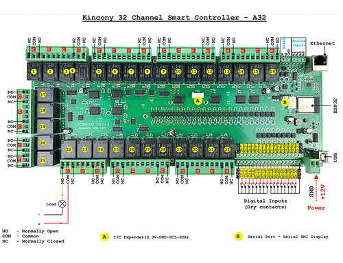

.. _kincony_kc868_a32:

KINCONY KC868-A32
#################

Overview
********

Kincony KC868-A32 is a home automation relay module based on the
Espressif ESP-WROOM-32 module with all its inherent capabilities
(Wi-Fi, Bluetooth, etc.)

The features include the following:

- 32 digital optoisolated inputs “dry contact”
- 4 analog inputs 0-5 V
- 32 relays 220 V, 10 A (COM, NO, NC)
- RS485 interface
- I2C connector
- Connector GSM/HMI
- Ethernet LAN8270A
- USB Type-B connector for programming and filling firmware
- RESET and DOWNLOAD buttons
- Powered by 12V DC

    KINCONCY-KC868-A32

System requirements
===================

Prerequisites
-------------

Espressif HAL requires WiFi and Bluetooth binary blobs in order work. Run the command
below to retrieve those files.

.. code-block:: console

   west blobs fetch hal_espressif

.. note::

   It is recommended running the command above after :file:`west update`.

Building & Flashing
-------------------

Build and flash applications as usual (see :ref:`build_an_application` and
:ref:`application_run` for more details).

.. zephyr-app-commands::
   :zephyr-app: samples/hello_world
   :board: kincony_kc868_a32/esp32/procpu
   :goals: build

The usual ``flash`` target will work with the ``kincony_kc868_a32`` board
configuration. Here is an example for the :ref:`hello_world`
application.

.. zephyr-app-commands::
   :zephyr-app: samples/hello_world
   :board: kincony_kc868_a32/esp32/procpu
   :goals: flash

Open the serial monitor using the following command:

.. code-block:: shell

   west espressif monitor

After the board has automatically reset and booted, you should see the following
message in the monitor:

.. code-block:: console

   ***** Booting Zephyr OS vx.x.x-xxx-gxxxxxxxxxxxx *****
   Hello World! kincony_kc868_a32

Enabling Ethernet
*****************

Enable Ethernet in KConfig:

.. code-block:: cfg

    CONFIG_NETWORKING=y
    CONFIG_NET_L2_ETHERNET=y
    CONFIG_MDIO=y

References
**********

.. _KINCONY KC868-A32 User Guide: https://www.kincony.com/arduino-esp32-32-channel-relay-module-kc868-a32.html
