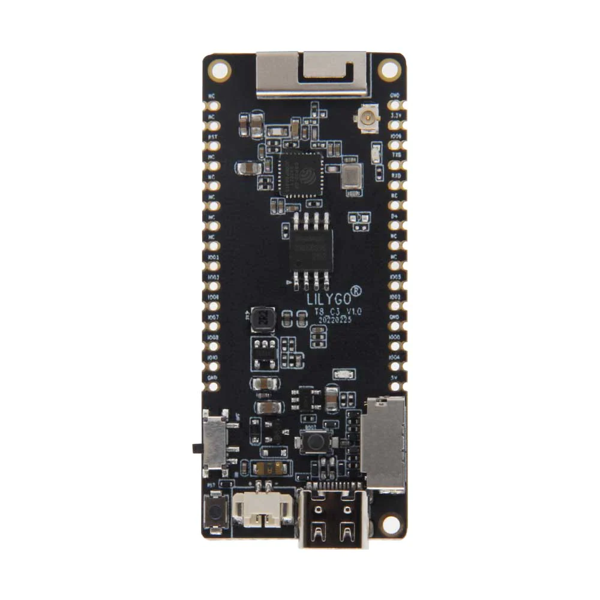

.. _ttgo_t8c3:

Lilygo TTGO T8-C3
#################

Overview
********

Lilygo TTGO T8-C3 is an IoT mini development board based on the
Espressif ESP32-C3 WiFi/Bluetooth dual-mode chip.

It features the following integrated components:

- ESP32-C3 chip (160MHz single core, 400KB SRAM, Wi-Fi)
- on board antenna and IPEX connector
- USB-C connector for power and communication
- JST GH 2-pin battery connector
- LED

   Lilygo TTGO T8-C3

Functional Description
**********************
This board is based on the ESP32-C3 with 4MB of flash, WiFi and BLE support. It
has an USB-C port for programming and debugging, integrated battery charging
and an on-board antenna. The fitted U.FL external antenna connector can be
enabled by moving a 0-ohm resistor.

Connections and IOs
===================

The TTGO T8-C3 board configuration supports the following hardware features:

+-----------+------------+------------------+
| Interface | Controller | Driver/Component |
+===========+============+==================+
| PMP       | on-chip    | arch/riscv       |
+-----------+------------+------------------+
| INTMTRX   | on-chip    | intc_esp32c3     |
+-----------+------------+------------------+
| PINMUX    | on-chip    | pinctrl_esp32    |
+-----------+------------+------------------+
| USB UART  | on-chip    | serial_esp32_usb |
+-----------+------------+------------------+
| GPIO      | on-chip    | gpio_esp32       |
+-----------+------------+------------------+
| UART      | on-chip    | uart_esp32       |
+-----------+------------+------------------+
| I2C       | on-chip    | i2c_esp32        |
+-----------+------------+------------------+
| SPI       | on-chip    | spi_esp32_spim   |
+-----------+------------+------------------+
| TWAI      | on-chip    | can_esp32_twai   |
+-----------+------------+------------------+

Start Application Development
*****************************

Before powering up your Lilygo TTGO T8-C3, please make sure that the board is in good
condition with no obvious signs of damage.

System requirements
*******************

Prerequisites
=============

Espressif HAL requires WiFi and Bluetooth binary blobs in order work. Run the command
below to retrieve those files.

.. code-block:: console

   west blobs fetch hal_espressif

.. note::

   It is recommended running the command above after :file:`west update`.

Building & Flashing
*******************

Simple boot
===========

The board could be loaded using the single binary image, without 2nd stage bootloader.
It is the default option when building the application without additional configuration.

.. note::

   Simple boot does not provide any security features nor OTA updates.

MCUboot bootloader
==================

User may choose to use MCUboot bootloader instead. In that case the bootloader
must be built (and flashed) at least once.

There are two options to be used when building an application:

1. Sysbuild
2. Manual build

.. note::

   User can select the MCUboot bootloader by adding the following line
   to the board default configuration file.

   .. code:: cfg

      CONFIG_BOOTLOADER_MCUBOOT=y

Sysbuild
========

The sysbuild makes possible to build and flash all necessary images needed to
bootstrap the board with the ESP32-C3 SoC.

To build the sample application using sysbuild use the command:

.. zephyr-app-commands::
   :tool: west
   :zephyr-app: samples/hello_world
   :board: ttgo_t8c3
   :goals: build
   :west-args: --sysbuild
   :compact:

By default, the ESP32-C3 sysbuild creates bootloader (MCUboot) and application
images. But it can be configured to create other kind of images.

Build directory structure created by sysbuild is different from traditional
Zephyr build. Output is structured by the domain subdirectories:

.. code-block::

  build/
  ├── hello_world
  │   └── zephyr
  │       ├── zephyr.elf
  │       └── zephyr.bin
  ├── mcuboot
  │    └── zephyr
  │       ├── zephyr.elf
  │       └── zephyr.bin
  └── domains.yaml

.. note::

   With ``--sysbuild`` option the bootloader will be re-build and re-flash
   every time the pristine build is used.

For more information about the system build please read the :ref:`sysbuild` documentation.

Manual build
============

During the development cycle, it is intended to build & flash as quickly possible.
For that reason, images can be built one at a time using traditional build.

The instructions following are relevant for both manual build and sysbuild.
The only difference is the structure of the build directory.

.. note::

   Remember that bootloader (MCUboot) needs to be flash at least once.

Build and flash applications as usual (see :ref:`build_an_application` and
:ref:`application_run` for more details).

.. zephyr-app-commands::
   :zephyr-app: samples/hello_world
   :board: ttgo_t8c3
   :goals: build

The usual ``flash`` target will work with the ``ttgo_t8c3`` board
configuration. Here is an example for the :zephyr:code-sample:`hello_world`
application.

.. zephyr-app-commands::
   :zephyr-app: samples/hello_world
   :board: ttgo_t8c3
   :goals: flash

The default baud rate for the Lilygo TTGO T8-C3 is set to 1500000bps. If experiencing issues when flashing,
try using different values by using ``--esp-baud-rate <BAUD>`` option during
``west flash`` (e.g. ``west flash --esp-baud-rate 115200``).

You can also open the serial monitor using the following command:

.. code-block:: shell

   west espressif monitor

After the board has automatically reset and booted, you should see the following
message in the monitor:

.. code-block:: console

   ***** Booting Zephyr OS vx.x.x-xxx-gxxxxxxxxxxxx *****
   Hello World! ttgo_t8c3

Sample applications
===================

The following samples will run out of the box on the TTGO T8-C3 board.

To build the blinky sample:

.. zephyr-app-commands::
   :tool: west
   :zephyr-app: samples/basic/blinky
   :board: ttgo_t8c3
   :goals: build

To build the bluetooth beacon sample:

.. zephyr-app-commands::
   :tool: west
   :zephyr-app: samples/bluetooth/beacon
   :board: ttgo_t8c3
   :goals: build

Related Documents
*****************
.. _`Lilygo TTGO T8-C3 schematic`: https://github.com/Xinyuan-LilyGO/T8-C3/blob/main/Schematic/T8-C3_V1.1.pdf
.. _`Lilygo github repo`: https://github.com/Xinyuan-LilyGo
.. _`Espressif ESP32-C3 datasheet`: https://www.espressif.com/sites/default/files/documentation/esp32-c3_datasheet_en.pdf
.. _`Espressif ESP32-C3 technical reference manual`: https://www.espressif.com/sites/default/files/documentation/esp32-c3_technical_reference_manual_en.pdf
.. _`OpenOCD ESP32`: https://github.com/espressif/openocd-esp32/releases
