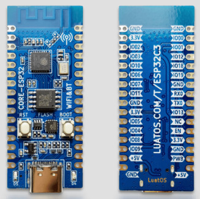
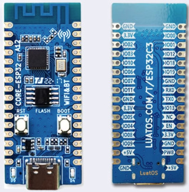
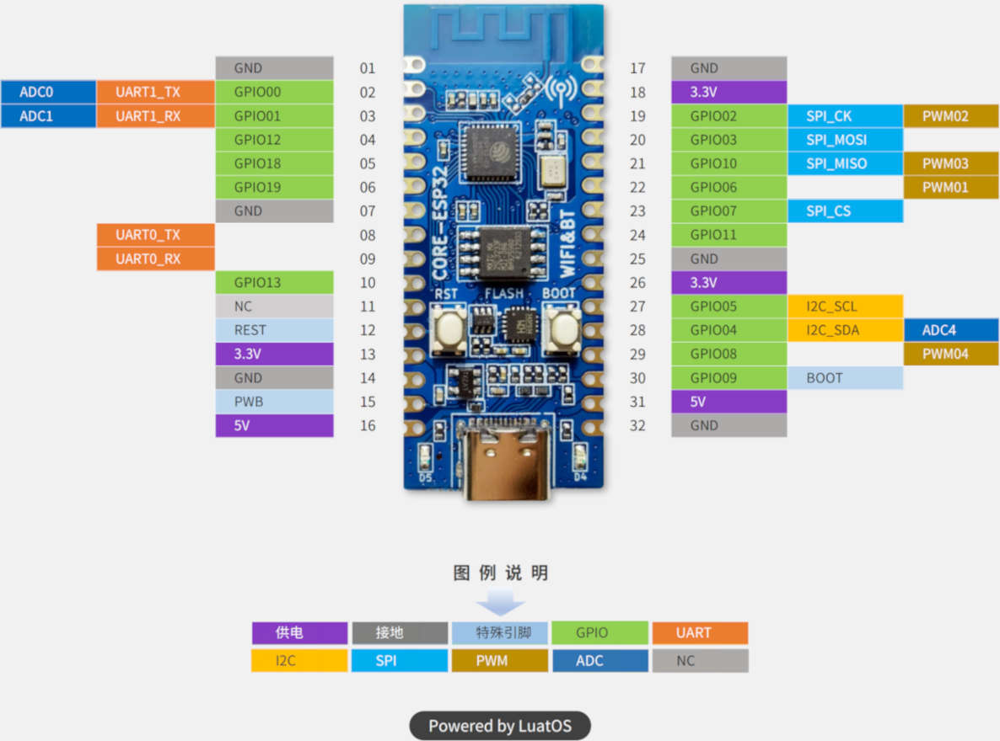

.. _esp32c3_luatos_core:

ESP32C3_LUATOS_CORE
###################

Overview
********

ESP32-C3 is a single-core Wi-Fi and Bluetooth 5 (LE) microcontroller SoC,
based on the open-source RISC-V architecture. It strikes the right balance of power,
I/O capabilities and security, thus offering the optimal cost-effective
solution for connected devices.
The availability of Wi-Fi and Bluetooth 5 (LE) connectivity not only makes the device configuration easy,
but it also facilitates a variety of use-cases based on dual connectivity. [1]_

The features include the following:

- 32-bit core RISC-V microcontroller with a maximum clock speed of 160 MHz
- 400 KB of internal RAM
- 802.11b/g/n/e/i
- A Bluetooth LE subsystem that supports features of Bluetooth 5 and Bluetooth Mesh
- Various peripherals:

  - 12-bit ADC with up to 6 channels
  - TWAI compatible with CAN bus 2.0
  - Temperature sensor
  - 3x SPI
  - 1x I2S
  - 1x I2C
  - 2x UART
  - LED PWM with up to 6 channels

- Cryptographic hardware acceleration (RNG, ECC, RSA, SHA-2, AES)

There are two version hardware of this board. The difference between them is the ch343 chip.

1. USB-C connect to UART over CH343 chip(esp32c3_luatos_core)

2. USB-C connect to esp32 chip directly(esp32c3_luatos_core/esp32c3/usb)

Supported Features
==================

Current Zephyr's ESP32C3_LUATOS_CORE board supports the following features:

+------------+------------+-------------------------------------+
| Interface  | Controller | Driver/Component                    |
+============+============+=====================================+
| UART       | on-chip    | serial port                         |
+------------+------------+-------------------------------------+
| GPIO       | on-chip    | gpio                                |
+------------+------------+-------------------------------------+
| PINMUX     | on-chip    | pinmux                              |
+------------+------------+-------------------------------------+
| USB-JTAG   | on-chip    | hardware interface                  |
+------------+------------+-------------------------------------+
| SPI Master | on-chip    | spi                                 |
+------------+------------+-------------------------------------+
| Timers     | on-chip    | counter                             |
+------------+------------+-------------------------------------+
| Watchdog   | on-chip    | watchdog                            |
+------------+------------+-------------------------------------+
| TRNG       | on-chip    | entropy                             |
+------------+------------+-------------------------------------+
| LEDC       | on-chip    | pwm                                 |
+------------+------------+-------------------------------------+
| SPI DMA    | on-chip    | spi                                 |
+------------+------------+-------------------------------------+
| TWAI       | on-chip    | can                                 |
+------------+------------+-------------------------------------+
| USB-CDC    | on-chip    | serial                              |
+------------+------------+-------------------------------------+
| ADC        | on-chip    | adc                                 |
+------------+------------+-------------------------------------+
| Wi-Fi      | on-chip    |                                     |
+------------+------------+-------------------------------------+
| Bluetooth  | on-chip    |                                     |
+------------+------------+-------------------------------------+

System requirements
*******************

Prerequisites
=============

Espressif HAL requires WiFi and Bluetooth binary blobs in order work. Run the command
below to retrieve those files.

.. code-block:: console

   west blobs fetch hal_espressif

.. note::

   It is recommended running the command above after :file:`west update`.

Building & Flashing
*******************

Simple boot
===========

The board could be loaded using the single binary image, without 2nd stage bootloader.
It is the default option when building the application without additional configuration.

.. note::

   Simple boot does not provide any security features nor OTA updates.

MCUboot bootloader
==================

User may choose to use MCUboot bootloader instead. In that case the bootloader
must be built (and flashed) at least once.

There are two options to be used when building an application:

1. Sysbuild
2. Manual build

.. note::

   User can select the MCUboot bootloader by adding the following line
   to the board default configuration file.

   .. code:: cfg

      CONFIG_BOOTLOADER_MCUBOOT=y

Sysbuild
========

The sysbuild makes possible to build and flash all necessary images needed to
bootstrap the board with the ESP32 SoC.

To build the sample application using sysbuild use the command:

.. zephyr-app-commands::
   :tool: west
   :zephyr-app: samples/hello_world
   :board: esp32c3_luatos_core
   :goals: build
   :west-args: --sysbuild
   :compact:

By default, the ESP32 sysbuild creates bootloader (MCUboot) and application
images. But it can be configured to create other kind of images.

Build directory structure created by sysbuild is different from traditional
Zephyr build. Output is structured by the domain subdirectories:

.. code-block::

  build/
  ├── hello_world
  │   └── zephyr
  │       ├── zephyr.elf
  │       └── zephyr.bin
  ├── mcuboot
  │    └── zephyr
  │       ├── zephyr.elf
  │       └── zephyr.bin
  └── domains.yaml

.. note::

   With ``--sysbuild`` option the bootloader will be re-build and re-flash
   every time the pristine build is used.

For more information about the system build please read the :ref:`sysbuild` documentation.

Manual build
============

During the development cycle, it is intended to build & flash as quickly possible.
For that reason, images can be built one at a time using traditional build.

The instructions following are relevant for both manual build and sysbuild.
The only difference is the structure of the build directory.

.. note::

   Remember that bootloader (MCUboot) needs to be flash at least once.

Build and flash applications as usual (see :ref:`build_an_application` and
:ref:`application_run` for more details).

.. zephyr-app-commands::
   :zephyr-app: samples/hello_world
   :board: esp32c3_luatos_core
   :goals: build

The usual ``flash`` target will work with the ``esp32c3_luatos_core`` board
configuration. Here is an example for the :zephyr:code-sample:`hello_world`
application.

.. zephyr-app-commands::
   :zephyr-app: samples/hello_world
   :board: esp32c3_luatos_core
   :goals: flash

Open the serial monitor using the following command:

.. code-block:: shell

   west espressif monitor

After the board has automatically reset and booted, you should see the following
message in the monitor:

.. code-block:: console

   ***** Booting Zephyr OS vx.x.x-xxx-gxxxxxxxxxxxx *****
   Hello World! esp32c3_luatos_core

Debugging
*********

As with much custom hardware, the ESP32-C3 modules require patches to
OpenOCD that are not upstreamed yet. Espressif maintains their own fork of
the project. The custom OpenOCD can be obtained at `OpenOCD ESP32`_.

The Zephyr SDK uses a bundled version of OpenOCD by default. You can overwrite that behavior by adding the
``-DOPENOCD=<path/to/bin/openocd> -DOPENOCD_DEFAULT_PATH=<path/to/openocd/share/openocd/scripts>``
parameter when building.

Here is an example for building the :zephyr:code-sample:`hello_world` application.

.. zephyr-app-commands::
   :zephyr-app: samples/hello_world
   :board: esp32c3_luatos_core
   :goals: build flash
   :gen-args: -DOPENOCD=<path/to/bin/openocd> -DOPENOCD_DEFAULT_PATH=<path/to/openocd/share/openocd/scripts>

You can debug an application in the usual way. Here is an example for the :zephyr:code-sample:`hello_world` application.

.. zephyr-app-commands::
   :zephyr-app: samples/hello_world
   :board: esp32c3_luatos_core
   :goals: debug

.. _`OpenOCD ESP32`: https://github.com/espressif/openocd-esp32/releases

References
**********

.. [1] https://www.espressif.com/en/products/socs/esp32-c3
.. _ESP32C3 Core Website: https://wiki.luatos.com/chips/esp32c3/board.html
.. _ESP32C3 Technical Reference Manual: https://espressif.com/sites/default/files/documentation/esp32-c3_technical_reference_manual_en.pdf
.. _ESP32C3 Datasheet: https://www.espressif.com/sites/default/files/documentation/esp32-c3_datasheet_en.pdf
