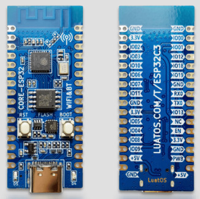
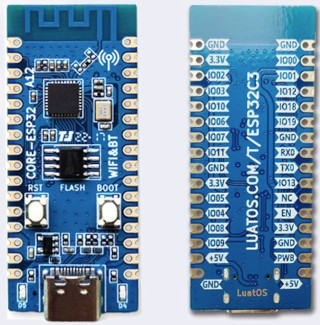
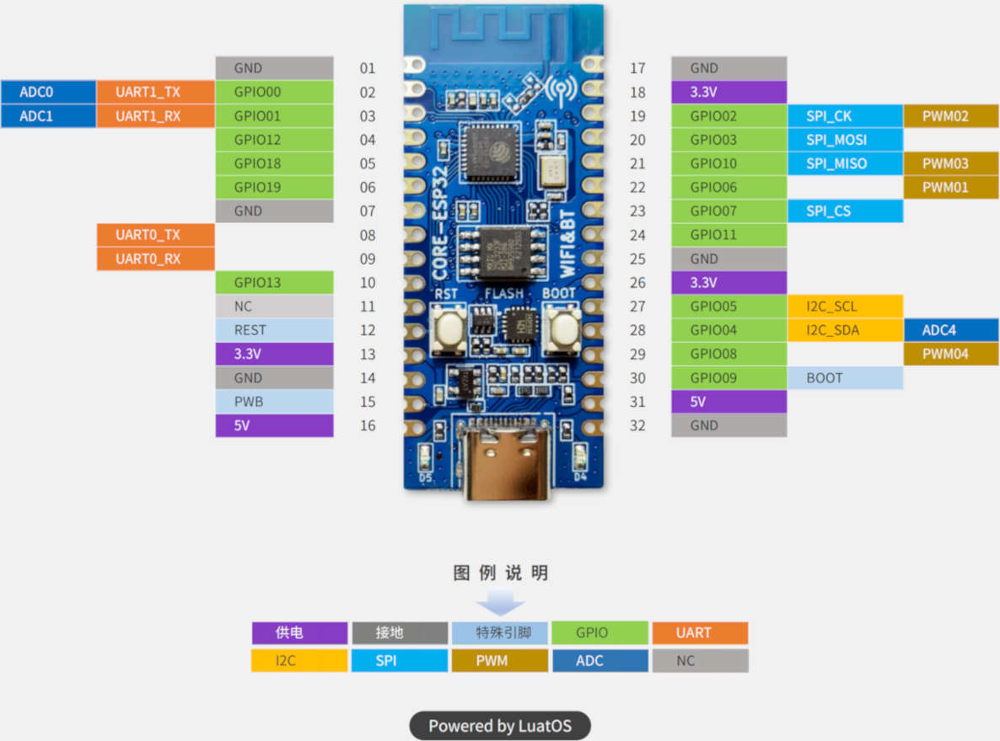

.. zephyr:board:: esp32c3_luatos_core

Overview
********

ESP32-C3 is a single-core Wi-Fi and Bluetooth 5 (LE) microcontroller SoC,
based on the open-source RISC-V architecture. It strikes the right balance of power,
I/O capabilities and security, thus offering the optimal cost-effective
solution for connected devices.
The availability of Wi-Fi and Bluetooth 5 (LE) connectivity not only makes the device configuration easy,
but it also facilitates a variety of use-cases based on dual connectivity. [1]_

The features include the following:

- 32-bit core RISC-V microcontroller with a maximum clock speed of 160 MHz
- 400 KB of internal RAM
- 802.11b/g/n/e/i
- A Bluetooth LE subsystem that supports features of Bluetooth 5 and Bluetooth Mesh
- Various peripherals:

  - 12-bit ADC with up to 6 channels
  - TWAI compatible with CAN bus 2.0
  - Temperature sensor
  - 3x SPI
  - 1x I2S
  - 1x I2C
  - 2x UART
  - LED PWM with up to 6 channels

- Cryptographic hardware acceleration (RNG, ECC, RSA, SHA-2, AES)

There are two version hardware of this board. The difference between them is the ch343 chip.

1. USB-C connect to UART over CH343 chip(esp32c3_luatos_core)

2. USB-C connect to esp32 chip directly(esp32c3_luatos_core/esp32c3/usb)

Supported Features
==================

Current Zephyr's ESP32C3_LUATOS_CORE board supports the following features:

+------------+------------+-------------------------------------+
| Interface  | Controller | Driver/Component                    |
+============+============+=====================================+
| UART       | on-chip    | serial port                         |
+------------+------------+-------------------------------------+
| GPIO       | on-chip    | gpio                                |
+------------+------------+-------------------------------------+
| PINMUX     | on-chip    | pinmux                              |
+------------+------------+-------------------------------------+
| USB-JTAG   | on-chip    | hardware interface                  |
+------------+------------+-------------------------------------+
| SPI Master | on-chip    | spi                                 |
+------------+------------+-------------------------------------+
| Timers     | on-chip    | counter                             |
+------------+------------+-------------------------------------+
| Watchdog   | on-chip    | watchdog                            |
+------------+------------+-------------------------------------+
| TRNG       | on-chip    | entropy                             |
+------------+------------+-------------------------------------+
| LEDC       | on-chip    | pwm                                 |
+------------+------------+-------------------------------------+
| SPI DMA    | on-chip    | spi                                 |
+------------+------------+-------------------------------------+
| TWAI       | on-chip    | can                                 |
+------------+------------+-------------------------------------+
| USB-CDC    | on-chip    | serial                              |
+------------+------------+-------------------------------------+
| ADC        | on-chip    | adc                                 |
+------------+------------+-------------------------------------+
| Wi-Fi      | on-chip    |                                     |
+------------+------------+-------------------------------------+
| Bluetooth  | on-chip    |                                     |
+------------+------------+-------------------------------------+

System requirements
*******************

Espressif HAL requires WiFi and Bluetooth binary blobs in order work. Run the command
below to retrieve those files.

.. code-block:: console

   west blobs fetch hal_espressif

.. note::

   It is recommended running the command above after :file:`west update`.

Programming and Debugging
*************************

.. zephyr:board-supported-runners::

.. include:: ../../../espressif/common/building-flashing.rst
   :start-after: espressif-building-flashing

.. include:: ../../../espressif/common/board-variants.rst
   :start-after: espressif-board-variants

Debugging
=========

.. include:: ../../../espressif/common/openocd-debugging.rst
   :start-after: espressif-openocd-debugging

References
**********

.. target-notes::

.. [1] https://www.espressif.com/en/products/socs/esp32-c3
.. _ESP32C3 Core Website: https://wiki.luatos.com/chips/esp32c3/board.html
.. _ESP32C3 Technical Reference Manual: https://espressif.com/sites/default/files/documentation/esp32-c3_technical_reference_manual_en.pdf
.. _ESP32C3 Datasheet: https://www.espressif.com/sites/default/files/documentation/esp32-c3_datasheet_en.pdf
