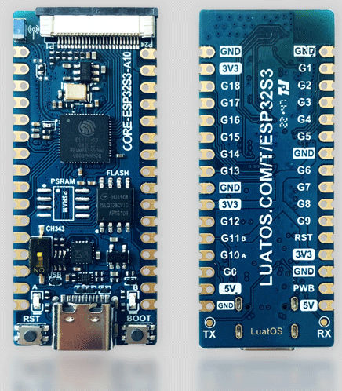
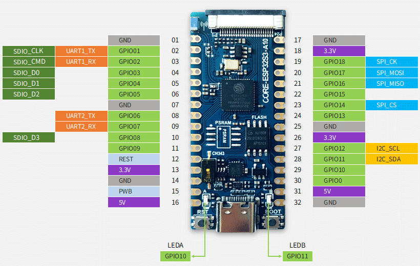

.. _esp32s3_luatos_core:

ESP32S3-Luatos-Core
###################

Overview
********

The ESP32S3-LUATOS-CORE development board is a compact board based on Espressif ESP32-S3.
The board comes equipped with a 2.4GHz antenna and supports both Wi-Fi and Bluetooth functionalities.
For more information, check `ESP32S3-LUATOS-CORE`_ (chinese)



Hardware
********

ESP32-S3 is a low-power MCU-based system on a chip (SoC) with integrated 2.4 GHz Wi-Fi
and Bluetooth® Low Energy (Bluetooth LE). It consists of high-performance dual-core microprocessor
(Xtensa® 32-bit LX7), a low power coprocessor, a Wi-Fi baseband, a Bluetooth LE baseband,
RF module, and numerous peripherals.

ESP32S3-LUATOS-CORE includes the following features:

- Dual core 32-bit Xtensa Microprocessor (Tensilica LX7), running up to 240MHz
- Additional vector instructions support for AI acceleration
- 512KB of SRAM
- 384KB of ROM
- 8MB of PSRAM
- 16MB of FLASH
- Wi-Fi 802.11b/g/n
- Bluetooth LE 5.0 with long-range support and up to 2Mbps data rate

Digital interfaces:

- 4x SPI
- 1x LCD interface (8-bit ~16-bit parallel RGB, I8080 and MOTO6800), supporting conversion between RGB565, YUV422, YUV420 and YUV411
- 1x DVP 8-bit ~16-bit camera interface
- 3x UART
- 2x I2C
- 2x I2S
- 1x RMT (TX/RX)
- 1x pulse counter
- LED PWM controller, up to 8 channels
- 1x USB Port with USB switcher, supporting following modes:
  - 1x full-speed USB OTG or 1x USB Serial/JTAG controller
  - USB to serial chip CH343
- 2x MCPWM
- 1x SDIO host controller with 2 slots
- General DMA controller (GDMA), with 5 transmit channels and 5 receive channels
- 1x TWAI® controller, compatible with ISO 11898-1 (CAN Specification 2.0)
- 2x Blue LED

Analog interfaces:

- 2x 12-bit SAR ADCs, up to 20 channels

Timers:

- 4x 54-bit general-purpose timers
- 1x 52-bit system timer
- 3x watchdog timers

Low Power:

- Power Management Unit with five power modes
- Ultra-Low-Power (ULP) coprocessors: ULP-RISC-V and ULP-FSM

Security:

- Secure boot
- Flash encryption
- 4-Kbit OTP, up to 1792 bits for users
- Cryptographic hardware acceleration: (AES-128/256, Hash, RSA, RNG, HMAC, Digital signature)

For more information, check the datasheet at `ESP32-S3 Datasheet`_.



Supported Features
==================

Current Zephyr's ESP32S3-LUATOS-Core board supports the following features:

+------------+------------+-------------------------------------+
| Interface  | Controller | Driver/Component                    |
+============+============+=====================================+
+------------+------------+-------------------------------------+
| UART       | on-chip    | serial port                         |
+------------+------------+-------------------------------------+
| GPIO       | on-chip    | gpio                                |
+------------+------------+-------------------------------------+
| PINMUX     | on-chip    | pinmux                              |
+------------+------------+-------------------------------------+
| USB-JTAG   | on-chip    | hardware interface                  |
+------------+------------+-------------------------------------+
| SPI Master | on-chip    | spi                                 |
+------------+------------+-------------------------------------+
| TWAI/CAN   | on-chip    | can                                 |
+------------+------------+-------------------------------------+
| Timers     | on-chip    | counter                             |
+------------+------------+-------------------------------------+
| Watchdog   | on-chip    | watchdog                            |
+------------+------------+-------------------------------------+
| TRNG       | on-chip    | entropy                             |
+------------+------------+-------------------------------------+
| LEDC       | on-chip    | pwm                                 |
+------------+------------+-------------------------------------+
| MCPWM      | on-chip    | pwm                                 |
+------------+------------+-------------------------------------+
| PCNT       | on-chip    | qdec                                |
+------------+------------+-------------------------------------+
| GDMA       | on-chip    | dma                                 |
+------------+------------+-------------------------------------+
| USB-CDC    | on-chip    | serial                              |
+------------+------------+-------------------------------------+

Prerequisites
-------------

Espressif HAL requires WiFi and Bluetooth binary blobs in order work. Run the command
below to retrieve those files.

.. code-block:: console

   west blobs fetch hal_espressif

.. note::

   It is recommended running the command above after :file:`west update`.

Building & Flashing
*******************

Simple boot
===========

The board could be loaded using the single binary image, without 2nd stage bootloader.
It is the default option when building the application without additional configuration.

.. note::

   Simple boot does not provide any security features nor OTA updates.

MCUboot bootloader
==================

User may choose to use MCUboot bootloader instead. In that case the bootloader
must be build (and flash) at least once.

There are two options to be used when building an application:

1. Sysbuild
2. Manual build

.. note::

   User can select the MCUboot bootloader by adding the following line
   to the board default configuration file.
   ```
   CONFIG_BOOTLOADER_MCUBOOT=y
   ```

Sysbuild
========

The sysbuild makes possible to build and flash all necessary images needed to
bootstrap the board with the ESP32 SoC.

To build the sample application using sysbuild use the command:

.. zephyr-app-commands::
   :tool: west
   :app: samples/hello_world
   :board: esp32s3_luatos_core
   :goals: build
   :west-args: --sysbuild
   :compact:

By default, the ESP32 sysbuild creates bootloader (MCUboot) and application
images. But it can be configured to create other kind of images.

Build directory structure created by sysbuild is different from traditional
Zephyr build. Output is structured by the domain subdirectories:

.. code-block::

  build/
  ├── hello_world
  │   └── zephyr
  │       ├── zephyr.elf
  │       └── zephyr.bin
  ├── mcuboot
  │    └── zephyr
  │       ├── zephyr.elf
  │       └── zephyr.bin
  └── domains.yaml

.. note::

   With ``--sysbuild`` option the bootloader will be re-build and re-flash
   every time the pristine build is used.

For more information about the system build please read the :ref:`sysbuild` documentation.

Manual build
============

During the development cycle, it is intended to build & flash as quickly possible.
For that reason, images can be build one at a time using traditional build.

The instructions following are relevant for both manual build and sysbuild.
The only difference is the structure of the build directory.

.. note::

   Remember that bootloader (MCUboot) needs to be flash at least once.

Build and flash applications as usual (see :ref:`build_an_application` and
:ref:`application_run` for more details).

.. zephyr-app-commands::
   :zephyr-app: samples/hello_world
   :board: esp32s3_luatos_core/esp32s3/procpu
   :goals: build

If CH343 chip is disabled, You need use the following command to build:

.. zephyr-app-commands::
   :zephyr-app: samples/hello_world
   :board: esp32s3_luatos_core_usb/esp32s3/procpu
   :goals: build

The usual ``flash`` target will work with the ``esp32s3_luatos_core`` board
configuration. Here is an example for the :ref:`hello_world`
application.

.. zephyr-app-commands::
   :zephyr-app: samples/hello_world
   :board: esp32s3_luatos_core/esp32s3/procpu
   :goals: flash

Open the serial monitor using the following command:

.. code-block:: shell

   west espressif monitor

After the board has automatically reset and booted, you should see the following
message in the monitor:

.. code-block:: console

   ***** Booting Zephyr OS vx.x.x-xxx-gxxxxxxxxxxxx *****
   Hello World! esp32s3_luatos_core

Debugging
*********

ESP32-S3 support on OpenOCD is available upstream as of version 0.12.0.
Download and install OpenOCD from `OpenOCD`_.

ESP32-S3 has a built-in JTAG circuitry and can be debugged without any additional chip. Only an USB cable connected to the D+/D- pins is necessary.

Further documentation can be obtained from the SoC vendor in `JTAG debugging
for ESP32-S3`_.

Here is an example for building the :ref:`hello_world` application.

.. zephyr-app-commands::
   :zephyr-app: samples/hello_world
   :board: esp32s3_luatos_core/esp32s3/procpu
   :goals: build flash

You can debug an application in the usual way. Here is an example for the :ref:`hello_world` application.

.. zephyr-app-commands::
   :zephyr-app: samples/hello_world
   :board: esp32s3_luatos_core/esp32s3/procpu
   :goals: debug

.. _`JTAG debugging for ESP32-S3`: https://docs.espressif.com/projects/esp-idf/en/latest/esp32s3/api-guides/jtag-debugging/
.. _`OpenOCD`: https://github.com/openocd-org/openocd
.. _`ESP32S3-LUATOS-CORE`: https://wiki.luatos.com/chips/esp32s3/board.html

References
**********

.. _ESP32S3-LUATOS-CORE User Guide: https://wiki.luatos.com/chips/esp32s3/board.html
.. _ESP32-S3 Datasheet: https://www.espressif.com/sites/default/files/documentation/esp32-s3-mini-1_mini-1u_datasheet_en.pdf
.. _ESP32 Technical Reference Manual: https://www.espressif.com/sites/default/files/documentation/esp32-s3_technical_reference_manual_en.pdf
