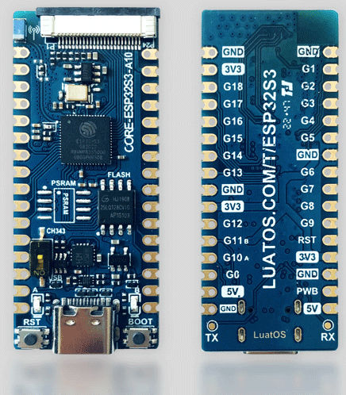
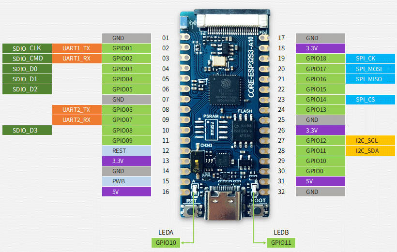

.. zephyr:board:: esp32s3_luatos_core

Overview
********

The ESP32S3-Luatos-Core development board is a compact board based on Espressif ESP32-S3.
The board comes equipped with a 2.4GHz antenna and supports both Wi-Fi and Bluetooth functionalities.
For more information, check `ESP32S3-Luatos-Core`_ (chinese)

Hardware
********

ESP32-S3 is a low-power MCU-based system on a chip (SoC) with integrated 2.4 GHz Wi-Fi
and Bluetooth® Low Energy (Bluetooth LE). It consists of high-performance dual-core microprocessor
(Xtensa® 32-bit LX7), a low power coprocessor, a Wi-Fi baseband, a Bluetooth LE baseband,
RF module, and numerous peripherals.

ESP32S3-Luatos-Core includes the following features:

- Dual core 32-bit Xtensa Microprocessor (Tensilica LX7), running up to 240MHz
- Additional vector instructions support for AI acceleration
- 512KB of SRAM
- 384KB of ROM
- 8MB of PSRAM
- 16MB of FLASH
- Wi-Fi 802.11b/g/n
- Bluetooth LE 5.0 with long-range support and up to 2Mbps data rate

Digital interfaces:

- 4x SPI
- 1x LCD interface (8-bit ~16-bit parallel RGB, I8080 and MOTO6800), supporting conversion between RGB565, YUV422, YUV420 and YUV411
- 1x DVP 8-bit ~16-bit camera interface
- 3x UART
- 2x I2C
- 2x I2S
- 1x RMT (TX/RX)
- 1x pulse counter
- LED PWM controller, up to 8 channels
- 1x USB Port with USB switcher, supporting following modes:
  - 1x full-speed USB OTG or 1x USB Serial/JTAG controller
  - USB to serial chip CH343
- 2x MCPWM
- 1x SDIO host controller with 2 slots
- General DMA controller (GDMA), with 5 transmit channels and 5 receive channels
- 1x TWAI® controller, compatible with ISO 11898-1 (CAN Specification 2.0)
- 2x Blue LED

Analog interfaces:

- 2x 12-bit SAR ADCs, up to 20 channels

Timers:

- 4x 54-bit general-purpose timers
- 1x 52-bit system timer
- 3x watchdog timers

Low Power:

- Power Management Unit with five power modes
- Ultra-Low-Power (ULP) coprocessors: ULP-RISC-V and ULP-FSM

Security:

- Secure boot
- Flash encryption
- 4-Kbit OTP, up to 1792 bits for users
- Cryptographic hardware acceleration: (AES-128/256, Hash, RSA, RNG, HMAC, Digital signature)

For more information, check the datasheet at `ESP32-S3 Datasheet`_ or the technical reference
manual at `ESP32-S3 Technical Reference Manual`_.

Supported Features
==================

Current Zephyr's ESP32S3-Luatos-Core board supports the following features:

+------------+------------+-------------------------------------+
| Interface  | Controller | Driver/Component                    |
+============+============+=====================================+
| UART       | on-chip    | serial port                         |
+------------+------------+-------------------------------------+
| GPIO       | on-chip    | gpio                                |
+------------+------------+-------------------------------------+
| PINMUX     | on-chip    | pinmux                              |
+------------+------------+-------------------------------------+
| USB-JTAG   | on-chip    | hardware interface                  |
+------------+------------+-------------------------------------+
| SPI Master | on-chip    | spi                                 |
+------------+------------+-------------------------------------+
| TWAI/CAN   | on-chip    | can                                 |
+------------+------------+-------------------------------------+
| Timers     | on-chip    | counter                             |
+------------+------------+-------------------------------------+
| Watchdog   | on-chip    | watchdog                            |
+------------+------------+-------------------------------------+
| TRNG       | on-chip    | entropy                             |
+------------+------------+-------------------------------------+
| LEDC       | on-chip    | pwm                                 |
+------------+------------+-------------------------------------+
| MCPWM      | on-chip    | pwm                                 |
+------------+------------+-------------------------------------+
| PCNT       | on-chip    | qdec                                |
+------------+------------+-------------------------------------+
| GDMA       | on-chip    | dma                                 |
+------------+------------+-------------------------------------+
| USB-CDC    | on-chip    | serial                              |
+------------+------------+-------------------------------------+

System requirements
*******************

Espressif HAL requires WiFi and Bluetooth binary blobs in order work. Run the command
below to retrieve those files.

.. code-block:: console

   west blobs fetch hal_espressif

.. note::

   It is recommended running the command above after :file:`west update`.

Programming and Debugging
*************************

.. zephyr:board-supported-runners::

.. include:: ../../../espressif/common/building-flashing.rst
   :start-after: espressif-building-flashing

.. include:: ../../../espressif/common/board-variants.rst
   :start-after: espressif-board-variants

Debugging
=========

.. include:: ../../../espressif/common/openocd-debugging.rst
   :start-after: espressif-openocd-debugging

References
**********

.. target-notes::

.. _`ESP32S3-Luatos-Core`: https://wiki.luatos.com/chips/esp32s3/board.html
.. _`ESP32-S3 Datasheet`: https://www.espressif.com/sites/default/files/documentation/esp32-s3-mini-1_mini-1u_datasheet_en.pdf
.. _`ESP32-S3 Technical Reference Manual`: https://www.espressif.com/sites/default/files/documentation/esp32-s3_technical_reference_manual_en.pdf
.. _`JTAG debugging for ESP32-S3`: https://docs.espressif.com/projects/esp-idf/en/latest/esp32s3/api-guides/jtag-debugging/
.. _`OpenOCD ESP32`: https://github.com/espressif/openocd-esp32/releases
