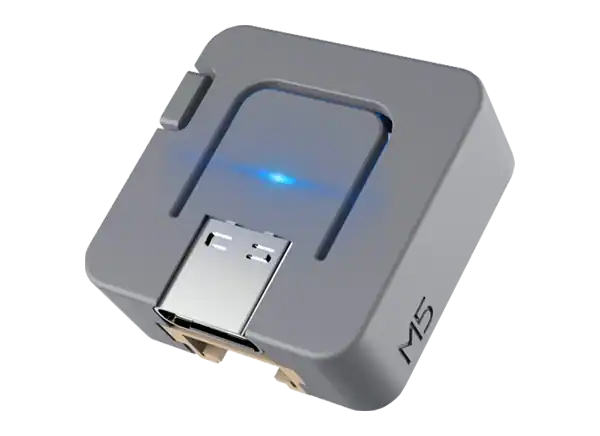

.. _m5stack_atom_lite:

M5Stack ATOM Lite
#################

Overview
********

M5Stack ATOM Lite is an ESP32-based development board from M5Stack.

It features the following integrated components:

- ESP32-PICO-D4 chip (240MHz dual core, Wi-Fi/BLE 5.0)
- 520KB SRAM
- SK6812 RGB LED
- Infrared LED
- 1x Grove extension port

        M5Stack ATOM Lite

Supported Features
==================

The Zephyr m5stack_atom_lite board configuration supports the following hardware features:

+-----------+------------+-------------------------------------+
| Interface | Controller | Driver/Component                    |
+===========+============+=====================================+
| NVIC      | on-chip    | nested vector interrupt controller  |
+-----------+------------+-------------------------------------+
| UART      | on-chip    | serial port-polling;                |
|           |            | serial port-interrupt               |
+-----------+------------+-------------------------------------+
| PINMUX    | on-chip    | pinmux                              |
+-----------+------------+-------------------------------------+
| GPIO      | on-chip    | gpio                                |
+-----------+------------+-------------------------------------+
| I2C       | on-chip    | i2c                                 |
+-----------+------------+-------------------------------------+
| SPI       | on-chip    | spi                                 |
+-----------+------------+-------------------------------------+
| CLOCK     | on-chip    | reset and clock control             |
+-----------+------------+-------------------------------------+
| COUNTER   | on-chip    | rtc                                 |
+-----------+------------+-------------------------------------+
| WATCHDOG  | on-chip    | independent watchdog                |
+-----------+------------+-------------------------------------+
| PWM       | on-chip    | pwm                                 |
+-----------+------------+-------------------------------------+
| ADC       | on-chip    | adc                                 |
+-----------+------------+-------------------------------------+
| DAC       | on-chip    | dac                                 |
+-----------+------------+-------------------------------------+
| die-temp  | on-chip    | die temperature sensor              |
+-----------+------------+-------------------------------------+

Start Application Development
*****************************

Before powering up your M5Stack ATOM Lite, please make sure that the board is in good
condition with no obvious signs of damage.

System requirements
===================

Prerequisites
-------------

Espressif HAL requires WiFi and Bluetooth binary blobs in order work. Run the command
below to retrieve those files.

.. code-block:: shell

   west blobs fetch hal_espressif

.. note::

   It is recommended running the command above after :file:`west update`.

Building & Flashing
-------------------

Build and flash applications as usual (see :ref:`build_an_application` and
:ref:`application_run` for more details).

.. zephyr-app-commands::
   :zephyr-app: samples/hello_world
   :board: m5stack_atom_lite/esp32/procpu
   :goals: build

The usual ``flash`` target will work with the ``m5stack_atom_lite`` board
configuration. Here is an example for the :zephyr:code-sample:`hello_world`
application.

.. zephyr-app-commands::
   :zephyr-app: samples/hello_world
   :board: m5stack_atom_lite/esp32/procpu
   :goals: flash

The baud rate of 921600bps is set by default. If experiencing issues when flashing,
try using different values by using ``--esp-baud-rate <BAUD>`` option during
``west flash`` (e.g. ``west flash --esp-baud-rate 115200``).

You can also open the serial monitor using the following command:

.. code-block:: shell

   west espressif monitor

After the board has automatically reset and booted, you should see the following
message in the monitor:

.. code-block:: console

   ***** Booting Zephyr OS vx.x.x-xxx-gxxxxxxxxxxxx *****
   Hello World! m5stack_atom_lite

Debugging
---------

M5Stack ATOM Lite debugging is not supported due to pinout limitations.

Related Documents
*****************
- `M5Stack ATOM Lite docs <https://docs.m5stack.com/en/core/ATOM%20Lite>`_
- `M5Stack ATOM Lite schematic <https://static-cdn.m5stack.com/resource/docs/products/core/atom_lite/atom_lite_map_01.webp>`_
- `ESP32-PICO-D4 Datasheet <https://www.espressif.com/sites/default/files/documentation/esp32-pico-d4_datasheet_en.pdf>`_ (PDF)
