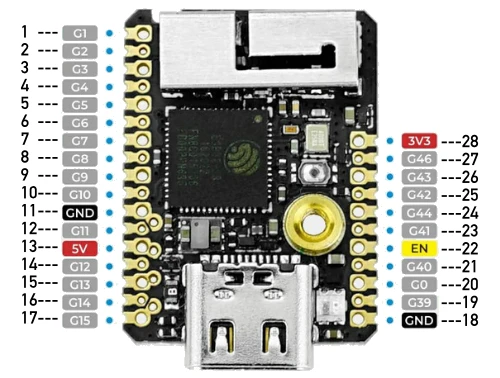

.. zephyr:board:: m5stack_stamps3

Overview
********

M5Stack StampS3 is an ESP32-based development board from M5Stack.

Hardware
********

It features the following integrated components:

- ESP32-S3FN8 chip (240MHz dual core)
- 512KB SRAM
- 384KB ROM
- 8MB Flash
- Wi-Fi
- Bluetooth
- User-Button

.. include:: ../../../espressif/common/soc-esp32s3-features.rst
   :start-after: espressif-soc-esp32s3-features

Supported Features
==================

.. zephyr:board-supported-hw::

Functional Description
======================

The following table below describes the key components, interfaces, and controls
of the M5Stack StampS3 module.

+---------------+-----------------------------------------------------------------+-----------+
| Key Component | Description                                                     | Status    |
+===============+=================================================================+===========+
| ESP32-S3FN8   | This MPU-ESP32S3 module provides complete Wi-Fi and Bluetooth   | supported |
| module        | functionalities and integrates a 8MB flash.                     |           |
+---------------+-----------------------------------------------------------------+-----------+
| Status LED    | One user LED connected via :dtcompatible:`worldsemi,ws2812-spi` | supported |
|               | interface (``led-strip``).                                      |           |
+---------------+-----------------------------------------------------------------+-----------+
| USB Port      | USB interface. Power supply for the board as well as the        | supported |
|               | communication interface between a computer and the board.       |           |
+---------------+-----------------------------------------------------------------+-----------+
| User button   | User button (``sw0``)                                           | supported |
+---------------+-----------------------------------------------------------------+-----------+

Main connector header
=====================

The Zephyr m5stack_stamps3 board can be used on various applications. It
therefore publishes a header definition to be used in different shields:
:dtcompatible:`m5stack,stamps3-header`.

        M5Stack StampS3 connector header

Following interfaces are being exported for this header:

- ``m5stack_stamps3_clkout0``: PWM output with 2 channels (0 and 2).
- ``m5stack_stamps3_spilcd``: SPI interface for interfacing LCDs. Consists of a
  CLK, MOSI and CS signal.
- ``m5stack_stamps3_i2c0`` and ``m5stack_stamps3_i2c1``: I2C interfaces (SDA, SCL).
- ``m5stack_stamps3_uart0``: UART interface (RXD, TXD).
- ``m5stack_stamps3_header``: All GPIOs are of course accessible via main header
  definition.

+-----+-----------------------------------------+-----+---------------------------------+
| Pin | Functions                               | Pin | Functions                       |
+=====+=========================================+=====+=================================+
| 1   |                                         |     |                                 |
+-----+-----------------------------------------+-----+---------------------------------+
| 2   |                                         |     |                                 |
+-----+-----------------------------------------+-----+---------------------------------+
| 3   | ``m5stack_stamps3_clkout0`` - Channel 0 |     |                                 |
+-----+-----------------------------------------+-----+---------------------------------+
| 4   |                                         |     |                                 |
+-----+-----------------------------------------+-----+---------------------------------+
| 5   | ``m5stack_stamps3_spilcd`` - MOSI       |     |                                 |
+-----+-----------------------------------------+-----+---------------------------------+
| 6   | ``m5stack_stamps3_spilcd`` - CLK        |     |                                 |
+-----+-----------------------------------------+-----+---------------------------------+
| 7   | ``m5stack_stamps3_spilcd`` - CS         | 28  | **3V3**                         |
+-----+-----------------------------------------+-----+---------------------------------+
| 8   |                                         | 27  | ``m5stack_stamps3_uart0`` - TXD |
+-----+-----------------------------------------+-----+---------------------------------+
| 9   | ``m5stack_stamps3_clkout0`` - Channel 2 | 26  |                                 |
+-----+-----------------------------------------+-----+---------------------------------+
| 10  |                                         | 25  | ``m5stack_stamps3_uart0`` - RXD |
+-----+-----------------------------------------+-----+---------------------------------+
| 11  | **GND**                                 | 24  |                                 |
+-----+-----------------------------------------+-----+---------------------------------+
| 12  | ``m5stack_stamps3_i2c1`` - SDA          | 23  |                                 |
+-----+-----------------------------------------+-----+---------------------------------+
| 13  | **5V**                                  | 22  | **EN**                          |
+-----+-----------------------------------------+-----+---------------------------------+
| 14  | ``m5stack_stamps3_i2c1`` - SCL          | 21  |                                 |
+-----+-----------------------------------------+-----+---------------------------------+
| 15  | ``m5stack_stamps3_i2c0`` - SDA          | 20  |                                 |
+-----+-----------------------------------------+-----+---------------------------------+
| 16  |                                         | 19  |                                 |
+-----+-----------------------------------------+-----+---------------------------------+
| 17  | ``m5stack_stamps3_i2c0`` - SCL          | 18  | **GND**                         |
+-----+-----------------------------------------+-----+---------------------------------+

Power supply
============

M5Stack StampS3 requires a single 5V input power supply. The module internally
features a DCDC (MUN3CAD01-SC) to generate the 3.3V needed for the MCU.

The **EN** signal (Pin 22) is an active low signal to enable the **3V3** power
supply. If this pin is pulled low this main 3.3V power supply for the MCU will be
deactivated. It is internally equipped with a pull-up and can hence be left open
if unused.

System Requirements
*******************

.. include:: ../../../espressif/common/system-requirements.rst
   :start-after: espressif-system-requirements

Programming and Debugging
*************************

.. zephyr:board-supported-runners::

.. include:: ../../../espressif/common/building-flashing.rst
   :start-after: espressif-building-flashing

.. include:: ../../../espressif/common/board-variants.rst
   :start-after: espressif-board-variants

Debugging
=========

.. include:: ../../../espressif/common/openocd-debugging.rst
   :start-after: espressif-openocd-debugging

M5Stack StampS3 exports a JTAG-interface via Pins 19 (MTCK), 21 (MTDO), 23
(MTDI), 25 (MTMS).

.. note::

   Please note that additional JTAG equipment is needed to utilize JTAG. Refer to
   the ESP32S3 datasheet and the M5Stack StampS3 documentation for details.

Related Documents
*****************

.. target-notes::

.. _`M5Stack StampS3 schematic`: https://m5stack.oss-cn-shenzhen.aliyuncs.com/resource/docs/datasheet/Stamp/S007%20StampS3/Sch_M5StampS3_v0.2.pdf
.. _`M5Stack StampS3`: https://docs.m5stack.com/en/core/StampS3
.. _`ESP32 Hardware Reference`: https://docs.espressif.com/projects/esp-idf/en/latest/esp32/hw-reference/index.html
