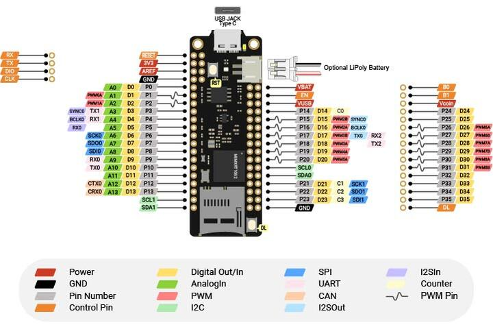

.. _mm_feather:

MadMachine SwiftIO Feather
##########################

Overview
********

The SwiftIO Feather board, designed by MadMachine is
designed with support for the modern `Swift language
<https://docs.swift.org/swift-book/>`_.  Zephyr provides basic
low-level capabilities for the SwiftIO Feather board. Swift application would
run on top of Zephyr. More information about the board can be found
at:

- `MadMachine Homepage`_
- `SwiftIO API Reference`_

Hardware
********

- MIMXRT1062DVL6B MCU (Cortex-M7 at 600MHz, 2048KB on-chip memory)

- Memory

   - 8MB QSPI Flash
   - 32MB SDRAM
   - TF socket for SD card

- USB

   - USB-C 2.0 OTG connector

- Power

   - 5V USB power
   - 4.2V DC jack

- Debug

   - SWD connector

- RGB LED

Supported Features
==================

The mm_feather board configuration supports the following hardware
features:

+-----------+------------+-------------------------------------+
| Interface | Controller | Driver/Component                    |
+===========+============+=====================================+
| NVIC      | on-chip    | nested vector interrupt controller  |
+-----------+------------+-------------------------------------+
| SYSTICK   | on-chip    | systick                             |
+-----------+------------+-------------------------------------+
| DISPLAY   | on-chip    | display                             |
+-----------+------------+-------------------------------------+
| GPIO      | on-chip    | gpio                                |
+-----------+------------+-------------------------------------+
| I2C       | on-chip    | i2c                                 |
+-----------+------------+-------------------------------------+
| SPI       | on-chip    | spi                                 |
+-----------+------------+-------------------------------------+
| UART      | on-chip    | serial port-polling;                |
|           |            | serial port-interrupt               |
+-----------+------------+-------------------------------------+
| I2S       | on-chip    | I2S                                 |
+-----------+------------+-------------------------------------+
| USB       | on-chip    | USB device                          |
+-----------+------------+-------------------------------------+

Connections and IOs
===================

Note:
The following SwiftIO Feather pinout diagram is used for Swift programming.
The Swift ID is not the same as the Zephyr driver ID.

+-----------+---------------+----------+---------------+--------------------------+
| Name                      | GPIO                     | Other peripherals        |
+===========+===============+==========+===============+==========+===============+
| Swift ID  | Pin name      | Swift ID | Zephyr driver | Swift ID | Zephyr driver |
+-----------+---------------+----------+---------------+----------+---------------+
| P0        | GPIO_AD_B1_04 | D0       | GPIO1_IO20    |          |               |
+-----------+---------------+----------+---------------+----------+---------------+
| P1        | GPIO_AD_B1_08 | D1       | GPIO1_IO24    |          |               |
+-----------+---------------+----------+---------------+----------+---------------+
| P2        | GPIO_AD_B1_09 | D2       | GPIO1_IO25    |          |               |
+-----------+---------------+----------+---------------+----------+---------------+
| P3        | GPIO_AD_B1_10 | D3       | GPIO1_IO26    |          |               |
+-----------+---------------+----------+---------------+ UART1    | UART_8        |
| P4        | GPIO_AD_B1_11 | D4       | GPIO1_IO27    |          |               |
+-----------+---------------+----------+---------------+----------+---------------+
| P5        | GPIO_AD_B1_12 | D5       | GPIO1_IO28    |          |               |
+-----------+---------------+----------+---------------+----------+---------------+
| P6        | GPIO_AD_B1_15 | D6       | GPIO1_IO31    |          |               |
+-----------+---------------+----------+---------------+          |               |
| P7        | GPIO_AD_B1_14 | D7       | GPIO1_IO30    | SPI0     | SPI_3         |
+-----------+---------------+----------+---------------+          |               |
| P8        | GPIO_AD_B1_13 | D8       | GPIO1_IO29    |          |               |
+-----------+---------------+----------+---------------+----------+---------------+
| P9        | GPIO_AD_B1_03 | D9       | GPIO1_IO19    |          |               |
+-----------+---------------+----------+---------------+ UART0    | UART_2        |
| P10       | GPIO_AD_B1_02 | D10      | GPIO1_IO18    |          |               |
+-----------+---------------+----------+---------------+----------+---------------+
| P11       | GPIO_AD_B1_05 | D11      | GPIO1_IO21    |          |               |
+-----------+---------------+----------+---------------+----------+---------------+
| P12       | GPIO_AD_B0_14 | D12      | GPIO1_IO14    |          |               |
+-----------+---------------+----------+---------------+ CAN0     | CAN_3         |
| P13       | GPIO_AD_B0_15 | D13      | GPIO1_IO15    |          |               |
+-----------+---------------+----------+---------------+----------+---------------+
| P14       | GPIO_B0_00    | D14      | GPIO2_IO00    |          |               |
+-----------+---------------+----------+---------------+----------+---------------+
| P15       | GPIO_B1_03    | D15      | GPIO2_IO19    |          |               |
+-----------+---------------+----------+---------------+----------+---------------+
| P16       | GPIO_B1_02    | D16      | GPIO2_IO18    |          |               |
+-----------+---------------+----------+---------------+----------+---------------+
| P17       | GPIO_B1_01    | D17      | GPIO2_IO17    |          |               |
+-----------+---------------+----------+---------------+ UART2    | UART_4        |
| P18       | GPIO_B1_00    | D18      | GPIO2_IO16    |          |               |
+-----------+---------------+----------+---------------+----------+---------------+
| P19       | GPIO_B1_15    | D19      | GPIO2_IO31    |          |               |
+-----------+---------------+----------+---------------+----------+---------------+
| P20       | GPIO_B1_14    | D20      | GPIO2_IO30    |          |               |
+-----------+---------------+----------+---------------+----------+---------------+
| P21       | GPIO_B0_03    | D21      | GPIO2_IO03    |          |               |
+-----------+---------------+----------+---------------+          |               |
| P22       | GPIO_B0_02    | D22      | GPIO2_IO02    | SPI1     | SPI_4         |
+-----------+---------------+----------+---------------+          |               |
| P23       | GPIO_B0_01    | D23      | GPIO2_IO01    |          |               |
+-----------+---------------+----------+---------------+----------+---------------+
| P24       | GPIO_B0_04    | D24      | GPIO2_IO04    |          |               |
+-----------+---------------+----------+---------------+----------+---------------+
| P25       | GPIO_B0_05    | D25      | GPIO2_IO05    |          |               |
+-----------+---------------+----------+---------------+----------+---------------+
| P26       | GPIO_B0_06    | D26      | GPIO2_IO06    |          |               |
+-----------+---------------+----------+---------------+----------+---------------+
| P27       | GPIO_B0_07    | D27      | GPIO2_IO07    |          |               |
+-----------+---------------+----------+---------------+----------+---------------+
| P28       | GPIO_B0_08    | D28      | GPIO2_IO08    |          |               |
+-----------+---------------+----------+---------------+----------+---------------+
| P29       | GPIO_B0_09    | D29      | GPIO2_IO09    |          |               |
+-----------+---------------+----------+---------------+----------+---------------+
| P30       | GPIO_B0_10    | D30      | GPIO2_IO10    |          |               |
+-----------+---------------+----------+---------------+----------+---------------+
| P31       | GPIO_B0_11    | D31      | GPIO2_IO11    |          |               |
+-----------+---------------+----------+---------------+----------+---------------+
| P32       | GPIO_B0_12    | D32      | GPIO2_IO12    |          |               |
+-----------+---------------+----------+---------------+----------+---------------+
| P33       | GPIO_B0_13    | D33      | GPIO2_IO13    |          |               |
+-----------+---------------+----------+---------------+----------+---------------+
| P34       | GPIO_B0_14    | D34      | GPIO2_IO14    |          |               |
+-----------+---------------+----------+---------------+----------+---------------+
| P35       | GPIO_B0_15    | D35      | GPIO2_IO15    |          |               |
+-----------+---------------+----------+---------------+----------+---------------+
|           | GPIO_AD_B1_07 |          | GPIO1_IO23    |          |               |
+-----------+---------------+----------+---------------+ I2C0     | I2C_3         |
|           | GPIO_AD_B1_06 |          | GPIO1_IO22    |          |               |
+-----------+---------------+----------+---------------+----------+---------------+
|           | GPIO_AD_B1_00 |          | GPIO1_IO16    |          |               |
+-----------+---------------+----------+---------------+ I2C1     | I2C_1         |
|           | GPIO_AD_B1_00 |          | GPIO1_IO17    |          |               |
+-----------+---------------+----------+---------------+----------+---------------+

Programming and Flash
*************************

Build and flash applications as usual (see :ref:`build_an_application` and
:ref:`application_run` for more details).

Configuring a Console
=====================

Connect a USB-to-serial adapter from your PC to corresponding UART pins of SwiftIO Feather.

Use the following settings with your serial terminal of choice (minicom, putty,
etc.):

- Speed: 115200
- Data: 8 bits
- Parity: None
- Stop bits: 1

Flashing
========

Here is an example for the :zephyr:code-sample:`hello_world` application.

Connect a DAPLink debugger from your PC to corresponding SWD pins of SwiftIO Feather.

.. zephyr-app-commands::
   :zephyr-app: samples/hello_world
   :board: mm_feather
   :goals: flash

Open a serial terminal, reset the board (press the "reset" button), and you should
see the following message in the terminal:

.. code-block:: console

   *** Booting Zephyr OS build v2.6.0-rc1-301-gd9c666a5abf8  ***
   Hello World! mm_feather

Debugging
=========

Here is an example for the :zephyr:code-sample:`hello_world` application.

.. zephyr-app-commands::
   :zephyr-app: samples/hello_world
   :board: mm_feather
   :goals: debug

Open a serial terminal, step through the application in your debugger, and you
should see the following message in the terminal:

.. code-block:: console

   *** Booting Zephyr OS build v2.6.0-rc1-301-gd9c666a5abf8  ***
   Hello World! mm_feather

.. _MadMachine Homepage:
   https://madmachine.io

.. _SwiftIO API Reference:
   https://madmachineio.github.io/SwiftIO/documentation/swiftio/
