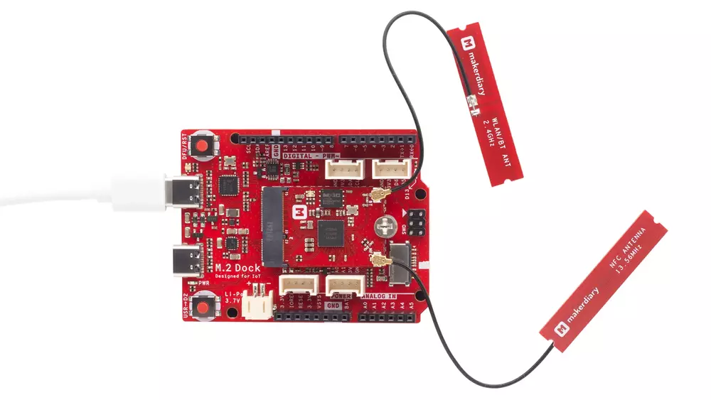
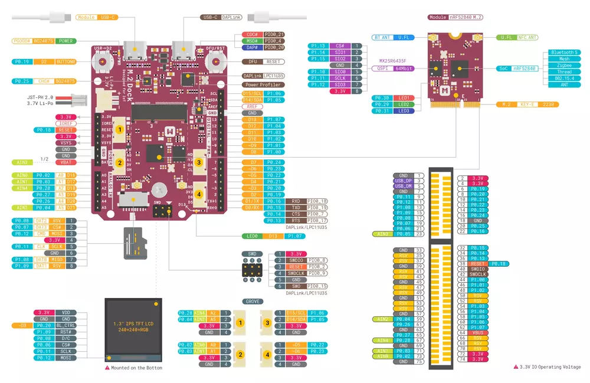

.. _nrf52840_m2:

nRF52840-m2
#################

Overview
********

`nRF52840 M.2 Developer
Kit <https://store.makerdiary.com/products/nrf52840-m2-developer-kit>`__
is a versatile IoT prototyping platform, including the `nRF52840 M.2
Module <https://store.makerdiary.com/products/nrf52840-m2-module>`__ and
`M.2 Dock <https://wiki.makerdiary.com/m2-dock>`__. You can use the
developer kit to prototype your IoT products and then scale to
production faster using the nRF52840 M.2 Module combined with your
custom PCB hardware.

The `nRF52840 M.2
Module <https://store.makerdiary.com/products/nrf52840-m2-module>`__ is
a removable M.2 E-Key form factor module based on the nRF52840 SoC,
supporting Bluetooth 5, Bluetooth mesh, Thread, Zigbee, 802.15.4, ANT
and 2.4 GHz proprietary stacks.

The `M.2 Dock <https://wiki.makerdiary.com/m2-dock>`__ extends the
interfaces compared to the nRF52840 M.2 Module through an M.2 E-Key
connector. This design also features a fully-integrated
`DAPLink <https://armmbed.github.io/DAPLink/>`__ debugger with `Power
Profiling <https://wiki.makerdiary.com/nrf52840-m2-devkit/power-profiling>`__,
enabling you to program, debug and perform real-time current profiling
of your applications without using external tools.

|image1|

See `nRF52840-m2 website`_ for more information about the development
board (`Getting Started Page`_ ) and `nRF52840 website`_ for the official reference on the IC itself.

Hardware Features
*****************

* nRF52840 M.2 Module
	- Nordic Semiconductor nRF52840 SoC
	- 64 MHz Arm® Cortex-M4 with FPU, 1 MB Flash + 256 KB RAM
	- Bluetooth 5, Bluetooth mesh, Thread, Zigbee, 802.15.4, ANT and 2.4 GHz proprietary
	- Arm TrustZone® Cryptocell 310 Security Subsystem
	- M.2 Key-E with USB 2.0, UART, SPI, TWI, PDM, I2S, PWM, ADC and up to 33 GPIOs
	- User programmable RGB LED
	- Ultra low power 64Mbit QSPI flash memory
	- U.FL/I-PEX MHF Antenna Connectors

* Integrated DAPLink Debugger
	- MSC - drag-n-drop programming flash memory
	- CDC - virtual com port for log, trace and terminal emulation
	- HID/WEBUSB HID - CMSIS-DAP compliant debug channel

* Advanced Power Profiling
	- Up to 690 mA current measurement
	- Voltage tracking
	- 30000 samples per second
	- Precision amplifiers with dual gain stage
	- Cross-platform utility available in Python

* Shipped with Python Interpreter firmware
* 1.3" 240x240 Color IPS TFT LCD Display
* Li-Po Battery Charger with Power Path Management
* User programmable LED and Button
* 2.4 GHz and NFC cabled PCB Antennas
* microSD Card Slot
* Arduino Form Factor
* 4 Grove Connectors
* Reversible USB-C Connectors
* 3.3V IO Operating Voltage

Pinout Diagram
**************

|image2|

References
**********
.. target-notes::
.. _nRF52840 website: https://www.nordicsemi.com/Products/Low-power-short-range-wireless/nRF52840
.. _nRF52840-m2 website: https://wiki.makerdiary.com/nrf52840-m2/
.. _Getting Started Page: https://wiki.makerdiary.com/nrf52840-m2/getting-started/