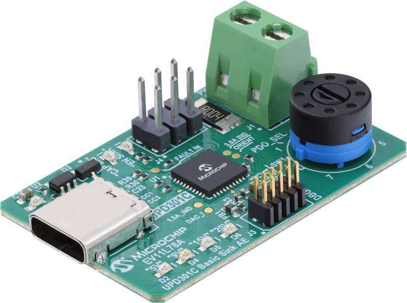

.. _ev11l78a:

UPD301C Basic Sink Application Example
######################################

Overview
********

The UPD301C Basic Sink Application Example Evaluation Kit (EV11L78A)
is a low-cost evaluation platform for Microchip's UPD301C Standalone
Programmable USB Power Delivery (PD) Controller. This RoHS-compliant
evaluation platform comes in a small form factor and adheres to the
USB Type-C™ Connector Specification and USB PD 3.0 specification.

    UPD301C Basic Sink Application Example (Credit: `Microchip Technology`_)

Hardware
********

- ATSAMD20E16 ARM Cortex-M0+ processor at 48 MHz
- UPD301C combines a SAMD20 core and a UPD350 USB-PD controller
- Sink PDO Selector Switch
- Onboard LED Voltmeter

Supported Features
==================

The ev11l78a board configuration supports the following hardware
features:

.. list-table::
    :header-rows: 1

    * - Interface
      - Controller
      - Driver / Component
    * - NVIC
      - on-chip
      - nested vector interrupt controller
    * - Flash
      - on-chip
      - Can be used with LittleFS to store files
    * - SYSTICK
      - on-chip
      - systick
    * - WDT
      - on-chip
      - Watchdog
    * - ADC
      - on-chip
      - Analog to Digital Converter
    * - GPIO
      - on-chip
      - I/O ports
    * - USART
      - on-chip
      - Serial ports
    * - I2C
      - on-chip
      - I2C ports
    * - SPI
      - on-chip
      - Serial Peripheral Interface ports

Other hardware features are not currently supported by Zephyr.

Refer to the `EV11L78A Schematics`_ for a detailed hardware diagram.

The default configuration can be found in the Kconfig
:zephyr_file:`boards/microchip/ev11l78a/ev11l78a_defconfig`.

Serial Port
===========

The SAMD20 MCU has 6 SERCOM based USARTs. One of the USARTs
(SERCOM1) is available on the Debug/Status header.

SPI Port
========

The SAMD20 MCU has 6 SERCOM based SPIs. One of the SPIs (SERCOM0)
is internally connected between the SAMD20 core and the UPD350.

I²C Port
========

The SAMD20 MCU has 6 SERCOM based I2Cs. One of the I2Cs (SERCOM3)
is available on the Debug/Status header.

References
**********

.. target-notes::

.. _Microchip Technology:
    https://www.microchip.com/en-us/development-tool/ev11l78a

.. _EV11L78A Schematics:
    https://ww1.microchip.com/downloads/aemDocuments/documents/UNG/ProductDocuments/SupportingCollateral/03-00056-R1.0.PDF
