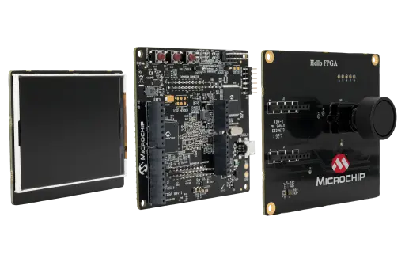

.. SPDX-FileCopyrightText: Copyright Bavariamatic GmbH
.. SPDX-License-Identifier: Apache-2.0

.. zephyr:board:: m2s_hello_fpga_kit

Overview
********

The Microchip M2S Hello FPGA Kit is a low-cost, compact, entry-level FPGA
platform for users with low to medium FPGA experience. It supports powerful
demos in image processing, signal processing, and artificial intelligence, and
can measure live FPGA core power consumption while designs are running. Flash
Freeze mode lets users freeze a design while maintaining the I/O state for low
power applications. The kit also includes Arduino and mikroBUS connectors for
prototyping and expansion.

The Zephyr board target for this port is ``m2s_hello_fpga_kit/m2s010``.

Reference material for the kit is available in the official
`Microchip M2S Hello FPGA Kit product page <https://www.microchip.com/en-us/development-tool/m2s-hello-fpga-kit>`_
and the related user guides and schematics published by Microchip.

Programming and debugging
*************************

.. zephyr:board-supported-runners::

Building
========

Applications for the ``m2s_hello_fpga_kit/m2s010`` board target can be built as
usual:

.. zephyr-app-commands::
   :board: m2s_hello_fpga_kit/m2s010
   :goals: build

Clock Configuration
===================

The current SmartFusion2 port does not program the MSS clock tree from Zephyr.
The actual CPU and peripheral clocks must already be configured in the
SmartFusion2 hardware design, for example in the MSS/Libero configuration used
to build the board image.

In Zephyr, the software-visible CPU frequency is taken from the devicetree CPU
node:

- ``&cpu0 { clock-frequency = <...>; }``

That value is then used to derive:

- ``CONFIG_SYS_CLOCK_HW_CYCLES_PER_SEC``
- the ``SystemCoreClock`` variable used by the SmartFusion2 SoC port

The SmartFusion2-specific clock-controller node is currently used for UART
clocking, while the remaining peripherals still use their local devicetree
frequency properties. If the hardware clock configuration changes, update the
devicetree to match the real board configuration. For example, an application
overlay can override the CPU and peripheral clock description values:

.. code-block:: dts

   &cpu0 {
      clock-frequency = <80000000>;
   };

   &clkc {
      clock-frequencies = <80000000 40000000>;
   };

The devicetree values must describe the real hardware clocks. Changing them in
Zephyr alone does not reprogram the SmartFusion2 clock hardware.

Flashing
========

The board uses the OpenOCD runner configuration from ``board.cmake`` and
``support/openocd.cfg``. Once the CMSIS-DAP/OpenOCD setup for the kit is
available in the host environment, the usual commands are:

.. code-block:: bash

   west flash --runner openocd
   west debug --runner openocd

Helpful Documentation
*********************

The following Microchip documents are useful when extending or upstreaming the
board support.

Board Documentation
===================

- `Hello FPGA Kit Quickstart Card <https://ww1.microchip.com/downloads/aemDocuments/documents/FPGA/ProductDocuments/UserGuides/qs-guide/Hello_FPGA-Kit_QuickStart_card.pdf>`_

SoC Documentation
=================

- `IGLOO 2 FPGA and SmartFusion 2 SoC FPGA Datasheet (DS00004750) <https://ww1.microchip.com/downloads/aemDocuments/documents/FPGA/ProductDocuments/DataSheets/IGLOO-2-FPGA-And-SmartFusion-2-SoC-FPGA-Data-Sheet-DS00004750.pdf>`_
- `SmartFusion2 and IGLOO2 Programming User Guide (UG0451) <https://ww1.microchip.com/downloads/aemdocuments/documents/FPGA/ProductDocuments/SoC/microsemi_smartfusion2_igloo2_programming_user_guide_ug0451_v9.pdf>`_

The quick start guide is useful for board bring-up, connector overview and kit
contents. The device datasheet is the better top-level reference for package
options, memory sizes, hard IP inventory and electrical capabilities. The
programming guide is the better reference for flash programming, device
configuration flows, boot/programming modes and debug-related setup.
