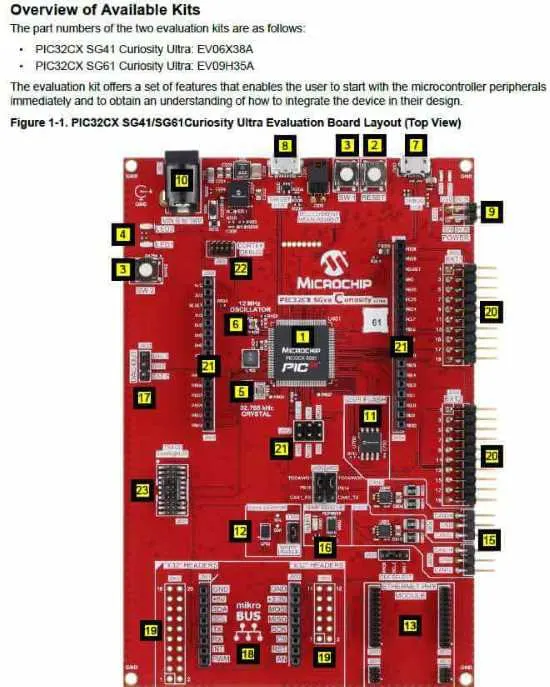
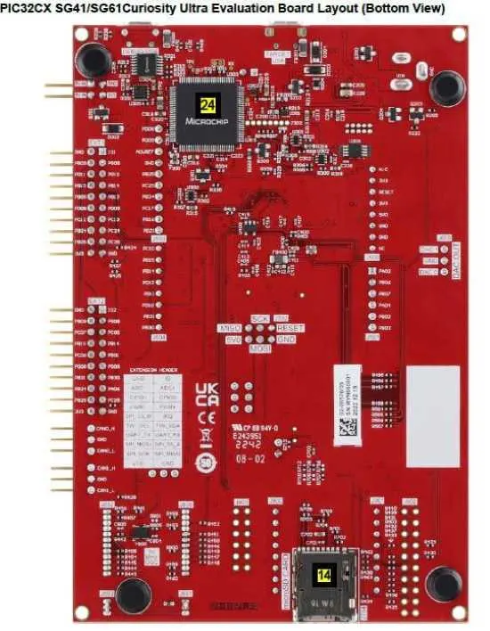
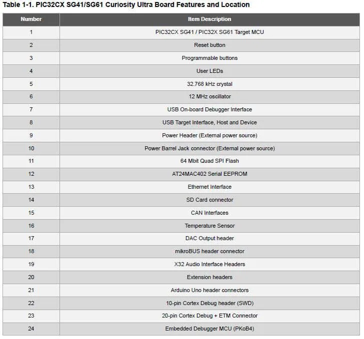

.. zephyr:board:: pic32cxsg41_cult

Overview
********

The PIC32CX SG41 Curiosity Ultra evaluation kit is ideal for evaluation and
prototyping with the PIC32CX SG Cortex®-M4F processor-based
microcontrollers. The kit includes Microchip’s Embedded Debugger (EDBG),
which provides a full debug interface without the need for additional
hardware.

Hardware
********

- PIC32CX1025SG41 ARM Cortex-M4F processor at 120 MHz
- 32.768 kHz crystal oscillator
- 12 MHz crystal oscillator
- 1024 KiB flash memory and 256 KiB of RAM
- Two yellow user LEDs
- Two mechanical user push buttons
- One reset button
- On-board USB based EDBG unit with serial console
- Embedded Debugger MCU (PKoB4)
- 64 Mbit QSPI Flash
- AT24MAC402 serial EEPROM with EUI-48™ MAC address
- Ethernet transceiver 10/100 Mbps Ethernet MAC,
  compatible with the IEEE 802.3 standard.
- Arduino Uno header connectors
- X32 Audio Interface Headers
- mikroBUS header connectors
- DAC Output header
- USB interface, host, and device
- SD/SDIO card connector

Supported Features
==================

.. zephyr:board-supported-hw::

Pin Mapping
===========

The Microchip PIC32CXSG41 Curiosity Ultra evaluation kit has 4 GPIO controllers. These
controllers are responsible for pin muxing, input/output, pull-up, etc.

For more details please refer to `Microchip PIC32CX SG41-SG60-SG61 Family Datasheet`_.

Default Zephyr Peripheral Mapping:
----------------------------------

- SERCOM2 USART TX : PB13
- SERCOM2 USART RX : PB12
- GPIO/PWM LED1    : PC21
- GPIO/PWM LED2    : PA16
- GPIO SW1         : PD00
- GPIO SW2         : PD01
- GMAC RMII REFCK  : PA14
- GMAC RMII TXEN   : PA17
- GMAC RMII TXD0   : PA18
- GMAC RMII TXD1   : PA19
- GMAC RMII CRSDV  : PC20
- GMAC RMII RXD0   : PA13
- GMAC RMII RXD1   : PA12
- GMAC RMII RXER   : PA15
- GMAC MDIO MDC    : PC11
- GMAC MDIO MDIO   : PC12
- SERCOM0 SPI SCK  : PB24
- SERCOM0 SPI MOSI : PB25
- SERCOM0 SPI MISO : PC25
- SERCOM0 SPI SS   : PC24
- SERCOM7 I2C SDA  : PD08
- SERCOM7 I2C SCL  : PD09
- USB DP           : PA25
- USB DM           : PA24

System Clock
============

The PIC32CXSG41 MCU is configured to use the 32.768 kHz external oscillator
with the on-chip PLL generating the 48 MHz system clock.

Serial Port
===========

The PIC32CXSG41 MCU has 8 SERCOM based USARTs with one configured as USARTs in this BSP.
- SERCOM4 is the default Zephyr console.

- SERCOM4 115200 8n1 connected to the onboard Microchip Embedded Debugger (EDBG).

The PIC32CXSG41 MCU has 8 SERCOM based SPIs.

The PIC32CXSG41 MCU has 5 SERCOM based I2Cs. On the Microchip PIC32CXSG41 Curiosity Ultra,
SERCOM7 is connected to a AT24MAC402 EEPROM.

Programming and Debugging
=========================

.. zephyr:board-supported-runners::

The Microchip PIC32CXSG41 Curiosity Ultra comes with a Microchip Embedded Debugger (EDBG).
This provides a debug interface to the PIC32CXSG41 chip and is supported by OpenOCD.

Flashing
========

#. Build the Zephyr kernel and the ``hello_world`` sample application:

.. zephyr-app-commands::
   :zephyr-app: samples/hello_world
   :board: pic32cxsg41_cult
   :goals: build
   :compact:

Connect the Microchip PIC32CXSG41 Curiosity Ultra to your host computer using the USB debug port.

Run your favorite terminal program to listen for output. Under Linux thet terminal should be.

.. code-block:: console

   $ minicom -D /dev/ttyACM0 -o

The -o option tells minicom not to send the modem initialization string.
Connection should be configured as follows:

   - Speed: 115200
   - Data: 8 bits
   - Parity: None
   - Stop bits: 1

To flash an image:

.. zephyr-app-commands::
   :zephyr-app: samples/hello_world
   :board: pic32cxsg41_cult
   :goals: flash
   :compact:

You should see "Hello World! pic32cxsg41_cult" in your terminal.

Debugging
=========

SVD files are included in hal_microchip/pic32c/pic32cxsg/include/pic32cxsg41/svd.

References
**********

.. target-notes::

.. _Microchip website:
	https://www.microchip.com/en-us/development-tool/EV06X38A

.. _Microchip PIC32CX SG41-SG60-SG61 Family Datasheet:
	https://ww1.microchip.com/downloads/aemDocuments/documents/MCU32/ProductDocuments/DataSheets/PIC32CX-SG41-SG60-SG61-Family-Data-Sheet-DS60001715.pdf
