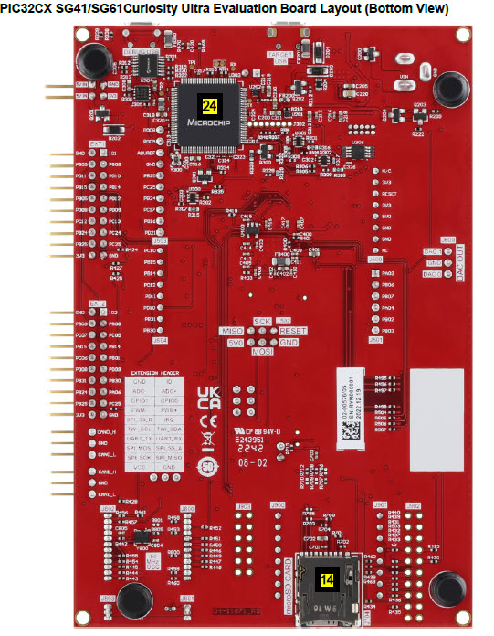

.. _pic32cxsg61_cult:

PIC32CX SG61 Curiosity Ultra Evaluation Kit
###################################

Overview
********

The PIC32CX SG61 Curiosity Ultra evaluation kit is ideal for evaluation and
prototyping with the PIC32CX SG Cortex®-M4F processor-based
microcontrollers. The kit includes Microchip’s Embedded Debugger (EDBG),
which provides a full debug interface without the need for additional
hardware.

.. image:: img/pic32cx_sg61_cult.jpg
     :align: center
     :alt: PIC32CX-CULT

Hardware
********

- PIC32CX1025SG61 ARM Cortex-M4F processor at 120 MHz
- 32.768 kHz crystal oscillator
- 12 MHz crystal oscillator
- 1024 KiB flash memory and 256 KiB of RAM
- Two yellow user LEDs
- Two mechanical user push buttons
- One reset button
- On-board USB based EDBG unit with serial console
- Embedded Debugger MCU (PKoB4)
- 64 Mbit QSPI Flash
- AT24MAC402 serial EEPROM with EUI-48™ MAC address
- Ethernet transceiver 10/100 Mbps Ethernet MAC, 
  compatible with the IEEE 802.3 standard.
- Arduino Uno header connectors
- X32 Audio Interface Headers
- mikroBUS header connectors
- DAC Output header
- USB interface, host, and device
- SD/SDIO card connector
- TA100 CryptoAuthentication™  device

Supported Features
==================

The pic32cxsg61_cult board configuration supports the following hardware
features:

+---------------+------------+----------------------------+
| Interface     | Controller | Driver/Component           |
+===============+============+============================+
| ADC           | on-chip    | adc                        |
+---------------+------------+----------------------------+
| DAC           | on-chip    | dac                        |
+---------------+------------+----------------------------+
| DMAC          | on-chip    | dma                        |
+---------------+------------+----------------------------+
| EEPROM        | i2c        | eeprom, EUI-48 MAC Address |
+---------------+------------+----------------------------+
| EIC           | on-chip    | interrupt_controller       |
+---------------+------------+----------------------------+
| GMAC          | on-chip    | ethernet, mdio             |
+---------------+------------+----------------------------+
| GPIO          | on-chip    | gpio                       |
+---------------+------------+----------------------------+
| MPU           | on-chip    | arch/arm                   |
+---------------+------------+----------------------------+
| NVIC          | on-chip    | arch/arm                   |
+---------------+------------+----------------------------+
| NVMCTRL       | on-chip    | flash                      |
+---------------+------------+----------------------------+
| PORT          | on-chip    | pinctrl                    |
+---------------+------------+----------------------------+
| RTC           | on-chip    | timer                      |
+---------------+------------+----------------------------+
| SERCOM I2C    | on-chip    | i2c                        |
+---------------+------------+----------------------------+
| SERCOM SPI    | on-chip    | spi                        |
+---------------+------------+----------------------------+
| SERCOM USART  | on-chip    | serial, console            |
+---------------+------------+----------------------------+
| Serial Number | on-chip    | hwinfo                     |
+---------------+------------+----------------------------+
| SYSTICK       | on-chip    | timer                      |
+---------------+------------+----------------------------+
| TC            | on-chip    | counter                    |
+---------------+------------+----------------------------+
| TCC           | on-chip    | counter, pwm               |
+---------------+------------+----------------------------+
| TRNG          | on-chip    | entropy                    |
+---------------+------------+----------------------------+
| USB           | on-chip    | usb                        |
+---------------+------------+----------------------------+
| WDT           | on-chip    | watchdog                   |
+---------------+------------+----------------------------+

Other hardware features are not currently supported by Zephyr.

The default configuration can be found in the Kconfig
:zephyr_file:`boards/microchip/pic32cxsg61_cult/pic32cxsg61_cult_defconfig`.

Pin Mapping
===========

The Microchip PIC32CXSG61 Curiosity Ultra evaluation kit has 4 GPIO controllers. These
controllers are responsible for pin muxing, input/output, pull-up, etc.

For more details please refer to `Microchip PIC32CX SG41/SG60/SG61 Family Datasheet`_ and 
the `Microchip PIC32CXSG61 Curiosity Ultra Schematic`_.

.. image:: img/PIC32CXSG61-pinout1.jpg
     :align: center
     :alt: PIC32CXSG61-CULT-pinout1

.. image:: img/PIC32CXSG61-pinout3.jpg
     :align: center
     :alt: PIC32CXSG61-CULT-pinout3

Default Zephyr Peripheral Mapping:
----------------------------------
- SERCOM2 USART TX : PB13
- SERCOM2 USART RX : PB12
- GPIO/PWM LED1    : PC21
- GPIO/PWM LED2    : PA16
- GPIO SW1         : PD00
- GPIO SW2         : PD01
- GMAC RMII REFCK  : PA14
- GMAC RMII TXEN   : PA17
- GMAC RMII TXD0   : PA18
- GMAC RMII TXD1   : PA19
- GMAC RMII CRSDV  : PC20
- GMAC RMII RXD0   : PA13
- GMAC RMII RXD1   : PA12
- GMAC RMII RXER   : PA15
- GMAC MDIO MDC    : PC11
- GMAC MDIO MDIO   : PC12
- SERCOM0 SPI SCK  : PB24
- SERCOM0 SPI MOSI : PB25
- SERCOM0 SPI MISO : PC25	
- SERCOM0 SPI SS   : PC24
- SERCOM7 I2C SDA  : PD08
- SERCOM7 I2C SCL  : PD09
- USB DP           : PA25
- USB DM           : PA24

System Clock
============

The PIC32CXSG61 MCU is configured to use the 32.768 kHz external oscillator
with the on-chip PLL generating the 48 MHz system clock.

Serial Port
===========

The PIC32CXSG61 MCU has 8 SERCOM based USARTs with one configured as USARTs in
this BSP. SERCOM2 is the default Zephyr console.

- SERCOM4 115200 8n1 connected to the onboard Atmel Embedded Debugger (EDBG)

PWM
===

The PIC32CXSG61 MCU has 5 TCC based PWM units with up to 6 outputs each and a period
of 24 bits or 16 bits.  If :code:`CONFIG_PWM_PIC32CXSG_TCC` is enabled then LED0 is
driven by TCC0 instead of by GPIO.

SPI Port
========

The PIC32CXSG61 MCU has 8 SERCOM based SPIs.

I2C Port
========

The PIC32CXSG61 MCU has 8 SERCOM based I2Cs. On the Microchip PIC32CXSG61 Curiosity Ultra,
SERCOM7 is connected to a AT24MAC402 EEPROM and SERCOM2 is connected to a TA100 Crypto
Authentication device.

Programming and Debugging
*************************

The Microchip PIC32CXSG61 Curiosity Ultra comes with a Atmel Embedded Debugger (EDBG).  This
provides a debug interface to the PIC32CXSG61 chip and is supported by
OpenOCD.

Flashing
========

#. Build the Zephyr kernel and the ``hello_world`` sample application:

   .. zephyr-app-commands::
      :zephyr-app: samples/hello_world
      :board: pic32cxsg61_cult
      :goals: build
      :compact:

#. Connect the Microchip PIC32CXSG61 Curiosity Ultra to your host computer using the USB debug
   port.

#. Run your favorite terminal program to listen for output. Under Linux the
   terminal should be :code:`/dev/ttyACM0`. For example:

   .. code-block:: console

      $ minicom -D /dev/ttyACM0 -o

   The -o option tells minicom not to send the modem initialization
   string. Connection should be configured as follows:

   - Speed: 115200
   - Data: 8 bits
   - Parity: None
   - Stop bits: 1

#. To flash an image:

   .. zephyr-app-commands::
      :zephyr-app: samples/hello_world
      :board: pic32cxsg61_cult
      :goals: flash
      :compact:

   You should see "Hello World! pic32cxsg61_cult" in your terminal.

References
**********

.. target-notes::

.. _Microchip website:
    https://www.microchip.com/en-us/development-tool/EV06X38A
    
.. _PIC32CX SG41/SG60/SG61 Family Datasheet:
	https://ww1.microchip.com/downloads/aemDocuments/documents/MCU32/ProductDocuments/DataSheets/PIC32CX-SG41-SG60-SG61-Family-Data-Sheet-DS60001715.pdf
