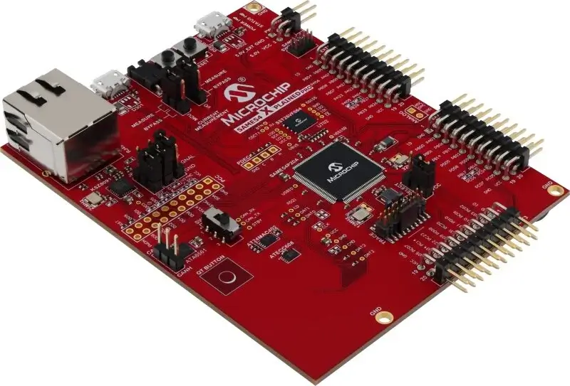
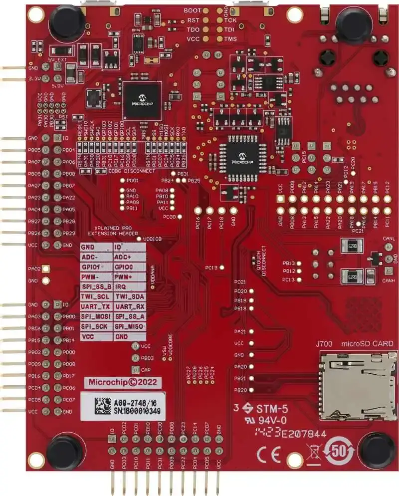

.. zephyr:board:: sam_e54_xpro

SAM E54 Xplained Pro Evaluation Kit
###################################

Overview
********

The SAM E54 Xplained Pro evaluation kit is ideal for evaluation and
prototyping with the SAM E54 Cortex®-M4F processor-based
microcontrollers. The kit includes Microchip’s Embedded Debugger (EDBG),
which provides a full debug interface without the need for additional
hardware.

Hardware
********

- ATSAME54P20A ARM Cortex-M4F processor at 120 MHz
- 32.768 kHz crystal oscillator
- 12 MHz crystal oscillator
- 1024 KiB flash memory and 256 KiB of RAM
- One yellow user LED
- One mechanical user push button
- One reset button
- On-board USB based EDBG unit with serial console
- One QTouch® PTC button
- 32 MiB QSPI Flash
- ATECC508 CryptoAuthentication™  device
- AT24MAC402 serial EEPROM with EUI-48™ MAC address
- Ethernet

   - RJ45 connector with built-in magnetics
   - KSZ8091RNA PHY
   - 10Base-T/100Base-TX IEE 802.3 compliant Ethernet transceiver

- USB interface, host, and device
- SD/SDIO card connector

Supported Features
==================

.. zephyr:board-supported-hw::

The default configuration can be found in the Kconfig
:zephyr_file:`boards/microchip/sam/sam_e54_xpro/sam_e54_xpro_defconfig`.

Pin Mapping
===========

The SAM E54 Xplained Pro evaluation kit has 4 GPIO controllers. These
controllers are responsible for pin muxing, input/output, pull-up, etc.

For more details please refer to `SAM D5x/E5x Family Datasheet`_ and the `SAM E54
Xplained Pro Schematic`_.

Default Zephyr Peripheral Mapping:
----------------------------------
- SERCOM2 USART TX : PB24
- SERCOM2 USART RX : PB25
- GPIO/PWM LED0    : PC18
- GPIO SW0         : PB31
- GMAC RMII REFCK  : PA14
- GMAC RMII TXEN   : PA17
- GMAC RMII TXD0   : PA18
- GMAC RMII TXD1   : PA19
- GMAC RMII CRSDV  : PC20
- GMAC RMII RXD0   : PA13
- GMAC RMII RXD1   : PA12
- GMAC RMII RXER   : PA15
- GMAC MDIO MDC    : PC11
- GMAC MDIO MDIO   : PC12
- SERCOM4 SPI SCK  : PB26
- SERCOM4 SPI MOSI : PB27
- SERCOM4 SPI MISO : PB29
- SERCOM7 I2C SDA  : PD08
- SERCOM7 I2C SCL  : PD09
- USB DP           : PA25
- USB DM           : PA24

System Clock
============

The SAME54 MCU is configured to use the 32.768 kHz external oscillator
with the on-chip PLL generating the 48 MHz system clock.

Serial Port
===========

The SAME54 MCU has 8 SERCOM based USARTs with one configured as USARTs in
this BSP. SERCOM2 is the default Zephyr console.

- SERCOM2 115200 8n1 connected to the onboard Microchip Embedded Debugger (EDBG)

Programming and Debugging
*************************

The SAM E54 Xplained Pro comes with a Microchip Embedded Debugger (EDBG).  This
provides a debug interface to the SAME54 chip and is supported by
OpenOCD.

Flashing
========

#. Build the Zephyr kernel and the ``hello_world`` sample application:

   .. zephyr-app-commands::
      :zephyr-app: samples/hello_world
      :board: sam_e54_xpro
      :goals: build
      :compact:

#. Connect the SAM E54 Xplained Pro to your host computer using the USB debug
   port.

#. Run your favorite terminal program to listen for output. Under Linux the
   terminal should be :code:`/dev/ttyACM0`. For example:

   .. code-block:: console

      $ minicom -D /dev/ttyACM0 -o

   The -o option tells minicom not to send the modem initialization
   string. Connection should be configured as follows:

   - Speed: 115200
   - Data: 8 bits
   - Parity: None
   - Stop bits: 1

#. To flash an image:

   .. zephyr-app-commands::
      :zephyr-app: samples/hello_world
      :board: sam_e54_xpro
      :goals: flash
      :compact:

   You should see "Hello World! same_54_xpro" in your terminal.

References
**********

.. target-notes::

.. _Microchip website:
    http://www.microchip.com/DevelopmentTools/ProductDetails.aspx?PartNO=ATSAME54-XPRO

.. _SAM D5x/E5x Family Datasheet:
    http://ww1.microchip.com/downloads/en/DeviceDoc/60001507C.pdf

.. _SAM E54 Xplained Pro Schematic:
    http://ww1.microchip.com/downloads/en/DeviceDoc/SAME54-Xplained-Pro_Design-Documentation.zip
