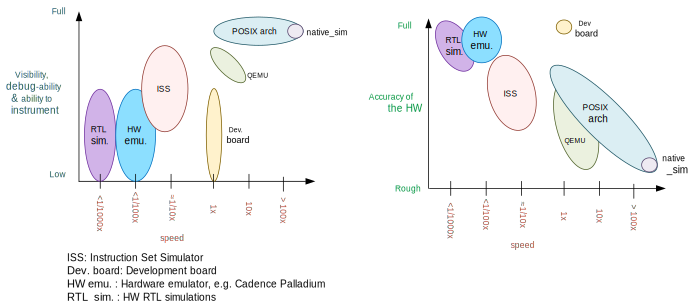
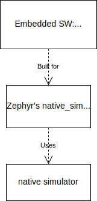

.. _Posix arch:

The POSIX architecture
######################

.. contents::
   :depth: 1
   :backlinks: entry
   :local:

Overview
********

The native simulator in combination with the POSIX architecture and the inf_clock SOC layer,
provide the foundation, architecture and SOC layers for a set of virtual test
boards.

Using these, a Zephyr application can be compiled together with
the Zephyr kernel, creating a normal executable that runs as
a native application on the host OS, without emulation. Instead,
you use native host tools for compiling, debugging, and analyzing your
Zephyr application, eliminating the need for architecture-specific
target hardware in the early phases of development.

.. note::

   The POSIX architecture is not related and should not be confused with the
   :ref:`POSIX OS abstraction<posix_support>`.
   The latter provides an adaptation shim that enables running applications
   which require POSIX APIs on Zephyr.

Types of POSIX arch based boards
================================

Today there are two types of POSIX boards:
:ref:`native_sim<native_sim>`, and the :ref:`bsim boards<bsim boards>`.
While they share the main objectives and principles, the first is intended as
a HW agnostic test platform which in some cases utilizes the host OS
peripherals, while the second intend to simulate a particular HW platform,
with focus on their radio (e.g. BT LE) and utilize the `BabbleSim`_ physical layer
simulation and framework, while being fully decoupled of the host.

.. _BabbleSim:
   https://BabbleSim.github.io

.. _posix_arch_deps:

Host system dependencies
========================

This port is designed and tested to run in Linux.

.. note::

   You must have the 32-bit C library installed in your system
   (in Ubuntu 16.04 install the gcc-multilib package)

.. note::

   The POSIX architecture is known to **not** work on macOS due to
   fundamental differences between macOS and other typical Unixes.

.. note::

   The 32 bit version of this port does not directly work in the old Windows Subsystem
   for Linux (WSL1) because WSL1 does not support native 32-bit binaries.
   You may want to consider WSL2, or, if using :ref:`native_sim <native_sim>`,
   you can also just use the ``native_sim/native/64``
   target: Check :ref:`32 and 64bit versions<native_sim32_64>`.
   Otherwise `with some tinkering
   <https://github.com/microsoft/WSL/issues/2468#issuecomment-374904520>`_ it
   should be possible to make it work.

.. _posix_arch_limitations:

Important limitations
*********************

The underlying assumptions behind this port set some limitations on what
can and cannot be done.
These limitations are due to the code executing natively in
the host CPU without any instrumentation or means to interrupt it unless the
simulated CPU is sleeping.

You can imagine the code executes in a simulated CPU
which runs at an infinitely fast clock: No time passes while the CPU is
running.
Therefore interrupts, including timer interrupts, will not arrive
while code executes, except immediately after the SW enables or unmasks
them if they were pending.

This behavior is intentional, as it provides a deterministic environment to
develop and debug.
For more information please see the
`Rationale for this port`_ and :ref:`Architecture<posix_arch_architecture>`
sections

Therefore these limitations apply:

- There can **not** be busy wait loops in the application code that wait for
  something to happen without letting the CPU sleep.
  If busy wait loops do exist, they will behave as infinite loops and
  will stall the execution. For example, the following busy wait loop code,
  which could be interrupted on actual hardware, will stall the execution of
  all threads, kernel, and HW models:

  .. code-block:: c

     while (1){}

  Similarly the following code where we expect ``condition`` to be
  updated by an interrupt handler or another thread, will also stall
  the application when compiled for this port.

  .. code-block:: c

     volatile condition = true;
     while (condition){}

- Code that depends on its own execution speed will normally not
  work as expected. For example, code such as shown below, will likely not
  work as expected:

  .. code-block:: c

     peripheral_x->run = true;

     /* Wait for a number of CPU cycles */
     for (int i = 0; i < 100; i++) NOP;

     /* We expect the peripheral done and ready to do something else */

- This port is not meant to, and could not possibly help debug races between
  HW and SW, or similar timing related issues.

- You may not use hard coded memory addresses because there is no I/O or
  MMU emulation.

Working around these limitations
================================

If a busy wait loop exists, it will become evident as the application will be
stalled in it. To find the loop, you can run the binary in a debugger and
pause it after the execution is stuck; it will be paused in
some part of that loop.

The best solution is to remove that busy wait loop, and instead use
an appropriate kernel primitive to synchronize your threads.
Note that busy wait loops are in general a bad coding practice as they
keep the CPU executing and consuming power.

If removing the busy loop is really not an option, you may add a conditionally
compiled call to :c:func:`k_cpu_idle` if you are waiting for an
interrupt, or a call to :c:func:`k_busy_wait` with some small delay in
microseconds.
In the previous example, modifying the code as follows would work:

.. code-block:: c

   volatile condition = true;
   while (condition) {
    #if defined(CONFIG_ARCH_POSIX)
      k_cpu_idle();
    #endif
   }

.. _posix_arch_unsupported:

Significant unsupported features
********************************

Currently, these are the most significant features which are not supported in this architecture:

* :ref:`User mode/userspace <usermode_api>`: When building for these targets,
  :kconfig:option:`CONFIG_USERSPACE` will always be disabled,
  and all calls into the kernel will be done as normal calls.

* Stack checks: :kconfig:option:`CONFIG_HW_STACK_PROTECTION`,
  :kconfig:option:`CONFIG_STACK_CANARIES`, and
  :kconfig:option:`CONFIG_THREAD_ANALYZER`.
  This is due to how Zephyr allocated threads' stacks are not *actually* being used like they are
  in other architectures. Check
  :ref:`the architecture section's architecture layer paragraph <posix_arch_design_archl>`
  for more information.

.. _posix_arch_rationale:

Rationale for this port
***********************

The main intents of this port are:

- Allow functional debugging, instrumentation and analysis of the code with
  native tooling.
- Allow functional regression testing, and simulations in which we have the
  full functionality of the code.
- Run tests fast: several minutes of simulated time per wall time second.
- Possibility to connect to external tools which may be able to run much
  faster or much slower than real time.
- Deterministic, repeatable runs:
  There must not be any randomness or indeterminism (unless host peripherals
  are used).
  The result must **not** be affected by:

  - Debugging or instrumenting the code.
  - Pausing in a breakpoint and continuing later.
  - The host computer performance or its load.

The aim of this port is not to debug HW/SW races, missed HW programming
deadlines, or issues in which an interrupt comes when it was not expected.
Normally those would be debugged with a cycle accurate Instruction Set Simulator
(ISS) or with a development board.

.. _posix_arch_compare:

Comparison with other options
*****************************

This port does not try to replace cycle accurate instruction set simulators
(ISS), development boards, or QEMU, but to complement them. This port's main aim
is to meet the targets described in the previous `Rationale for this port`_
section.

    Comparison of different debugging options. Note that realism has many
    dimensions: Having the real memory map or emulating the exact time an
    instruction executes is just some of it; Emulating peripherals accurately
    is another side.

This native port compiles your code directly for the host architecture
(typically x86), with no instrumentation or
monitoring code. Your code executes directly in the host CPU. That is, your code
executes just as fast as it possibly can.

Simulated time is normally decoupled from real host time.
The problem of how to emulate the instruction execution speed is solved
by assuming that code executes in zero simulated time.

There is no I/O or MMU emulation. If you try to access memory through hardcoded
addresses your binary will simply segfault.
The drivers and HW models for this architecture will hide this from the
application developers when it relates to those peripherals.
In general this port is not meant to help developing low level drivers for
target HW. But for developing application code.

Your code can be debugged, instrumented, or analyzed with all normal native
development tools just like any other Linux application.

Execution is fully reproducible, you can pause it without side-effects.

How does this port compare to QEMU:
===================================

With QEMU you compile your image targeting the board which is closer to
your desired board. For example an ARM based one. QEMU emulates the real memory
layout of the board, loads the compiled binary and through instructions
translation executes that ARM targeted binary on the host CPU.
Depending on configuration, QEMU also provides models of some peripherals
and, in some cases, can expose host HW as emulated target peripherals.

QEMU cannot provide any emulation of execution speed. It simply
executes code as fast as it can, and lets the host CPU speed determine the
emulated CPU speed. This produces highly indeterministic behavior,
as the execution speed depends on the host system performance and its load.

As instructions are translated to the host architecture, and the target CPU and
MMU are emulated, there is a performance penalty.

You can connect gdb to QEMU, but have few other instrumentation abilities.

Execution is not reproducible. Some bugs may be triggered only in some runs
depending on the computer and its load.

How does this port compare to an ISS:
======================================

With a cycle accurate instruction set simulator you compile targeting either
your real CPU/platform or a close enough relative. The memory layout is modeled
and some or all peripherals too.

The simulator loads your binary, slowly interprets each instruction, and
accounts for the time each instruction takes.
Time is simulated and is fully decoupled from real time.
Simulations are on the order of 10 to 100 times slower than real time.

Some instruction set simulators work with gdb, and may
provide some extra tools for analyzing your code.

Execution is fully reproducible. You can normally pause your execution without
side-effects.

.. _posix_arch_architecture:

Architecture and design
***********************

.. note::

   This section does not describe anymore the old :ref:`native_posix<native_posix>` or
   :kconfig:option:`CONFIG_NATIVE_APPLICATION` based architecture.
   It only describes the new native simulator based architecture used by targets built with the
   :kconfig:option:`CONFIG_NATIVE_LIBRARY` option.

.. note::

   This description applies to the boards on the tree,
   but it is not a requirement for other POSIX arch based boards to follow what is described here.

.. figure:: layering_natsim.svg
    :align: center
    :alt: Zephyr layering in a native simulator build
    :figclass: align-center

    Zephyr layering when built against an embedded target (left), and targeting a native_simulator
    based board (right)

    Relationship between Zephyr, the native_sim target and the native simulator

When building targeting Zephyr's :ref:`native_sim<native_sim>` board, we build our embedded SW,
that is, our application, the Zephyr kernel, and any subsystems and drivers we have selected,
with the :ref:`POSIX architecture<posix_arch_design_archl>` and the
:ref:`inf_clock<posix_arch_design_socl>` SOC layers.
The result of this build is a pre-linked elf library, which contains what we can call the
embedded SW.
Then the `native simulator <https://github.com/BabbleSim/native_simulator/>`_ runner will be built.
And after both the "embedded SW" and the runner will be linked together to form the final Linux
executable.
This final executable is typically called ``zephyr.exe`` and can be run or debugged just like any
other normal Linux executable.

The native simulator runner provides the Linux program entry point, command line argument parsing,
the HW models scheduler, as well as a component to emulate the CPU start/stop and CPU thread
switching.
It also provides a mechanism to register functions which need to be run at different points of the
executable lifetime.
When targeting native_sim, the native simulator is also built with some basic HW models like a
system timer and an interrupt controller.
You can find more information on these in the
`native simulator design documentation <https://github.com/BabbleSim/native_simulator/blob/main/docs/Design.md>`_.

The native_sim target is a single microcontroller (MCU) target with simple HW models. Other targets
like the :ref:`simulated nRF5340 (nrf5340bsim)<nrf5340bsim>` are multi MCU targets. Where one
embedded Zephyr image can be build for each MCU, and all MCU images and the runner are assembled
together into one executable with more elaborate HW models of those SOCs.

Native simulator runner context and the embedded context
========================================================

It is worth noting that the embedded SW library is first pre-linked. That is that all symbols which
can be resolved inside that library will be resolved. And that, after, all these library symbols,
except a selected few marked with an special annotation, will be hidden from further linking.
In this way, the runner link stage will not link to or conflict with any of these hidden symbols,
neither from the runner itself or from other CPUs embedded SW libraries.
It is also worth noting that all expected Zephyr sections are built and ordered with the Zephyr
linker script in that first embedded SW library link.

When the embedded SW is built, one has the option of linking an embedded C standard library with it,
or leave at that point all C library calls unresolved, and let them be linked in the final stage
with the host C library.

Due to all this, we can conceptually see our build divided in two separate contexts:
One is the embedded/Zephyr context, in which we build the Zephyr OS, an application for a given MCU,
and which may be built with an embedded C library.
Another is the runner context, which is always built with the host C library and which has very
limited visibility into the embedded context.

From the embedded context we can easily call into the runner context: All runner context symbols
will be linkable in the final link stage unless another embedded symbol with the same name was
already linked to it in the first pass.
But from the runner context only the symbols from the embedded context annotated with the
``NATIVE_SIMULATOR_IF`` macro will be linkable.

From Zephyr's build system it is possible to request a file to be built in the runner context by
adding it to the cmake ``native_simulator`` library target. You can check
:zephyr_file:`arch/posix/CMakeLists.txt` for more information.

You can find more information in the native simulator
`build documentation <https://github.com/BabbleSim/native_simulator/blob/main/docs/Design.md#build-and-symbol-visibility>`_

.. _posix_arch_design_archl:

Arch layer
==========

The POSIX architecture is mainly responsible for two things:

* Set up the Zephyr build to produce an static library for the host architecture to be later
  used with the native simulator build and linked with the native simulator runner.
* Provide a thin adaptation between the API the Zephyr kernel expects from an architecture
  layer and the native simulator CPU threading emulation (NCT).

This layer together with the NCT maps each Zephyr thread into one POSIX pthread, and emulates a
single threaded CPU/MCU by only allowing one SW thread to execute at a time, as commanded by the
Zephyr kernel. Whenever the Zephyr kernel desires to context switch two threads, the POSIX arch,
using NCT, blocks and unblocks the corresponding pthreads.

This architecture provides the same interface to the Kernel as other
architectures and is therefore transparent for the application.

Note that all threads use a normal Linux pthread stack, and do not use
the Zephyr thread stack allocation for their call stacks or automatic
variables. The Zephyr stacks (which are allocated in "static memory") are
only used by the POSIX architecture to keep thread bookkeeping data.

When using this architecture, the code is compiled natively for the host system,
and typically as a 32-bit binary assuming pointer and integer types are 32-bits
wide.

.. _posix_arch_design_socl:

SOC layer
=========

This SOC layer is mainly a very thin layer on top of the native simulator CPU emulation layer,
which is responsible for handling the simulation of the CPU start/stop, as well as the
initialization of the arch layer, and calling into the Zephyr boot (:c:func:`z_cstart()`) during
the CPU boot itself.

It also provides the :ref:`native_tasks<posix_arch_design_native_tasks>`, and specifies
a few other hooks it expects the board layer to provide.

Board layer
===========

The board layer is responsible to provide all the hooks the SOC layer and native simulator runner
expect. This includes the hooks to boot the CPU (which call into the SOC layer), to handle
interrupts, and the hooks for low level tracing and busy wait handling.

The overall execution and scheduling is handled by the native simulator runner itself, which calls
when necessary into the board layer hooks.
You can find information about how the native simulator runs the embedded SW in its
`design documentation <https://github.com/BabbleSim/native_simulator/blob/main/docs/Design.md#overall-execution>`_

For more complex simulated boards, like :ref:`bsim ones<bsim boards>`, the board layer also provides
the necessary logic and configuration to mimic a real target and SOC.

Note that the SOC/board split in this architecture is different than for other Zephyr targets.
This was done to enable very different real SOC simulations to share a common architecture and SOC
layer, while placing the real SOC specific replacement logic in the board layer.

.. _posix_busy_wait:

Busy waits
==========

Busy waits work thanks to logic provided by the board and native simulator.
This does not need to be the same for all boards, but both :ref:`native_sim<native_sim>` and the
:ref:`nrf*bsim boards<bsim boards>` work similarly through the combination of a board specific
:c:func:`arch_busy_wait()` and an special fake HW timer provided by the native simulator.

Please check the
`native simulator busy wait design documentation <https://github.com/BabbleSim/native_simulator/blob/main/docs/Design.md#busy-waits>`_
for more info.

.. _posix_arch_design_native_tasks:

NATIVE_TASKS
============

The soc_inf layer provides a special type of hook called the NATIVE_TASKS.

These allow registering (at build/link time) embedded context functions which will be called
at different stages during the process execution: Before command line parsing
(so dynamic command line arguments can be registered using this hook),
before initialization of the HW models, before the simulated CPU is started,
after the simulated CPU goes to sleep for the first time,
and when the application exists.

These hooks are ultimately based on the
`native simulator tasks <https://github.com/BabbleSim/native_simulator/blob/main/docs/Design.md#native-simulator-tasks>`_
which the users may also register from code built in the runner context.
