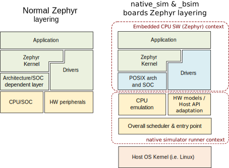
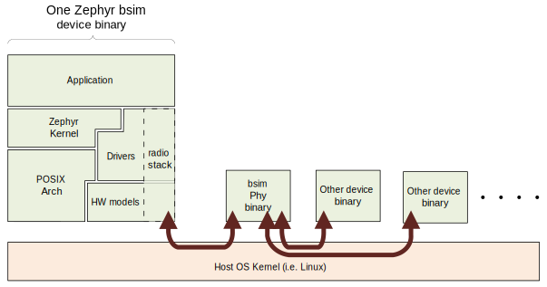

.. _bsim boards:

Bsim boards
###########

**Available bsim boards**

* :ref:`Simulated nRF52833 (nrf52_bsim)<nrf52_bsim>`
* :ref:`Simulated nRF5340 (nrf5340bsim)<nrf5340bsim>`
* :ref:`Simulated nRF54L15 (nrf54l15bsim)<nrf54l15bsim>`

.. contents:: Table of contents
   :depth: 2
   :backlinks: entry
   :local:

This page covers the design, architecture and rationale, of the
nrf5x_bsim boards and other similar bsim boards.
These boards are postfixed with `_bsim` as they use BabbleSim_
(shortened bsim), to simulate the radio environment.
These boards use the `native simulator`_ and the :ref:`POSIX architecture<Posix arch>` to build
and execute the embedded code natively on Linux.

Particular details on the :ref:`nRF52<nrf52_bsim>`, :ref:`nRF5340<nrf5340bsim>` and
:ref:`nRF54l15<nrf54l15bsim>` simulation boards, including how to use them,
can be found in their respective documentation.

.. _BabbleSim:
   https://BabbleSim.github.io

.. _EDTT:
   https://github.com/EDTTool/EDTT

.. _Architecture of HW models used for FW development and testing:
   https://babblesim.github.io/arch_hw_models.html

.. _native simulator:
   https://github.com/BabbleSim/native_simulator/blob/main/docs/README.md

.. _native simulator design documentation:
   https://github.com/BabbleSim/native_simulator/blob/main/docs/Design.md

.. _nRF HW models design documentation:
   https://github.com/BabbleSim/ext_nRF_hw_models/blob/main/docs/README_HW_models.md

Overall objective
*****************

The main purpose of these bsim boards is to be test-benches for
integration testing of embedded code on workstation/simulation.
Integration testing in the sense that the code under test will, at the very
least, run with the Zephyr RTOS just like for any other
:ref:`POSIX arch based board<posix_arch_rationale>`, but in addition these
will include some HW models which, to some degree, pretend to be the real
embedded HW.

These tests are run in workstation, that is, without using real embedded HW.
The intention being to be able to run tests much faster than real time,
without the need for real HW, and in a deterministic/reproducible fashion.

Unlike :ref:`native_sim <native_sim>`, bsim boards do not interact directly with any host
peripherals, and their execution is independent of the host load, or timing.

These boards are also designed to be used as prototyping and development environments,
which can help developing applications or communication stacks.

.. _bsim_boards_tests:

Different types of tests and how the bsim boards relate to them
===============================================================

With the POSIX architecture we provided an overall
:ref:`comparison of what the POSIX arch provides vs other options<posix_arch_compare>`.
That comparison applies fully to these boards, but in this section we expand
further on the differences, benefits and drawbacks of different testing
methodologies normally employed by embedded SW developers and how they relate
to these boards.

- Unit tests:
  Typical unit tests frameworks provide unit testing
  support which covers a different need: testing a component in isolation.
  Zephyr provides a unit testing target (unit_testing) which is not related to
  these bsim boards.
- Integration tests on real HW: Allows testing with the real SW
  components that may be too dependent on the exact HW particularities, and
  possibly without any changes compared to the final solution.
  As such can provide better integration coverage than simulation ins ome cases,
  but at the expense of slower execution, needing the real HW setups,
  test in general not being reproducible, and in many cases failures
  not being easy to debug.
  They otherwise serve a very similar purpose to simulation integration tests.
- Integration tests on workstation (what the POSIX arch and these boards enable)

  - Using bsim boards: Allow testing the embedded SW (or a subset), including
    the OS, models of peripherals etc. By testing them in conjunction,
    it is possible to test the components interactions and their integration.
  - Using bsim boards with the BabbleSim Physical layer simulation allows
    testing how several devices would interact with each other.
    For ex. how a left and a right earbud synchronize and exchange data and
    audio over their radio link, and how they interact with a mobile phone.
  - Using bsim boards, and the `EDTT`_ framework: With the EDTT framework we can
    test the embedded code under test while controlling the test from external
    python test scripts. This is supported by compiling the embedded code with
    an special driver that handles the EDTT communication (its RPC transport)
    and an embedded application that handles the RPC calls themselves, while
    the python test scripts provide the test logic.
  - Using Zephyr's :ref:`native_sim <native_sim>` board: It also allows integration testing of
    the embedded code, but without any specific HW. In that way, many embedded
    components which are dependent on the HW would not be suited for testing in
    that platform. Just like the bsim boards, this Zephyr target board can
    be used with or without Zephyr's ztest system and twister.
    The :ref:`native_sim <native_sim>` board shares the :ref:`POSIX architecture<Posix arch>`,
    and native simulator runner with the bsim boards.

- Zephyr's ztest infrastructure and Zephyr's twister:
  Based on dedicated embedded test applications build with the code under test.
  The embedded test application is responsible for driving the tests and check
  the results on its own, and provide a test result to a PC which directs the
  test.
  Originally used as a framework for integration testing on target,
  with a very dedicated test application,
  these are fully supported with the bsim boards.

Design
******

Layering: Zephyr's arch, soc and board layers
=============================================

The basic architecture layering of these boards is as follows:

- The `native simulator`_ runner is used to execute the code in your host.
- The architecture, SOC and board components of Zephyr are replaced with
  simulation specific ones.
- The architecture (arch) is the Zephyr :ref:`POSIX architecture<Posix arch>`
  layer.
  The SOC layer is `inf_clock`. And the board layer is dependent on
  the specific device we are simulating.
- The POSIX architecture provides an adaptation from the Zephyr arch API
  (which handles mostly the thread context switching) to the native simulator
  CPU thread emulation.
  See :ref:`POSIX arch architecture<posix_arch_architecture>`
- The SOC `inf_clock` layer provides an adaptation to the native simulator CPU "simulation"
  and the handling of control between the "CPU simulation" (Zephyr threads) and the
  HW models thread ( See `Threading`_ ).
- The board layer provides all SOC/ IC specific content, including
  selecting the HW models which are built in the native simulator runner context, IRQ handling,
  busy wait API (see :ref:`posix_busy_wait<posix_busy_wait>`), and Zephyr's printk backend.
  Note that in a normal Zephyr target interrupt handling and a custom busy wait
  would be provided by the SOC layer, but abusing Zephyr's layering, and for the
  `inf_clock` layer to be generic, these were delegated to the board.
  The board layer provides other test specific
  functionality like bs_tests hooks, trace control, etc, and
  by means of the native simulator, provides the :c:func:`main` entry point for the Linux
  program, command line argument handling, and the overall time scheduling of
  the simulated device.
  Note that the POSIX arch and `inf_clock` soc expect a set of APIs being provided by
  the board. This includes the busy wait API, a basic tracing API, the interrupt
  controller and interrupt handling APIs, :c:func:`posix_exit`,
  and :c:func:`posix_get_hw_cycle` (see :file:`posix_board_if.h` and :file:`posix_soc_if.h`).

    Overall architecture in a Zephyr application in an embedded target vs a bsim
    target

Important limitations and unsupported features
==============================================

All native and bsim boards share the same set of
:ref:`important limitations which<posix_arch_limitations>`
are inherited from the POSIX arch and `inf_clock` design.

Similarly, they inherit the POSIX architecture
:ref:`unsupported features set <posix_arch_unsupported>`.

.. _Threading:

Threading and overall scheduling of CPU and HW models
=====================================================

The threading description, as well as the general SOC and board architecture
introduced in
:ref:`POSIX arch architecture<posix_arch_architecture>` and on the
`native simulator design documentation`_ apply to the bsim boards.

Moreover in
`Architecture of HW models used for FW development and testing`_
a general introduction to the babblesim HW models and their scheduling are provided.

In case of the nRF bsim boards, more information can be found in the
`nRF HW models design documentation`_.

Time and the time_machine
=========================

Simulated time in bsim boards is in principle fully decoupled from
real wall-clock time. As described in
:ref:`POSIX arch architecture<posix_arch_architecture>`,
simulated time is advanced
as needed to the next scheduled HW event, and does not progress while
the simulated CPU is executing code.

In general simulation time will pass much faster than real time,
and the simulation results will not be affected in any way by the
load of the simulation host or by the process execution being "paused"
in a debugger or similar.

The native simulator HW scheduler provides the overall HW event time loop
required by the HW models, which consists of a very simple
"search for next event", "advance time to next event and execute it" loop,
together with an API for components that use it to inform about their events
timers having been updated. Events are defined at design time,
they are not registered dynamically for simplicity and speed.

Use of babblesim components: tracing, random number generation, logging activity
================================================================================

The same considerations as for the HW models apply to the bsim boards, see
`Architecture of HW models used for FW development and testing`_.

The communication between a Zephyr device and other simulated devices is
handled over the bsim libPhyCom libraries. For the radio activity the figure
below represents this communication:

    Communication between a Zephyr device and other simulated devices

Test code may also communicate with other devices' test code using the bsim
backchannels. These provide a direct, reliable pipe between devices which test code
can use to exchange data.

About using Zephyr APIs
=======================

Note that even though part of the bsim board code is linked with the Zephyr kernel,
one should in general not call Zephyr APIs from the board code itself.
In particular, one should not call Zephyr APIs from the original/HW models
thread as the Zephyr code would be called from the wrong context,
and will with all likelihood cause all kind of difficult to debug issues.

In general board code should be considered as lower level than the Zephyr OS,
and not dependent on it.
For example, board code should not use the printk API as that anyhow would
result in a call back into the board code (the bsim specific printk backend)
which relies on the bs_trace API. Instead, for tracing the bs_trace API
should be used directly.
The same applies to other Zephyr APIs, including the entropy API, etc.

posix_print and nsi_print backends
==================================

The bsim board provides a backend for the ``posix_print`` API which is expected by the posix
ARCH and `inf_clock` code, and for the ``nsi_print`` API expected by the native simulator.

These simply route this API calls into the ``bs_trace`` bsim API.
Any message printed to these APIs, and by extension by default to Zephyr's ``printk``,
will be printed to the console (stdout) together with all other device messages.

.. _bsim_boards_bs_tests:

bs_tests
========

The bsim boards provide also the bs_tests facility.

This allows tests to be defined (registered), and for each of these tests to
use a number of special test hooks which are present only in these simulated
targets.

These tests are built together with the embedded SW, and are present in the
binary but will not be executed by default.
From the command line the user can query what tests are present, and select
which test (if any) should be executed. When a test is selected its registered
callbacks are assigned to the respective hooks.

There is a set of one time hooks at different levels of initialization of the HW
and Zephyr OS, a hook to process possible command line arguments, and, a hook
that can be used to sniff or capture interrupts.
`bs_tests` also provides a hook which will be called from the embedded application
:c:func:`main`, but this will only work if the main application supports it,
that is, if the main app is a version for simulation which calls
:c:func:`bst_main` when running in the bsim board.

Apart from these hooks, the `bs_tests` system provides facilities to build a
dedicated test "task". This will be executed in the HW models thread context,
but will have access to all SW variables. This task will be driven with a
special timer which can be configured to produce either periodic or one time
ticks. When these ticks occur a registered test tick function will be called.
This can be used to support the test logic, like run checks or perform actions
at specific points in time. This can be combined with Babblesim's tb_defs macros
to build quite complex test tasks which can wait for a given amount of time,
for conditions to be fulfilled, etc.

Note when writing the tests with `bs_tests` one needs to be aware that other
bs tests will probably be built with the same application, and that therefore
the tests should not be registering initialization or callback functions using
NATIVE_TASKS or Zephyr's PRE/POST kernel driver initialization APIs as this
will execute even if the test is not selected.
Instead the equivalent `bs_tests` provided hooks should be used.

Note also that, for AMP targets like the :ref:`nrf5340bsim <nrf5340bsim>`, each embedded MCU has
its own separate `bs_tests` built with that MCU. You can select if and what test is used
for each MCU separatedly with the command line options.

Command line argument parsing
=============================

bsim boards need to handle command line arguments. There are several sets of
arguments:

- Basic arguments: to enable selecting things like trace verbosity, random seed,
  simulation device number and simulation id (when connected to a phy), etc.
  This follow as much as possible the same convention as other bsim
  devices to ease use for developers.
- The HW models command line arguments: The HW models will expose which
  arguments they need to have processed, but the bsim board as actual
  integrating program ensures they are handled.
- Test (bs_tests) control: To select a test for each embedded CPU,
  print which are available, and pass arguments to the tests themselves.

Command line argument parsing is handled by using the bs_cmd_line component
from Babblesim's base/libUtilv1 library. And basic arguments definitions that
comply with the expected convention are provided in bs_cmd_line_typical.h.

Other considerations
====================

- Endianness: Code will be built for the host target architecture, which is
  typically x86. x86 is little endian, which is typically also the case for the
  target architecture. If this is not the case, embedded code which works in one
  may not work in the other due to endianness bugs.
  Note that Zephyr code is be written to support both big and little endian.
- WordSize: The bsim targets, as well as normal embedded targets are 32 bit
  targets. In the case of the bsim targets this is done by explicitly targeting
  x86 (ILP32 ABI) instead of x86_64. This is done purposefully to provide more
  accurate structures layout in memory and therefore better reproduce possible
  issues related to access to structures members or array overflows.
