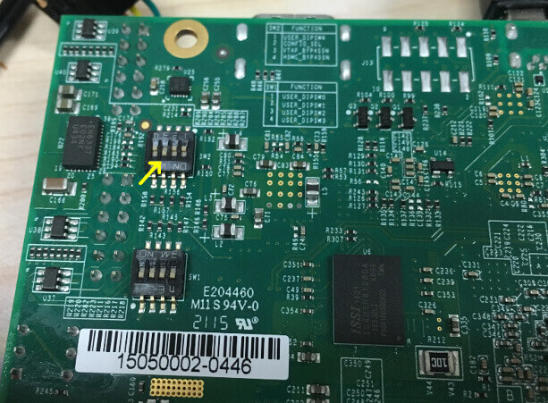

.. _altera_max10:

Altera MAX10
############

Overview
********

The Zephyr kernel is supported on the Altera MAX10 Rev C development kit, using
the Nios II Gen 2 soft CPU.

.. figure:: img/max_10_dev_kit_top_photo.jpg
   :width: 442px
   :align: center
   :alt: Altera’s MAX* 10

   Altera’s MAX* 10  (Credit: Altera)

Hardware
********

DIP Switch settings
===================

There are two sets of switches on the back of the board. Of particular
importance is SW2:

* Switch 2 (CONFIG_SEL) should be in the OFF (up) position so that the first
  boot image is CFM0
* Switch 3 (VTAP_BYPASS) needs to be in the ON (down) position or the flashing
  scripts won't work
* Switch 4 (HSMC_BYPASSN) should be OFF (up)

Other switches are user switches, their position is application-specific.

Necessary Software
==================

You will need the Altera Quartus SDK in order to work with this device. The
`Lite version <Altera Lite Distribution>`_ of Quartus may be obtained without
charge.

For convenience, once installed you should put the binaries provided by the SDK
in your path. Below is an example, adjust ALTERA_BASE to where you installed the
SDK:

.. code-block:: console

   export ALTERA_BASE=/opt/altera_lite/16.0
   export PATH=$PATH:$ALTERA_BASE/quartus/bin:$ALTERA_BASE/nios2eds/bin

You may need to adjust your udev rules so that you can talk to the USB Blaster
II peripheral, which is the built-in JTAG interface for this device.

The following works for Fedora 23:

.. code-block:: console

   # For Altera USB-Blaster permissions.
   SUBSYSTEM=="usb",\
   ENV{DEVTYPE}=="usb_device",\
   ATTR{idVendor}=="09fb",\
   ATTR{idProduct}=="6010",\
   MODE="0666",\
   NAME="bus/usb/$env{BUSNUM}/$env{DEVNUM}",\
   RUN+="/bin/chmod 0666 %c"
   SUBSYSTEM=="usb",\
   ENV{DEVTYPE}=="usb_device",\
   ATTR{idVendor}=="09fb",\
   ATTR{idProduct}=="6810",\
   MODE="0666",\
   NAME="bus/usb/$env{BUSNUM}/$env{DEVNUM}",\
   RUN+="/bin/chmod 0666 %c"

You can test connectivity with the SDK jtagconfig tool, you should see something
like:

.. code-block:: console

   $ jtagconfig
   1) USB-BlasterII [1-1.2]
     031050DD   10M50DA(.|ES)/10M50DC
     020D10DD   VTAP10

Reference CPU
=============

A reference CPU design of a Nios II/f core is included in the Zephyr tree. The
CPU may be found in the :file:`arch/nios2/soc/nios2f-zephyr/cpu` directory.

To flash this CPU, use the :file:`arch/nios2/soc/nios2f-zephyr/cpu/nios2-configure-sof`
tool:

.. code-block:: console

   $ nios2-configure-sof ghrd_10m50da.sof

This CPU is a Nios II/F core with a 16550 UART, JTAG UART, and the Avalon Timer.
For any Nios II SOC definition, you can find out more details about the CPU
configuration by inspecting system.h in the SOC's include directory.

Console Output
==============

16550 UART
----------

By default, the kernel is configured to send console output to the 16550 UART.
You can monitor this on your workstation by connecting to the top right mini USB
port on the board (it will show up in /dev as a ttyUSB node), and then running
minicom with flow control disabled, 115200-8N1 settings.

JTAG UART
---------

You can also have it send its console output to the JTAG UART. Set these in your
project configuration:

.. code-block:: console

   CONFIG_UART_ALTERA_JTAG=y
   CONFIG_UART_CONSOLE_ON_DEV_NAME="jtag_uart0"

To view these messages on your local workstation, run the terminal application
in the SDK:

.. code-block:: console

   $ nios2-terminal

Programming and Debugging
*************************

Flashing
========

Flashing Kernel into UFM
------------------------
This is as simple as:

.. code-block:: console

   $ make flash

This provisions the Zephyr kernel and the CPU configuration onto the board,
using the scripts/support/quartus-flash.py script. After it completes the kernel
will immediately boot.

Flashing Kernel directly into RAM over JTAG
-------------------------------------------

The SDK included the nios2-download tool which will let you flash a kernel
directly into RAM and then boot it from the __start symbol.

In order for this to work, your entire kernel must be located in RAM. Make sure
the following config options are disabled:

.. code-block:: console

   CONFIG_XIP=n
   CONFIG_INCLUDE_RESET_VECTOR=n

Then, after building your kernel, push it into device's RAM:

.. code-block:: console

   $ nios2-download --go outdir/zephyr.elf

If you have a console session running (either minicom or nios2-terminal) you
should see the application's output. There are additional arguments you can pass
to nios2-download so that it spawns a GDB server that you can connect to,
although it's typically simpler to just use nios2-gdb-server as described below.

Debugging
=========

The Altera SDK includes a GDB server which can be used to debug a MAX10 board.
You can either debug a running image that was flashed onto the device in User
Flash Memory (UFM), or load an image over the JTAG using GDB.

Debugging With UFM Flashed Image
--------------------------------

This can be accomplished with the "make debug" build target:

.. code-block:: console

   $ make debug
   make[1]: Entering directory '/projects/zephyr2'
   make[2]: Entering directory '/projects/zephyr2/tests/crypto/test_sha256/outdir'
     Using /projects/zephyr2 as source for kernel
     GEN     ./Makefile
     CHK     include/generated/version.h
     CHK     misc/generated/configs.c
     CHK     include/generated/offsets.h
     CHK     misc/generated/sysgen/prj.mdef
   Nios II GDB server running on port 14777
   Ignoring --stop option because --tcpport also specified
   Python Exception <type 'exceptions.ImportError'> No module named gdb:
   /opt/zephyr-sdk/sysroots/i686-pokysdk-linux/usr/bin/nios2-poky-elf/nios2-poky-elf-gdb: warning:
   Could not load the Python gdb module from `/opt/zephyr-sdk/2.0.1/sysroots/i686-pokysdk-linux/usr/share/gdb/python'.
   Limited Python support is available from the _gdb module.
   Suggest passing --data-directory=/path/to/gdb/data-directory.

   GNU gdb (GDB) 7.9.1
   Copyright (C) 2015 Free Software Foundation, Inc.
   License GPLv3+: GNU GPL version 3 or later <http://gnu.org/licenses/gpl.html>
   This is free software: you are free to change and redistribute it.
   There is NO WARRANTY, to the extent permitted by law.  Type "show copying"
   and "show warranty" for details.
   This GDB was configured as "--host=i686-pokysdk-linux --target=nios2-poky-elf".
   Type "show configuration" for configuration details.
   For bug reporting instructions, please see:
   <http://www.gnu.org/software/gdb/bugs/>.
   Find the GDB manual and other documentation resources online at:
   <http://www.gnu.org/software/gdb/documentation/>.
   For help, type "help".
   Type "apropos word" to search for commands related to "word"...
   Reading symbols from /projects/zephyr2/tests/crypto/test_sha256/outdir/zephyr.elf...done.
   Remote debugging using :14777
   Using cable "USB-BlasterII [1-1.6.1]", device 1, instance 0x00
   Resetting and pausing target processor: OK
   Listening on port 14777 for connection from GDB: accepted
   vprintf (format=<optimized out>, vargs=<optimized out>)
       at /projects/zephyr2/lib/libc/minimal/source/stdout/fprintf.c:61
   61 {
   (gdb) b nano_init
   Breakpoint 1 at 0x1de8: file /projects/zephyr2/kernel/nanokernel/nano_init.c, line 207.
   (gdb) c
   Continuing.

   Breakpoint 1, _Cstart () at /projects/zephyr2/kernel/nanokernel/nano_init.c:323
   323      nano_init((struct tcs *)&dummyTCS);
   (gdb) bt
   Python Exception <type 'exceptions.ImportError'> No module named gdb.frames:
   #0  _Cstart () at /projects/zephyr2/kernel/nanokernel/nano_init.c:323
   #1  0x00003ca4 in _PrepC () at /projects/zephyr2/arch/nios2/core/prep_c.c:61
   #2  0x00003ccc in __start () at /projects/zephyr2/arch/nios2/core/crt0.S:155
   (gdb)

To start debugging manually:

.. code-block:: console

   nios2-gdb-server --tcpport 1234 --stop --reset-target

And then connect with GDB:

.. code-block:: console

   nios2-poky-elf-gdb  outdir/zephyr.elf -ex "target remote :1234"

Debugging With JTAG Flashed Image
---------------------------------

In order for this to work, execute-in-place must be disabled, since the GDB
'load' command can only put text and data in RAM. Ensure this is in your
configuration:

.. code-block:: console

   CONFIG_XIP=n

It is OK for this procedure to leave the reset vector enabled, unlike
nios2-download (which errors out if it finds sections outside of SRAM) it will
be ignored.

In a terminal, launch the nios2 GDB server. It doesn't matter what kernel (if
any) is on the device, but you should have at least flashed a CPU using
nios2-configure-sof. You can leave this process running.

.. code-block:: console

   $ nios2-gdb-server --tcpport 1234 --tcppersist --init-cache --reset-target

Build your zephyr kernel, and load it into a GDB built for Nios II (included in
the Zephyr SDK):

.. code-block:: console

   $ nios2-poky-elf-gdb outdir/zephyr.elf

Then connect to the GDB server:

.. code-block:: console

   (gdb) target remote :1234

And then load the kernel image over the wire. The CPU will not start from the
reset vector, instead it will boot from the __start symbol:

.. code-block:: console

   (gdb) load
   Loading section reset, size 0xc lma 0x0
   Loading section exceptions, size 0x1b0 lma 0x400020
   Loading section text, size 0x8df0 lma 0x4001d0
   Loading section devconfig, size 0x30 lma 0x408fc0
   Loading section rodata, size 0x3f4 lma 0x408ff0
   Loading section datas, size 0x888 lma 0x4093e4
   Loading section initlevel, size 0x30 lma 0x409c6c
   Loading section _k_task_list, size 0x58 lma 0x409c9c
   Loading section _k_task_ptr, size 0x8 lma 0x409cf4
   Loading section _k_event_list, size 0x10 lma 0x409cfc
   Start address 0x408f54, load size 40184
   Transfer rate: 417 KB/sec, 368 bytes/write.
   After this is done you may set breakpoints and continue execution. If you ever want to reset the CPU, issue the 'load' command again.

References
**********

* `CPU Documentation <https://www.altera.com/en_US/pdfs/literature/hb/nios2/n2cpu-nii5v1gen2.pdf>`_
* `Nios II Processor Booting Methods in MAX 10 FPGA Devices <https://www.altera.com/en_US/pdfs/literature/an/an730.pdf>`_
* `Embedded Peripherals IP User Guide <https://www.altera.com/content/dam/altera-www/global/en_US/pdfs/literature/ug/ug_embedded_ip.pdf>`_
* `MAX 10 FPGA Configuration User Guide <https://www.altera.com/content/dam/altera-www/global/en_US/pdfs/literature/hb/max-10/ug_m10_config.pdf>`_
* `MAX 10 FPGA Development Kit User Guide <https://www.altera.com/content/dam/altera-www/global/en_US/pdfs/literature/ug/ug-max10m50-fpga-dev-kit.pdf>`_
* `Nios II Command-Line Tools <https://www.altera.com/content/dam/altera-www/global/en_US/pdfs/literature/hb/nios2/edh_ed51004.pdf>`_
* `Quartus II Scripting Reference Manual <https://www.altera.com/content/dam/altera-www/global/en_US/pdfs/literature/manual/tclscriptrefmnl.pdf>`_

.. _Altera Lite Distribution: http://dl.altera.com/?edition=lite
