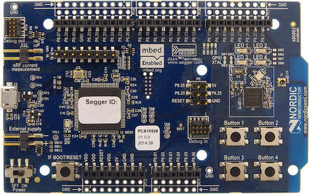

.. _nrf51dk_nrf51822:

nRF51 DK
########

Overview
********

The nRF51 Development Kit (PCA10028) hardware provides support for the Nordic
Semiconductor nRF51822 ARM Cortex-M0 CPU and the following devices:

* :abbr:`ADC (Analog to Digital Converter)`
* CLOCK
* FLASH
* :abbr:`GPIO (General Purpose Input Output)`
* :abbr:`I2C (Inter-Integrated Circuit)`
* :abbr:`NVIC (Nested Vectored Interrupt Controller)`
* RADIO (Bluetooth Low Energy)
* :abbr:`RTC (nRF RTC System Clock)`
* Segger RTT (RTT Console)
* :abbr:`SPI (Serial Peripheral Interface)`
* :abbr:`UART (Universal asynchronous receiver-transmitter)`
* :abbr:`WDT (Watchdog Timer)`

     nRF51 DK (Credit: Nordic Semiconductor)

More information about the board can be found at the
`nRF51 DK website`_. The `nRF51 Development Kit User Guide`_
contains the processor's information and the datasheet.

Hardware
********

nRF51 DK has two external oscillators. The frequency of
the slow clock is 32.768 kHz. The frequency of the main clock
is 16 MHz.

Supported Features
==================

The nrf51dk/nrf51822 board configuration supports the following nRF51
hardware features:

+-----------+------------+----------------------+
| Interface | Controller | Driver/Component     |
+===========+============+======================+
| ADC       | on-chip    | adc                  |
+-----------+------------+----------------------+
| CLOCK     | on-chip    | clock_control        |
+-----------+------------+----------------------+
| FLASH     | on-chip    | flash                |
+-----------+------------+----------------------+
| GPIO      | on-chip    | gpio                 |
+-----------+------------+----------------------+
| I2C(M)    | on-chip    | i2c                  |
+-----------+------------+----------------------+
| NVIC      | on-chip    | arch/arm             |
+-----------+------------+----------------------+
| RADIO     | on-chip    | Bluetooth            |
+-----------+------------+----------------------+
| RTC       | on-chip    | system clock         |
+-----------+------------+----------------------+
| RTT       | Segger     | console              |
+-----------+------------+----------------------+
| SPI(M/S)  | on-chip    | spi                  |
+-----------+------------+----------------------+
| UART      | on-chip    | serial               |
+-----------+------------+----------------------+
| WDT       | on-chip    | watchdog             |
+-----------+------------+----------------------+

Other hardware features have not been enabled yet for this board.
See `nRF51 DK website`_ and `nRF51 Development Kit User Guide`_
for a complete list of nRF51 Development Kit board hardware features.

Connections and IOs
===================

LED
---

* LED1 (green) = P0.21
* LED2 (green) = P0.22
* LED3 (green) = P0.23
* LED4 (green) = P0.24

Push buttons
------------

* BUTTON1 = SW1 = P0.17
* BUTTON2 = SW2 = P0.18
* BUTTON3 = SW3 = P0.19
* BUTTON4 = SW4 = P0.20
* BOOT = SW5 = boot/reset

Programming and Debugging
*************************

Flashing
========

Follow the instructions in the :ref:`nordic_segger` page to install
and configure all the necessary software. Further information can be
found in :ref:`nordic_segger_flashing`. Then build and flash
applications as usual (see :ref:`build_an_application` and
:ref:`application_run` for more details).

Here is an example for the :zephyr:code-sample:`hello_world` application.

First, run your favorite terminal program to listen for output.

.. code-block:: console

   $ minicom -D <tty_device> -b 115200

Replace :code:`<tty_device>` with the port where the board nRF51 DK
can be found. For example, under Linux, :code:`/dev/ttyACM0`.

Then build and flash the application in the usual way.

.. zephyr-app-commands::
   :zephyr-app: samples/hello_world
   :board: nrf51dk/nrf51822
   :goals: build flash

Debugging
=========

Refer to the :ref:`nordic_segger` page to learn about debugging Nordic boards with a
Segger IC.

Testing the LEDs and buttons in the nRF51 DK
********************************************

There are 2 samples that allow you to test that the buttons (switches) and LEDs on
the board are working properly with Zephyr:

.. code-block:: console

   samples/basic/blinky
   samples/basic/button

You can build and flash the examples to make sure Zephyr is running correctly on
your board. The button and LED definitions can be found in
:zephyr_file:`boards/nordic/nrf51dk/nrf51dk_nrf51822.dts`.

References
**********

.. target-notes::

.. _nRF51 DK website: https://www.nordicsemi.com/Software-and-Tools/Development-Kits/nRF51-DK
.. _nRF51 Development Kit User Guide: https://docs.nordicsemi.com/bundle/nRF51-Series-DK/resource/nRF51_Development_Kit_User_Guide_v1.2.pdf
