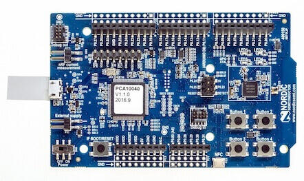

.. _nrf52dk_nrf52832:

nRF52 DK
########

Overview
********

The nRF52 Development Kit (PCA10040) hardware provides
support for the Nordic Semiconductor nRF52832 ARM Cortex-M4F CPU and
the following devices:

* :abbr:`ADC (Analog to Digital Converter)`
* CLOCK
* FLASH
* :abbr:`GPIO (General Purpose Input Output)`
* :abbr:`I2C (Inter-Integrated Circuit)`
* :abbr:`MPU (Memory Protection Unit)`
* :abbr:`NVIC (Nested Vectored Interrupt Controller)`
* :abbr:`PWM (Pulse Width Modulation)`
* RADIO (Bluetooth Low Energy)
* :abbr:`RTC (nRF RTC System Clock)`
* Segger RTT (RTT Console)
* :abbr:`SPI (Serial Peripheral Interface)`
* :abbr:`UART (Universal asynchronous receiver-transmitter)`
* :abbr:`WDT (Watchdog Timer)`

     nRF52 DK (Credit: Nordic Semiconductor)

More information about the board can be found at the
`nRF52 DK website`_. The `Nordic Semiconductor Infocenter`_
contains the processor's information and the datasheet.

Hardware
********

nRF52 DK has two external oscillators. The frequency of
the slow clock is 32.768 kHz. The frequency of the main clock
is 32 MHz.

Supported Features
==================

The ``nrf52dk/nrf52832`` board configuration supports the following
hardware features:

+-----------+------------+----------------------+
| Interface | Controller | Driver/Component     |
+===========+============+======================+
| ADC       | on-chip    | adc                  |
+-----------+------------+----------------------+
| CLOCK     | on-chip    | clock_control        |
+-----------+------------+----------------------+
| FLASH     | on-chip    | flash                |
+-----------+------------+----------------------+
| GPIO      | on-chip    | gpio                 |
+-----------+------------+----------------------+
| I2C(M)    | on-chip    | i2c                  |
+-----------+------------+----------------------+
| MPU       | on-chip    | arch/arm             |
+-----------+------------+----------------------+
| NVIC      | on-chip    | arch/arm             |
+-----------+------------+----------------------+
| PWM       | on-chip    | pwm                  |
+-----------+------------+----------------------+
| RADIO     | on-chip    | Bluetooth            |
+-----------+------------+----------------------+
| RTC       | on-chip    | system clock         |
+-----------+------------+----------------------+
| RTT       | Segger     | console              |
+-----------+------------+----------------------+
| SPI(M/S)  | on-chip    | spi                  |
+-----------+------------+----------------------+
| UART      | on-chip    | serial               |
+-----------+------------+----------------------+
| WDT       | on-chip    | watchdog             |
+-----------+------------+----------------------+

Other hardware features have not been enabled yet for this board.
See `nRF52 DK website`_ and `Nordic Semiconductor Infocenter`_
for a complete list of nRF52 Development Kit board hardware features.

Connections and IOs
===================

LED
---

* LED1 (green) = P0.17
* LED2 (green) = P0.18
* LED3 (green) = P0.19
* LED4 (green) = P0.20
* LD5 (red/green) = OB LED 1/2

Push buttons
------------

* BUTTON1 = SW1 = P0.13
* BUTTON2 = SW2 = P0.14
* BUTTON3 = SW3 = P0.15
* BUTTON4 = SW4 = P0.16
* BOOT = SW5 = boot/reset

External Connectors
-------------------

J-Link Prog Connector

+-------+--------------+
| PIN # | Signal Name  |
+=======+==============+
| 1     | VDD          |
+-------+--------------+
| 2     | IMCU_TMSS    |
+-------+--------------+
| 3     | GND          |
+-------+--------------+
| 4     | IMCU_TCKS    |
+-------+--------------+
| 5     | V5V          |
+-------+--------------+
| 6     | IMCU_TDOS    |
+-------+--------------+
| 7     | Cut off      |
+-------+--------------+
| 8     | IMCU_TDIS    |
+-------+--------------+
| 9     | Cut off      |
+-------+--------------+
| 10    | IMCU_RESET   |
+-------+--------------+

Debug IN

+-------+--------------+-------------------------+
| PIN # | Signal Name  | NRF52832 Functions      |
+=======+==============+=========================+
| 1     | VDD          | N/A                     |
+-------+--------------+-------------------------+
| 2     | SWDIO        | SWDIO                   |
+-------+--------------+-------------------------+
| 3     | GND          | N/A                     |
+-------+--------------+-------------------------+
| 4     | SWDCLK       | SWDCLK                  |
+-------+--------------+-------------------------+
| 5     | GND          | N/A                     |
+-------+--------------+-------------------------+
| 6     | P0.18        | P0.18 / TRACEDATA[0] /  |
|       |              | SWO                     |
+-------+--------------+-------------------------+
| 7     | Cut off      | N/A                     |
+-------+--------------+-------------------------+
| 8     | Cut off      | N/A                     |
+-------+--------------+-------------------------+
| 9     | GND          | N/A                     |
+-------+--------------+-------------------------+
| 10    | P0.21        | P0.21 / RESET           |
+-------+--------------+-------------------------+

Debug OUT

+-------+----------------+
| PIN # | Signal Name    |
+=======+================+
| 1     | EXT_VTG        |
+-------+----------------+
| 2     | EXT_SWDIO      |
+-------+----------------+
| 3     | GND            |
+-------+----------------+
| 4     | EXT_SWDCLK     |
+-------+----------------+
| 5     | GND            |
+-------+----------------+
| 6     | EXT_SWO        |
|       |                |
+-------+----------------+
| 7     | Cut off        |
+-------+----------------+
| 8     | Cut off        |
+-------+----------------+
| 9     | EXT_GND_DETECT |
+-------+----------------+
| 10    | EXT_RESET      |
+-------+----------------+

Shield Debug and Current measurement

+-------+----------------+
| PIN # | Signal Name    |
+=======+================+
| 1     | VDD_nRF        |
+-------+----------------+
| 2     | VDD            |
+-------+----------------+
| 3     | SH_VTG         |
+-------+----------------+
| 4     | SH_SWDIO       |
+-------+----------------+
| 5     | SH_SWDCLK      |
+-------+----------------+
| 6     | SH_SWO         |
+-------+----------------+
| 7     | SH_RESET       |
+-------+----------------+
| 8     | SH_GND_DETECT  |
+-------+----------------+

Auxiliary

+-------+--------------+-------------------------+
| PIN # | Signal Name  | NRF52832 Functions      |
+=======+==============+=========================+
| 1     | P0.00        | P0.00 / XL1             |
+-------+--------------+-------------------------+
| 2     | P0.01        | P0.01 / XL2             |
+-------+--------------+-------------------------+
| 3     | P0.21        | P0.21 / RESET           |
+-------+--------------+-------------------------+
| 4     | P0.05_C      | P0.05 / AIN3            |
+-------+--------------+-------------------------+
| 5     | P0.06_C      | P0.06                   |
+-------+--------------+-------------------------+
| 6     | P0.07_C      | P0.07                   |
+-------+--------------+-------------------------+
| 7     | P0.08_C      | P0.08                   |
+-------+--------------+-------------------------+
| 8     | P0.09        | P0.09 / NFC1            |
+-------+--------------+-------------------------+
| 9     | P0.10        | P0.10 / NFC2            |
+-------+--------------+-------------------------+

Arduino Headers
---------------

P1/P7 Power

+-------+--------------+-------------------------+
| PIN # | Signal Name  | NRF52832 Functions      |
+=======+==============+=========================+
| 1     | VDD          | N/A                     |
+-------+--------------+-------------------------+
| 2     | VDD          | N/A                     |
+-------+--------------+-------------------------+
| 3     | RESET        | P0.21 / RESET           |
+-------+--------------+-------------------------+
| 4     | VDD          | N/A                     |
+-------+--------------+-------------------------+
| 5     | V5V          | N/A                     |
+-------+--------------+-------------------------+
| 6     | GND          | N/A                     |
+-------+--------------+-------------------------+
| 7     | GND          | N/A                     |
+-------+--------------+-------------------------+
| 8     | VIN          | N/A                     |
+-------+--------------+-------------------------+

P2/P8 Analog in

+-------+--------------+-------------------------+
| PIN # | Signal Name  | NRF52832 Functions      |
+=======+==============+=========================+
| 1     | A0           | P0.03 / AIN1            |
+-------+--------------+-------------------------+
| 2     | A1           | P0.04 / AIN2            |
+-------+--------------+-------------------------+
| 3     | A2           | P0.28 / AIN4            |
+-------+--------------+-------------------------+
| 4     | A3           | P0.29 / AIN5            |
+-------+--------------+-------------------------+
| 5     | A4           | P0.30 / AIN6            |
+-------+--------------+-------------------------+
| 6     | A5           | P0.31 / AIN7            |
+-------+--------------+-------------------------+

P3/P9 Digital I/O

+-------+--------------+-------------------------+
| PIN # | Signal Name  | NRF52832 Functions      |
+=======+==============+=========================+
| 1     | D0 (RX)      | P0.11                   |
+-------+--------------+-------------------------+
| 2     | D1 (TX)      | P0.12                   |
+-------+--------------+-------------------------+
| 3     | D2           | P0.13                   |
+-------+--------------+-------------------------+
| 4     | D3           | P0.14 / TRACEDATA[3]    |
+-------+--------------+-------------------------+
| 5     | D4           | P0.15 / TRACEDATA[2]    |
+-------+--------------+-------------------------+
| 6     | D5           | P0.16 / TRACEDATA[1]    |
+-------+--------------+-------------------------+
| 7     | D6           | P0.17                   |
+-------+--------------+-------------------------+
| 8     | D7           | P0.18 / TRACEDATA[3]  / |
|       |              | SWO                     |
+-------+--------------+-------------------------+

P4/P10 Digital I/O

+-------+--------------+-------------------------+
| PIN # | Signal Name  | NRF52832 Functions      |
+=======+==============+=========================+
| 1     | D8           | P0.19                   |
+-------+--------------+-------------------------+
| 2     | D9           | P0.20 / TRACECLK        |
+-------+--------------+-------------------------+
| 3     | D10 (SS)     | P0.22                   |
+-------+--------------+-------------------------+
| 4     | D11 (MOSI)   | P0.23                   |
+-------+--------------+-------------------------+
| 5     | D12 (MISO)   | P0.24                   |
+-------+--------------+-------------------------+
| 6     | D13 (SCK)    | P0.25                   |
+-------+--------------+-------------------------+
| 7     | GND          | N/A                     |
+-------+--------------+-------------------------+
| 8     | AREF         | P0.02 / AIN0            |
+-------+--------------+-------------------------+
| 9     | SDA          | P0.26                   |
+-------+--------------+-------------------------+
| 10    | SCL          | P0.27                   |
+-------+--------------+-------------------------+

P5/P11

+-------+--------------+-------------------------+
| PIN # | Signal Name  | NRF52832 Functions      |
+=======+==============+=========================+
| 1     | D12 (MISO)   | P0.24                   |
+-------+--------------+-------------------------+
| 2     | V5V          | N/A                     |
+-------+--------------+-------------------------+
| 3     | D13 (SCK)    | P0.25                   |
+-------+--------------+-------------------------+
| 4     | D11 (MOSI)   | P0.23                   |
+-------+--------------+-------------------------+
| 5     | RESET        | N/A                     |
+-------+--------------+-------------------------+
| 6     | N/A          | N/A                     |
+-------+--------------+-------------------------+

Programming and Debugging
*************************

Flashing
========

Follow the instructions in the :ref:`nordic_segger` page to install
and configure all the necessary software. Further information can be
found in :ref:`nordic_segger_flashing`. Then build and flash
applications as usual (see :ref:`build_an_application` and
:ref:`application_run` for more details).

Here is an example for the :ref:`hello_world` application.

First, run your favorite terminal program to listen for output.

.. code-block:: console

   $ minicom -D <tty_device> -b 115200

Replace :code:`<tty_device>` with the port where the board nRF52 DK
can be found. For example, under Linux, :code:`/dev/ttyACM0`.

Then build and flash the application in the usual way.

.. zephyr-app-commands::
   :zephyr-app: samples/hello_world
   :board: nrf52dk/nrf52832
   :goals: build flash

Debugging
=========

Refer to the :ref:`nordic_segger` page to learn about debugging Nordic boards with a
Segger IC.

Testing the LEDs and buttons in the nRF52 DK
********************************************

There are 2 samples that allow you to test that the buttons (switches) and LEDs on
the board are working properly with Zephyr:

.. code-block:: console

   samples/basic/blinky
   samples/basic/button

You can build and flash the examples to make sure Zephyr is running correctly on
your board. The button and LED definitions can be found in
:zephyr_file:`boards/nordic/nrf52dk/nrf52dk_nrf52832.dts`.

References
**********

.. target-notes::

.. _nRF52 DK website: https://www.nordicsemi.com/Software-and-Tools/Development-Kits/nRF52-DK
.. _Nordic Semiconductor Infocenter: https://infocenter.nordicsemi.com

.. _nrf52dk_nrf52805:

nRF52805 emulation on nRF52 DK
##############################

Overview
********

The ``nrf52dk/nrf52805`` board is a modified version of the :ref:`nrf52dk_nrf52832`
that enforces the limitations imposed by the nRF52805 IC, which is a
cost-reduced variant of the original nRF52832. Since Nordic does not offer a
development kit for the nRF52805, you can use this board to develop for this
IC while using the nRF52 Development Kit (PCA10040).

See :ref:`nrf52dk_nrf52832` for more information about the development board and
`nRF52805 website`_ for the official reference on the IC itself.

References
**********

.. target-notes::

.. _nRF52805 website: https://www.nordicsemi.com/Products/Low-power-short-range-wireless/nRF52805

.. _nrf52dk_nrf52810:

nRF52810 emulation on nRF52 DK
##############################

Overview
********

The ``nrf52dk/nrf52810`` board is a modified version of the :ref:`nrf52dk_nrf52832`
that enforces the limitations imposed by the nRF52810 IC, which is a
cost-reduced variant of the original nRF52832. Since Nordic does not offer a
development kit for the nRF52810 you can use this board to develop for this
IC while using the nRF52 Development Kit (PCA10040).

See :ref:`nrf52dk_nrf52832` for more information about the development board and
`nRF52810 website`_ for the official reference on the IC itself.

References
**********

.. target-notes::

.. _nRF52810 website: https://www.nordicsemi.com/Products/Low-power-short-range-wireless/nRF52810
